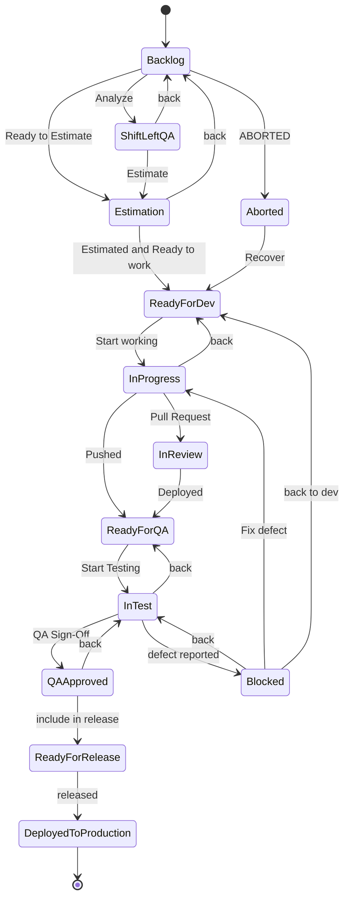

# Backlog Access Recipe — Jira (Bunkai TMS)

> This file documents HOW to reach the backlog, never a copy of it. Jira is the single source of truth; `.context/PBI/epics/...` is a read-only cache synced on demand by `/sprint-testing` (see `CLAUDE.md` §9). Do not hand-write ticket content here.

## 1. Header

| Field | Value |
|---|---|
| PM tool | Jira Cloud |
| Instance | `https://upexgalaxy71.atlassian.net` |
| Project key | `BK` |
| Project name | Bunkai TMS |
| Board | "Bunkai Board" (board id `6`), type **Scrum** |
| Access method | `acli` (CLI) — primary. Atlassian MCP — opt-in fallback, not installed by default |
| Last verified | 2026-08-17 (live `acli` queries against the BK project — see §8) |

## 2. Backlog Location

- Web: `https://upexgalaxy71.atlassian.net/browse/BK` (Epics/Stories); board view via the "Bunkai Board" (Scrum board, id `6`).
- The Atlassian site (`upexgalaxy71.atlassian.net`) hosts multiple projects — sibling boards observed during discovery: `SANDBOX (SX)`, `SoloQ (Fintech) (SQ)`, `Onboarding UPEX (OB)` (Kanban), `MyMentor (EdTech) (MYM)`. All JQL/queries in this file MUST be scoped with `project = BK` to avoid cross-project leakage.
- 480 live issues confirmed in BK across 13 issue types at verification time (see §4 for the breakdown) — do not re-paste that breakdown outside this recipe; re-run the query in §5 for a fresh count.

## 3. Access Configuration

**Primary — `acli` (per this repo's Tool Resolution table, `CLAUDE.md` §6):**

1. Ensure `.env` has `ATLASSIAN_URL`, `ATLASSIAN_EMAIL`, `ATLASSIAN_API_TOKEN` set (see §7).
2. Load the `/acli` skill before any Jira command (repo rule — syntax/gotchas live there, not here).
3. Authenticate once per machine/session:
   ```
   acli jira auth login --site upexgalaxy71.atlassian.net --email "$ATLASSIAN_EMAIL" --token
   acli jira auth status   # ✓ Authenticated / Site / Email / oauth_global
   ```
4. Verify project reachability: `acli jira project view --key BK --json`.

**Fallback — Atlassian MCP** (opt-in only, not enabled in this repo's default `.mcp.json`): copy the `atlassian` block from `docs/mcp/<agent>.template.*`, ensure the same three env vars are set, restart the agent. Use only if `acli` is unavailable or hits one of its documented blind spots (see `/acli` skill → `references/gotchas.md`).

**Detailed content reads bypass both of the above** — per-ticket custom fields (ACs, ATP/ATR, comments) go through the sync script, never `acli view` (`acli view` returns `null` for `customfield_*`):
```
bun run jira:sync-issues get <KEY> --include-comments
bun run jira:sync-issues jql "project = BK AND ..."
```

## 4. Project Structure

**TMS Modality confirmed: A — Xray on Jira.** Live BK data includes native `Test`, `Test Plan`, `Test Execution`, `Test Set`, and `Precondition` issue types (Xray container types), so `[TMS_TOOL]` resolves to `/xray-cli` for those entities and `/acli` for generic Jira issues.

### Issue types in use (verified live, `acli jira workitem search --jql "project = BK"`)

| Canonical name (use in JQL) | UI label seen (session locale = Spanish) | Live count | Cataloged in `.agents/jira-workflows.json`? |
|---|---|---|---|
| Story | Historia | 106 | Yes |
| Test | Test | 264 | Yes |
| Bug | Error | 36 | Yes |
| Epic | Epic | 18 | Yes |
| Test Plan | Test Plan | 10 | Yes |
| Defect | Defect | 10 | Yes |
| Test Execution | Test Execution | 9 | Yes |
| Tech Story | Tech Story | 7 | Yes |
| Test Set | Test Set | 6 | Yes |
| Improvement | Mejora | 5 | Yes |
| — | Tarea | 5 | **No — see Discovery Gaps** |
| Tech Debt | Tech Debt | 2 | Yes |
| Precondition | Precondition | 2 | Yes |

> **Gotcha (confirmed empirically):** the account's Jira profile language is Spanish, so `acli` search results render some issue-type/status names translated (`Error`, `Historia`, `Planificación`, `Cerrada`, `Borrador`, `Listo`…), but **JQL still matches on the English canonical name only**. `issuetype = Bug` → 36 hits; `issuetype = Error` → `el valor 'error' no existe para el campo 'issuetype'`. Always write JQL against the canonical names in `.agents/jira-workflows.json`, never against what the UI displays.

### Workflow — Story lifecycle (the one QA skills drive most)

Source: `.agents/jira-workflows.json` → `story` (workflow "UPEX Feature (US) Workflow", scheme "UPEX PROGRAM Workflow Scheme", id `10003`) — states/transitions below are the cataloged, previously-synced set; not re-derived from scratch in this pass.



Other work-type lifecycles (Bug/Defect share "UPEX BUG/DEFECT LIFE CYCLE"; Epic uses "UPEX Epic Workflow"; Test uses "UPEX Test (TC) Workflow"; Tech Story/Tech Debt share "UPEX Tech Task/Debt (TD) Workflow") are fully cataloged with the same fidelity in `.agents/jira-workflows.json` — not re-diagrammed here to avoid duplicating that file. Terminal states observed live: Bug/Defect/Improvement → `Closed`/`Cerrada`, `Cannot Reproduce`, `Duplicated`, `Rejected`; Epic → `Done`; Test → `AUTOMATED`/`MANUAL`/`DEPRECATED`.

### Sprint cadence — Scrum, ~4-week sprints

| Sprint | Window | State |
|---|---|---|
| Bunkai (67) Sprint 1 | 2026-05-11 → 2026-06-08 | closed |
| Bunkai (69) Sprint 2 | 2026-06-09 → 2026-07-06 | closed |
| Bunkai (70) Sprint 3 | 2026-07-07 → 2026-08-04 | **active** (see Discovery Gaps — end date already elapsed at verification time) |

Naming convention: `Bunkai (<cycle-number>) Sprint <N>`. Query: `acli jira board list-sprints --id 6 --json`.

## 5. Common Queries

| Need | JQL |
|---|---|
| Current sprint ready for QA | `project = BK AND sprint in openSprints() AND status = "Ready For QA"` |
| All open bugs | `project = BK AND issuetype = Bug AND resolution = Unresolved ORDER BY priority DESC` |
| My testing tasks | `project = BK AND status = "In Test" AND assignee = currentUser()` |
| Recently updated | `project = BK AND updated >= -1d ORDER BY updated DESC` |

`[ISSUE_TRACKER_TOOL]` pseudocode equivalent (resolved via `/acli`):
```
acli jira workitem search --jql "<query above>" --paginate --json
```

## 6. Integration with KATA

- `/shift-left-testing` — fetches `project = BK AND status = "Backlog"` (or `"Shift-Left QA"`) batches during pre-sprint grooming; writes AC refinements back to the Story's custom fields, then syncs.
- `/sprint-testing` — entry point: syncs one ticket via `bun run jira:sync-issues get <KEY> --include-comments` into `.context/PBI/epics/EPIC-BK-<n>-<slug>/stories/STORY-BK-<n>-<slug>/`; drives triage, ATP/ATR authoring, and bug filing against the Bug/Defect workflow above.
- `/test-documentation` — reads the synced Test-Plan/Test-Execution Xray artifacts (Modality A) via `/xray-cli`; ROI verdicts written back to `to_be_automated`.
- `/test-automation` — hand-off target for Candidate-verdict Tests; reads `.context/PBI/epics/.../test-specs/` (non-Jira, local working area), never re-authors synced files.
- Local storage rule: everything under `.context/PBI/epics/` is a **read-only cache**, regenerated by re-running the sync — never hand-edited.

## 7. Credentials

Required in `.env` (values never printed here — see `CLAUDE.md` §1 Rule 1):

```
ATLASSIAN_URL=
ATLASSIAN_EMAIL=
ATLASSIAN_API_TOKEN=
```

No `JIRA_*` aliases exist in this repo — single source of truth is the three keys above, consumed by `acli`, the sync scripts, `xray-cli`, and the opt-in Atlassian MCP.

## 8. Discovery Gaps

- **Uncataloged issue type `Tarea` (5 live issues).** Not present in `.agents/jira-workflows.json` or `.agents/jira-required.yaml` `work_types`. Likely a native Jira "Task" type outside the QA methodology's scope, but unconfirmed — do not assume it is safe to ignore until a maintainer confirms it is not meant to be a coverable QA work type.
- **Active sprint end date already elapsed.** "Bunkai (70) Sprint 3" end date is `2026-08-04`, but the board still reports `state: active` as of this verification (`2026-08-17`). Unclear whether the sprint was deliberately extended or simply not closed on schedule — flag before relying on `sprint in openSprints()` for time-sensitive queries.
- **Locale mismatch between catalog and live UI labels.** `.agents/jira-workflows.json` stores English canonical names (`Bug`, `Story`, `Planning`, `Closed`); the live API/UI renders some of them translated to the session's Spanish locale (`Error`, `Historia`, `Planificación`, `Cerrada`, `Borrador`, `Listo`, `Tareas por hacer`). JQL only accepts the English canonical form — confirmed empirically (see §4 gotcha). Not a blocker, but anyone hand-writing JQL from what they see in the Jira UI will hit silent JQL parse errors.
- **`.agents/jira-workflows.json` / `jira-fields.json` / `jira-required.yaml` were not re-synced in this pass.** They already existed as comprehensive, previously-generated catalogs and were used as-is per the golden rule (check the catalog before hitting the API fresh). If a very recent Jira admin change (new status, new issue type) is suspected, re-run `bun run jira:sync-workflows --force` and `bun run jira:sync-fields --force` to refresh before trusting this file's Project Structure section.
- **Per-ticket field-population health (e.g. "~X% of Stories lack ACs") not measured in this pass.** That is a `/shift-left-testing` / `/sprint-testing` concern surfaced from the synced per-ticket cache, not a Phase-4 backlog-access-recipe concern — out of scope here by design.
