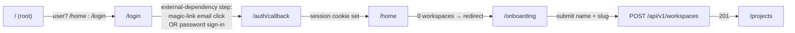
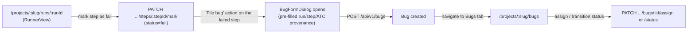
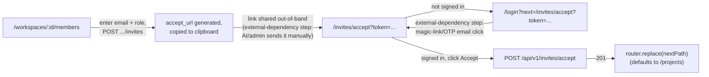
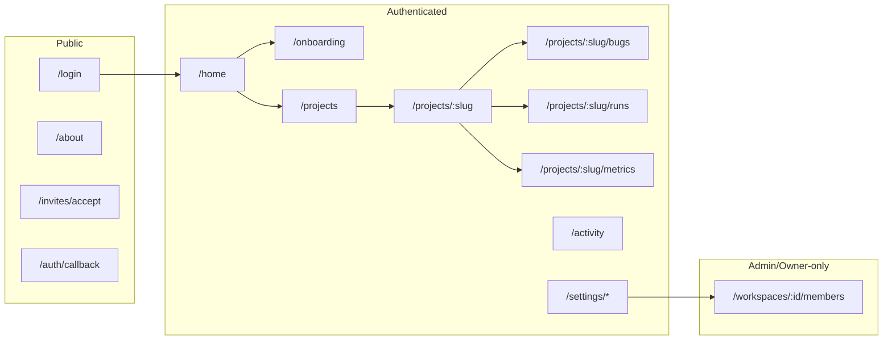

```mermaid
flowchart LR
    A["/projects/:slug\n(workbench)"] -->|"open story form"| B["User Story form\n(dialog)"]
    B -->|"POST /api/v1/user-stories"| C["Story created"]
    C -->|"open AC panel"| D["Acceptance Criterion form\n(dialog)"]
    D -->|"POST .../acceptance-criteria"| E["AC created"]
    E -->|"Create ATC (pre-anchored)"| F["/projects/:slug/atcs/new?story=&ac="]
    F -->|"POST /api/v1/atcs"| G["ATC created →\n/projects/:slug/atcs/:atcId"]
```

```mermaid
flowchart LR
    A["/projects/:slug/tests/new"] -->|"pick ATC chain, POST /api/v1/tests"| B["Test created →\n/projects/:slug"]
    B -->|"open Test detail"| C["/projects/:slug/tests/:testId"]
    C -->|"Start run (pick Environment),\nPOST /api/v1/runs"| D["Run created →\n/projects/:slug/runs/:runId"]
    D -->|"mark each step pass/fail"| E["PATCH .../steps/:stepId/mark"]
    E -->|"all steps marked"| F["Run status: passed/failed"]
```

# User Journeys — Bunkai TMS

> Target: `upex-bunkai-tms` (local path `../upex-bunkai-tms`). Routes = Next.js 15 App Router (`app/`). Built from a fresh route-tree + navigation + redirect-pattern read on top of `executive-summary.md` and `user-personas.md`. Personas referenced below are the four `workspace_members.role` values documented in `user-personas.md` (`viewer` / `member` / `admin` / `owner`).
> Generated: 2026-08-17

---

## 1. Route Map

### Public Routes (Unauthenticated)

| Route | Page | Purpose |
|---|---|---|
| `/login` | `app/(auth)/login/page.tsx` | Email-first sign-in/sign-up (check-email → password or create → OTP verify) |
| `/about` | `app/about/page.tsx` | Marketing/about page |
| `/design-tokens` | `app/design-tokens/page.tsx` | Internal design-system reference page |
| `/qa` | `app/qa/page.tsx` | QA/dev utility page |
| `/api/docs` | `app/api/docs/page.tsx` | Rendered API documentation (OpenAPI viewer) |
| `/auth/callback` | `app/auth/callback/route.ts` | Magic-link / OTP exchange callback (route handler, not a page) |
| `/auth/oauth/[provider]` | `app/auth/oauth/[provider]/route.ts` | OAuth provider redirect initiator (route handler) |
| `/invites/accept` | `app/invites/accept/page.tsx` | Invite-token landing page; gates into `needs-auth` if not signed in |
| `/api/v1/*` | `app/api/v1/**/route.ts` | Versioned JSON API surface (not a browser page — listed for completeness per `executive-summary.md` §2) |

Middleware public-prefix allowlist confirms `/login`, `/auth`, `/api/auth` bypass the auth gate: `middleware.ts:11` (`PUBLIC_PREFIXES`).

### Protected Routes (Authenticated)

| Route | Page | Requires (role) | Purpose |
|---|---|---|---|
| `/home` | `app/(app)/home/page.tsx` | any active member (any role) | Post-login landing/dashboard |
| `/onboarding` | `app/(app)/onboarding/page.tsx` | authenticated, zero workspaces | First-workspace creation form |
| `/projects` | `app/(app)/projects/page.tsx` | any active member | Project list for the active workspace |
| `/projects/new` | `app/(app)/projects/new/page.tsx` | `member`+ (write policies) | Create-project form |
| `/projects/[projectSlug]` | `app/(app)/projects/[projectSlug]/page.tsx` | any active member (read); `member`+ to author | Project workbench (explorer, stories, ACs, ATCs) |
| `/projects/[projectSlug]/bugs` | `app/(app)/projects/[projectSlug]/bugs/page.tsx` | any active member (read); `member`+ to create/assign | Bug list + heatmap |
| `/projects/[projectSlug]/metrics` | `app/(app)/projects/[projectSlug]/metrics/page.tsx` | any active member | Project metrics dashboard |
| `/projects/[projectSlug]/traceability` | `app/(app)/projects/[projectSlug]/traceability/page.tsx` | any active member | Requirement-to-ATC traceability report |
| `/projects/[projectSlug]/milestones` | `app/(app)/projects/[projectSlug]/milestones/page.tsx` | any active member (read); `member`+ to author | Milestone list |
| `/projects/[projectSlug]/runs` | `app/(app)/projects/[projectSlug]/runs/page.tsx` | any active member | Run history for the project |
| `/projects/[projectSlug]/tests/new` | `app/(app)/projects/[projectSlug]/tests/new/page.tsx` | `member`+ | Compose a Test (chain ATCs) |
| `/activity` | `app/(app)/activity/page.tsx` | any active member | Workspace activity feed |
| `/settings` | `app/(app)/settings/page.tsx` | authenticated | Redirects to `/settings/account` (`app/(app)/settings/page.tsx:1`) |
| `/settings/account` | `app/(app)/settings/account/page.tsx` | authenticated | Personal account settings |
| `/settings/notifications` | `app/(app)/settings/notifications/page.tsx` | authenticated | Notification preferences |
| `/settings/tokens` | `app/(app)/settings/tokens/page.tsx` | authenticated | Personal Access Token management |
| `/settings/workspaces` | `app/(app)/settings/workspaces/page.tsx` | authenticated | Workspace-switcher settings view |

Protected-prefix gate: `middleware.ts:9` (`PROTECTED_PREFIXES = ['/home', '/projects', '/onboarding', '/settings', '/activity']`); unauthenticated hit → `NextResponse.redirect` to `/login?next=<path>` (`middleware.ts:44-48`).

### Dynamic Routes

| Pattern | Example | Purpose |
|---|---|---|
| `/projects/[projectSlug]/atcs/new` | `/projects/acme-qa/atcs/new` | ATC authoring form, optionally pre-anchored via `?story=&ac=` query params (`app/(app)/projects/[projectSlug]/atcs/new/page.tsx:11`) |
| `/projects/[projectSlug]/atcs/[atcId]` | `/projects/acme-qa/atcs/atc_123` | ATC detail/edit view |
| `/projects/[projectSlug]/tests/[testId]` | `/projects/acme-qa/tests/test_456` | Test detail (Steps tab); shell also renders the "Start run" control (`app/(app)/projects/[projectSlug]/tests/[testId]/layout.tsx:60-65`) |
| `/projects/[projectSlug]/tests/[testId]/runs` | `/projects/acme-qa/tests/test_456/runs` | Run history scoped to one Test |
| `/projects/[projectSlug]/runs/[runId]` | `/projects/acme-qa/runs/run_789` | Run execution/results view (`RunnerView`) |
| `/projects/[projectSlug]/milestones/[milestoneId]` | `/projects/acme-qa/milestones/ms_1` | Milestone detail |
| `/workspaces/[id]/members` | `/workspaces/ws_1/members` | Workspace roster + invite management (`admin`/`owner` only) |
| `/auth/oauth/[provider]` | `/auth/oauth/google` | OAuth provider-specific redirect initiator |

---

## 2. Journey 1 — New User Onboarding → First Workspace

**Persona**: any authenticated user with zero workspace memberships (pre-role — role is assigned only once a workspace exists). **Goal**: go from a fresh sign-in to owning a workspace they can start working in. **Discovered From**: `app/page.tsx:14` (root redirect), `app/(app)/home/page.tsx:106` and `app/(app)/onboarding/page.tsx` (zero-workspace redirect), `app/(app)/onboarding/onboarding-form.tsx`.

### Flow Diagram

### Step-by-Step Flow

| Step | Page | Action | Next | Evidence (file:line) |
|---|---|---|---|---|
| 1 | `/` | Root visit; server checks session | `/home` if signed in, else `/login` | `app/page.tsx:14` |
| 2 | `/login` | User submits email; API checks existence | `password` step (existing) or `create` step (new) | `app/(auth)/login/email-first-form.tsx:62-96` |
| 3 | `/login` (create step) | User sets password → account created, unconfirmed | `verify` step (OTP) — **external-dependency step**: the OTP arrives by email and cannot be simulated from the code alone | `app/(auth)/login/email-first-form.tsx:15,116-121` |
| 4 | `/auth/callback` | Magic-link/OTP exchange completes, session cookies set | Redirect to `safeNext` (defaults into the app) | `app/auth/callback/route.ts` |
| 5 | `/home` | Server component checks workspace count | 0 workspaces → `/onboarding`; else stays on `/home` | `app/(app)/home/page.tsx:106` |
| 6 | `/onboarding` | User fills workspace name; slug auto-derives, editable | Submit enabled once name + valid slug present | `app/(app)/onboarding/onboarding-form.tsx:59-85` |
| 7 | `/onboarding` | Form POSTs `{ slug, name }` | 201 → workspace created, becomes `owner` | `app/(app)/onboarding/onboarding-form.tsx:89-93` |
| 8 | `/onboarding` | On success, client redirects | `router.replace('/projects')` + `router.refresh()` | `app/(app)/onboarding/onboarding-form.tsx:105-106` |

### Error Paths

| Error | Handling | Evidence |
|---|---|---|
| Slug already taken | Toast: `Slug "<slug>" is taken — try another.` (form stays open, no navigation) | `app/(app)/onboarding/onboarding-form.tsx:96-101` |
| Invalid slug (fails `SLUG_REGEX`) | Client-side guard blocks submit; toast `Use at least 3 letters or digits…` | `app/(app)/onboarding/onboarding-form.tsx:81-84` |
| Network error during workspace create | Toast with error message; `submitting` reset so user can retry | `app/(app)/onboarding/onboarding-form.tsx:108-111` |
| Already-authenticated user hits `/onboarding` with ≥1 workspace | Server redirect straight to `/projects`, bypassing the form | `app/(app)/onboarding/page.tsx:23` |
| Unauthenticated hit on any protected onboarding/home/projects route | Redirect to `/login?next=<original path>` | `app/(app)/home/page.tsx:72`, `app/(app)/onboarding/page.tsx:12`, `app/(app)/projects/page.tsx:27`, `middleware.ts:44-48` |
| 429 rate limit on check-email/signin | Toast: `Too many attempts. Please wait a moment and retry.` | `app/(auth)/login/email-first-form.tsx:72-75,112-115` |

### Success Criteria

- [ ] User lands on `/projects` with a workspace where their `workspace_members.role = 'owner'`.
- [ ] Session cookie is present and subsequent protected-route visits do not redirect to `/login`.
- [ ] Workspace slug is unique and URL-valid (`SLUG_REGEX`).

---

## 3. Journey 2 — Author User Story → Acceptance Criterion → ATC

**Persona**: QA Contributor (`member`) or higher. **Goal**: turn a requirement into a reusable, traceable Acceptance Test Case. **Discovered From**: `app/(app)/projects/[projectSlug]/user-story-form.tsx`, `app/(app)/projects/[projectSlug]/acceptance-criteria-panel.tsx`, `components/atcs/NewAtcEditor.tsx`.

### Flow Diagram

### Step-by-Step Flow

| Step | Page | Action | Next | Evidence (file:line) |
|---|---|---|---|---|
| 1 | `/projects/[projectSlug]` | User opens the User Story create form from the explorer | Form renders, anchored to a `moduleId` | `app/(app)/projects/[projectSlug]/user-story-form.tsx:28-34` |
| 2 | `/projects/[projectSlug]` | Submits title/description/optional Jira `external_id` | `POST`/`PATCH` to `/api/v1/user-stories` (create vs edit) | `app/(app)/projects/[projectSlug]/user-story-form.tsx:86-115` |
| 3 | `/projects/[projectSlug]` | Story saved; tree + panel refresh | `router.refresh()` | `app/(app)/projects/[projectSlug]/user-story-form.tsx:115` |
| 4 | `/projects/[projectSlug]` | User opens the Acceptance Criteria panel for the story | Fetches existing ACs | `app/(app)/projects/[projectSlug]/acceptance-criteria-panel.tsx:83` |
| 5 | `/projects/[projectSlug]` | Submits new AC text | `POST /api/v1/user-stories/:id/acceptance-criteria` | `app/(app)/projects/[projectSlug]/acceptance-criteria-panel.tsx:109-122` |
| 6 | `/projects/[projectSlug]/atcs/new` | User navigates to "Create ATC", optionally pre-anchored to the story/AC via query params | Module picker + AC anchoring panel pre-populated | `app/(app)/projects/[projectSlug]/atcs/new/page.tsx:11-12,53` (comment) |
| 7 | `/projects/[projectSlug]/atcs/new` | User composes steps/assertions and selects ≥1 AC to anchor to (BR-1 "anchoring moat") | Submit button disabled until `anchored === true` | `components/atcs/NewAtcEditor.tsx:129-182` |
| 8 | `/projects/[projectSlug]/atcs/new` | Form POSTs `/api/v1/atcs` | 201 → redirect to the new ATC detail page | `components/atcs/NewAtcEditor.tsx:206-231` |

### Error Paths

| Error | Handling | Evidence |
|---|---|---|
| Title too short/long, external Jira ID malformed or duplicate | Field-specific toast/inline message via `friendlyError()` | `app/(app)/projects/[projectSlug]/user-story-form.tsx:39-66` |
| ATC submitted without any AC anchor | Server rejects `ac_outside_user_story`; client shows `PROVENANCE_MESSAGE` and keeps the submit button disabled client-side too | `components/atcs/NewAtcEditor.tsx:78-79,182` |
| Not a project member (`not_a_member`) | Friendly message: "You do not have permission in this project." | `app/(app)/projects/[projectSlug]/user-story-form.tsx:55-56` |
| Story/AC no longer exists (stale UI) | `not_found` → "This story no longer exists." | `app/(app)/projects/[projectSlug]/user-story-form.tsx:59-60` |
| Session expired mid-form | `unauthorized` → "Your session expired — sign in again." | `app/(app)/projects/[projectSlug]/user-story-form.tsx:61-62` |

### Success Criteria

- [ ] User Story exists with ≥1 Acceptance Criterion.
- [ ] ATC exists, anchored to ≥1 AC (never zero — BR-1 enforced both client- and server-side).
- [ ] New ATC is reachable at `/projects/[projectSlug]/atcs/[atcId]`.

---

## 4. Journey 3 — Compose Test → Execute Run → View Result

**Persona**: QA Contributor (`member`) or higher. **Goal**: chain existing ATCs into a Test, run it against an Environment, and see pass/fail per step. **Discovered From**: `components/tests/NewTestBuilder.tsx`, `components/tests/StartRunButton.tsx`, `components/runs/RunnerView.tsx`.

### Flow Diagram

### Step-by-Step Flow

| Step | Page | Action | Next | Evidence (file:line) |
|---|---|---|---|---|
| 1 | `/projects/[projectSlug]/tests/new` | User picks a title and chains ATCs from the library into an ordered list | Chain assembled client-side | `components/tests/NewTestBuilder.tsx:55-59` |
| 2 | `/projects/[projectSlug]/tests/new` | Submits with an `Idempotency-Key` header | `POST /api/v1/tests` | `components/tests/NewTestBuilder.tsx:67-77` |
| 3 | `/projects/[projectSlug]/tests/new` | On success, redirected back to the project workbench | `router.push('/projects/:slug')` | `components/tests/NewTestBuilder.tsx:93-95` |
| 4 | `/projects/[projectSlug]/tests/[testId]` | User opens the Test detail; "Start run" control renders in the shared layout if they `canReorder` (author permission) | Environment picker shown | `app/(app)/projects/[projectSlug]/tests/[testId]/layout.tsx:59-65` |
| 5 | `/projects/[projectSlug]/tests/[testId]` | User selects an Environment and clicks Start | `POST /api/v1/runs` with `{ test_id, environment_id }` + `Idempotency-Key` | `components/tests/StartRunButton.tsx:57-71` |
| 6 | `/projects/[projectSlug]/tests/[testId]` | 201 (created) or 200 (idempotent replay) both return `{ run }` | Redirect to the Run detail | `components/tests/StartRunButton.tsx:88-99` |
| 7 | `/projects/[projectSlug]/runs/[runId]` | `RunnerView` loads the run; user marks each step `pass`/`fail` with optional notes | `PATCH /api/v1/runs/:id/steps/:stepId/mark` per step | `components/runs/RunnerView.tsx:484` |
| 8 | `/projects/[projectSlug]/runs/[runId]` | Once all steps are marked, the run's overall status renders as `passed`/`failed` | Terminal state; user may `finish`/`abort` the run | `components/runs/RunnerView.tsx:369,418,658-671` |

### Error Paths

| Error | Handling | Evidence |
|---|---|---|
| Test has no executable ATC steps | Server 422 `no_executable_steps`; frozen server copy shown verbatim via toast | `components/tests/StartRunButton.tsx:75-78` (comment cites exact frozen message) |
| Run creation retried with a changed payload under the same Idempotency-Key | Server 409 conflict; client rotates the key for the next attempt | `components/tests/StartRunButton.tsx:78-83` |
| No environments configured for the project | "Start run" control renders a disabled/empty state instead of a form | `components/tests/StartRunButton.tsx:41-47` |
| Test creation fails (e.g. foreign/nonexistent ATC in chain) | Non-disclosure-safe server message rendered verbatim; idempotency key rotated for retry | `components/tests/NewTestBuilder.tsx:79-90` |
| Response missing `run.id` on the "success" path | Toast fallback "Could not start the run."; key rotated | `components/tests/StartRunButton.tsx:92-97` |

### Success Criteria

- [ ] Test exists with an ordered ATC chain (`test_steps`).
- [ ] Run exists, is bound to one Environment, and reflects an immutable snapshot of the Test at start time (BR-3).
- [ ] Every step in the run reaches a terminal `pass`/`fail` status; the run's own status aggregates correctly.

---

## 5. Journey 4 — File a Bug From a Failed Run Step

**Persona**: QA Contributor (`member`) or higher (bug creation and self-assignment require `member`+; `viewer` can read but never file or be assigned — `user-personas.md` §2). **Goal**: turn a failed Run Step directly into a tracked Bug without leaving the run screen. **Discovered From**: `components/runs/RunnerView.tsx`, `components/bugs/BugFormDialog.tsx`, `components/bugs/BugsListView.tsx`.

### Flow Diagram

### Step-by-Step Flow

| Step | Page | Action | Next | Evidence (file:line) |
|---|---|---|---|---|
| 1 | `/projects/[projectSlug]/runs/[runId]` | User opens the mark-form for a step and selects `failed` | Internal status mapped `'failed' → 'fail'` for the API verb | `components/runs/RunnerView.tsx:157-161` |
| 2 | `/projects/[projectSlug]/runs/[runId]` | Mark submitted | `PATCH /api/v1/runs/:runId/steps/:stepId/mark` | `components/runs/RunnerView.tsx:484` |
| 3 | `/projects/[projectSlug]/runs/[runId]` | `bugDialogStepId` set for the failed step, opening `BugFormDialog` pre-filled with run/step/ATC provenance | `BugFormDialog` renders, remounting fresh per step (state isolation) | `components/runs/RunnerView.tsx:214,1218-1222` |
| 4 | `/projects/[projectSlug]/runs/[runId]` | User fills severity/description and submits | `POST /api/v1/bugs` | `components/bugs/BugFormDialog.tsx:145` |
| 5 | `/projects/[projectSlug]/bugs` | User (or a teammate) later reviews/assigns the Bug from the list | `PATCH /api/v1/bugs/:id/assign` | `components/bugs/BugsListView.tsx:447` |
| 6 | `/projects/[projectSlug]/bugs` | Status advanced through its forward-only lifecycle (BR-5) | `PATCH /api/v1/bugs/:id/status` | `components/bugs/BugsListView.tsx:490` |

### Error Paths

| Error | Handling | Evidence |
|---|---|---|
| Assigning a Bug to a `viewer` | Server rejects with `bug_assignee_view_only` (SQLSTATE `45313`) | `user-personas.md` §2 citing `supabase/migrations/0054_bug_assignment_status.sql:171,510` |
| Bug status transition skipped or moved backward | Server rejects with `bug_status_transition_skipped`/`_backward` (`45310`/`45311`) | `user-personas.md` §3 citing `supabase/migrations/0054_bug_assignment_status.sql:589-601` |
| `viewer` attempts to file a Bug | Rejected at the RLS layer (`bugs_insert_workspace_role_member_plus` excludes `viewer`) — independent of any UI gate | `user-personas.md` §2, `supabase/migrations/0046_bugs.sql:148-160` |

### Success Criteria

- [ ] Failed Run Step has a Bug linked with Run/Step/ATC provenance recorded.
- [ ] Bug is assignable only to non-`viewer` active members.
- [ ] Bug status only ever advances forward through its defined lifecycle.

---

## 6. Journey 5 — Invite a Teammate to the Workspace

**Persona**: Workspace Administrator (`admin`) or Owner (`owner`) generates the invite; the invited person (any future role) redeems it. **Goal**: get a new teammate an active `workspace_members` row with the intended role. **Discovered From**: `app/(app)/workspaces/[id]/members/members-client.tsx`, `app/invites/accept/accept-client.tsx`, `app/invites/accept/page.tsx`.

### Flow Diagram

### Step-by-Step Flow

| Step | Page | Action | Next | Evidence (file:line) |
|---|---|---|---|---|
| 1 | `/workspaces/[id]/members` | Admin/owner enters an email and picks a role (`viewer`/`member`/`admin` — `owner` is not invitable) | Submit enabled once email present | `app/(app)/workspaces/[id]/members/members-client.tsx:39-44` |
| 2 | `/workspaces/[id]/members` | Form POSTs `{ email, role }` | `POST /api/v1/workspaces/:id/invites` | `app/(app)/workspaces/[id]/members/members-client.tsx:47-51` |
| 3 | `/workspaces/[id]/members` | Response returns `accept_url`; copied to clipboard, success toast shown | Admin manually shares the link (Slack/email/etc.) — **external-dependency step**, no in-app email send is coded | `app/(app)/workspaces/[id]/members/members-client.tsx:58-62` |
| 4 | `/invites/accept?token=...` | Invitee opens the link; page checks session | `ready` (signed in) or `needs-auth` | `app/invites/accept/accept-client.tsx:26-35` |
| 5 | `/invites/accept?token=...` | If `needs-auth`, user is routed to sign in with `next` pointing back to the accept page | `/login?next=/invites/accept?token=...` — **external-dependency step**: if the invitee needs a magic-link/OTP, that email click cannot be simulated from code | `app/invites/accept/accept-client.tsx:62-65` |
| 6 | `/invites/accept?token=...` | Signed-in user clicks "Accept invite" | `POST /api/v1/invites/accept` with `{ token }` | `app/invites/accept/accept-client.tsx:37-44` |
| 7 | `/invites/accept?token=...` | On success, `workspace_members` row created for the invitee | `router.replace(nextPath)` (defaults to `/projects`) + `router.refresh()` | `app/invites/accept/accept-client.tsx:52-54`, `app/invites/accept/page.tsx:16` |

### Error Paths

| Error | Handling | Evidence |
|---|---|---|
| Invite creation fails (e.g. not admin/owner, invalid role) | Toast: `body.error?.message ?? 'Could not create invite.'` | `app/(app)/workspaces/[id]/members/members-client.tsx:52-56` |
| Missing token on the accept page | `phase = 'error'`, message "Missing invite token." | `app/invites/accept/accept-client.tsx:27-30` |
| Accept call fails (expired/revoked/already-used token) | `phase = 'error'`, server message shown, "Back to sign-in" button offered | `app/invites/accept/accept-client.tsx:45-50,110-118` |
| Admin attempts to invite as `owner` | Rejected — `workspace_invites.role` enum excludes `owner` | `user-personas.md` §4 citing `supabase/migrations/0010_workspace_invites.sql:17-18` |

### Success Criteria

- [ ] Invite row created with a bounded expiry and the intended role.
- [ ] Invitee ends up with an active `workspace_members` row matching the invited role.
- [ ] Invite cannot be redeemed twice or after expiry (not directly evidenced in this pass — flagged in Discovery Gaps).

---

## 7. Navigation Structure

Sidebar nav item source: `components/layout/AppSidebar.tsx:167-174` (`Home`, `Activity`, `Projects`, `ATC Library`*, `Test Runs`*, `Bug Reports`*, `Metrics`*, `Settings` — items marked `*` have `href: null`, i.e. no direct top-level route exists yet for them; they are reached through a Project first). Settings sub-nav back-link to `/projects`: `components/settings/SettingsNav.tsx:27-34`.

---

## 8. Breadcrumb Patterns

| Path | Breadcrumb |
|---|---|
| `/projects/[projectSlug]/*` (workbench sections) | `Workspace name / Project name / Section label` — `app/(app)/projects/[projectSlug]/project-shell.tsx:85` |
| `/projects/[projectSlug]/atcs/new` and ATC editor | `Module path segments` joined with `›` (e.g. `Auth › Login`) — `components/atcs/NewAtcEditor.tsx:500`, `components/atcs/AtcPreview.tsx:72-76` |
| `/projects/[projectSlug]/tests/[testId]/*` | `Tests / <Test title>` chrome bar (back-link + label, not a full breadcrumb trail) — `app/(app)/projects/[projectSlug]/tests/[testId]/layout.tsx:36-57` |
| `/settings/*` | No breadcrumb; a "Back to app" link to `/projects` instead — `components/settings/SettingsNav.tsx:27-34` |

---

## 9. Critical Paths

### Happy Paths (Must Work)

| Journey | Start | End | Business Impact |
|---|---|---|---|
| Onboarding | `/` (fresh sign-in) | `/projects` with an owned workspace | Blocks 100% of product usage until complete — the single hardest gate in the product |
| Story → AC → ATC authoring | `/projects/[slug]` | New ATC at `/projects/[slug]/atcs/[atcId]`, anchored | Core value proposition: structural traceability (`executive-summary.md` Key Differentiator) |
| Test → Run → Result | `/projects/[slug]/tests/new` | Run reaches a terminal `passed`/`failed` status | The actual "do QA" loop; everything else supports this |
| Bug from failed step | Run marked `fail` | Bug created with Run/Step/ATC provenance | Closes the loop from defect discovery to tracked remediation |
| Invite → join | `/workspaces/[id]/members` | Invitee has an active `workspace_members` row | Team growth path; blocks multi-user adoption if broken |

### Unhappy Paths (Must Handle)

| Scenario | Expected Behavior | Evidence |
|---|---|---|
| Unauthenticated access to any protected route | Redirect to `/login?next=<original>`, return to the same route post-auth | `middleware.ts:44-48` |
| Zero-workspace user hits a route other than `/onboarding` | Server-side redirect to `/onboarding` | `app/(app)/home/page.tsx:106`, `app/(app)/projects/page.tsx:39`, `app/(app)/projects/new/page.tsx:33` |
| ATC submitted with zero AC anchors | Client blocks submit; server enforces `ac_outside_user_story` regardless | `components/atcs/NewAtcEditor.tsx:78-79,182` |
| Run started twice with the same Idempotency-Key + same payload | Replays the original run (200, not a duplicate 201) | `components/tests/StartRunButton.tsx:88-89` (comment) |
| `viewer` attempts any write (bug, ATC, story, run) | Rejected at the RLS layer independent of UI | `user-personas.md` §2 |
| Invite token expired/invalid/already used | Accept page shows `phase='error'` with server message | `app/invites/accept/accept-client.tsx:45-50` |

---

## 10. Discovery Gaps

| Flow | Unknown | Question |
|---|---|---|
| OTP/magic-link email click (Journeys 1 and 5) | Cannot verify the actual email content, delivery, or click-through behavior from code alone — flagged per this pass's instructions as an external-dependency step at every occurrence | Confirm with a live Supabase/email-provider test, or ask whether a test inbox (e.g. Mailhog/Resend sandbox) is available for automation |
| Invite expiry/reuse enforcement | `members-client.tsx` shows an `expires_at` field but this pass did not trace the server-side rejection path for an expired or already-accepted token | Grep `app/api/v1/workspaces/[id]/invites/route.ts` and `app/api/v1/invites/accept/route.ts` server handlers directly (out of scope for this route/nav-focused pass) |
| "ATC Library" / "Test Runs" / "Bug Reports" / "Metrics" sidebar items with `href: null` | These render as non-navigable nav entries at the top level — unclear if they're planned top-level routes or intentionally project-scoped only | Ask product owner whether workspace-wide (cross-project) views for these are planned |
| Milestone authoring journey | Route exists (`/projects/[slug]/milestones`, `/milestones/[milestoneId]`) but this pass did not trace its create/edit flow — excluded from the 5 chosen journeys per the 3-5 cap | Would need a dedicated pass through `components/milestones/` if milestones become QA-critical |
| Jira import journey (`POST /api/v1/imports`) | Referenced in `executive-summary.md` as a Core Capability but no UI entry point was located in this route/nav pass | Grep for an "Import from Jira" trigger component (candidate: `import-from-jira-dialog.tsx`, not traced end-to-end here) |
| `/settings/workspaces` and `/settings/notifications` flows | Routes exist but their step-level behavior wasn't traced — out of scope for the 5 chosen journeys | Dedicated settings-flow pass if these become QA-critical |

---

## 11. QA Relevance

### Critical E2E Test Scenarios

| Priority | Scenario | Journey Reference |
|---|---|---|
| P0 | Fresh sign-up → workspace creation → land on `/projects` as `owner` | Journey 1 |
| P0 | ATC creation is blocked (client + server) when zero ACs are anchored | Journey 2 |
| P0 | Run reaches a terminal status and its snapshot is immutable after Test edits (BR-3) | Journey 3 |
| P0 | Bug filed from a failed step carries correct Run/Step/ATC provenance | Journey 4 |
| P1 | Idempotent Run creation replays instead of duplicating on retry with the same key | Journey 3 |
| P1 | Invite redemption creates a `workspace_members` row with the exact invited role | Journey 5 |
| P1 | `viewer` is rejected at every write attempt across all four core resources (story/AC/ATC, test, run, bug) | Cross-cutting (Journeys 2-4) |
| P1 | Bug status transitions only move forward (no skip, no backward) | Journey 4 |
| P2 | Unauthenticated deep-link to any protected route round-trips correctly via `?next=` after login | Journey 1 (error path), all protected routes |
| P2 | Slug collision on workspace creation surfaces a retryable, non-blocking error | Journey 1 (error path) |
| P2 | Admin cannot invite as `owner`; Admin cannot update/delete the workspace itself | Journey 5 (error path) |

### Suggested Test Data

| Journey | Test User | Prerequisites |
|---|---|---|
| Onboarding | Fresh, never-seen email | No pre-existing `auth.users` row (per `user-personas.md` §9, no per-role `.env` keys currently exist — flagged there) |
| Story → AC → ATC | `member` in a workspace with ≥1 Project + ≥1 Module | Module must not be `archived_at` |
| Test → Run → Result | `member` in a Project with ≥1 ATC and ≥1 configured Environment | `StartRunButton` renders an empty state with zero environments (`components/tests/StartRunButton.tsx:41-47`) — worth testing directly |
| Bug from failed step | `member` (or `admin`/`owner`) executing an active Run | Run must have ≥1 step; a `viewer` account is useful as a negative-path test user |
| Invite → join | `admin` or `owner` inviting a fresh email; a second browser/session for the invitee | Confirms cross-session invite redemption, not just same-session |

Full role/permission doctrine: `.context/PRD/user-personas.md` §6-9. Feature taxonomy: `.context/business/business-feature-map.md` (once generated by `/business-feature-map`).
