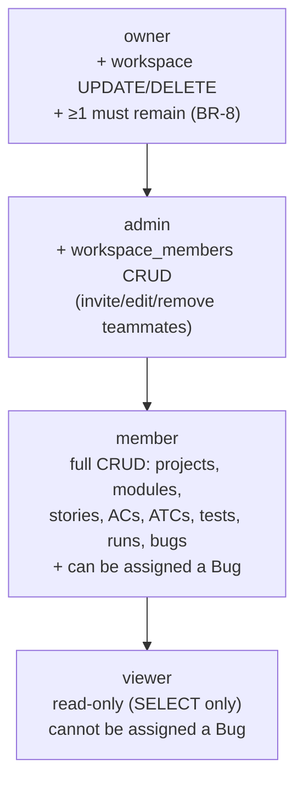

# User Personas — Bunkai TMS

> Target: `upex-bunkai-tms` (local path `../upex-bunkai-tms`). Personas = the four `workspace_members.role` values the RLS layer and RPC layer actually enforce — no demographic personas invented. Verified against `supabase/migrations/0001_tenancy.sql`, `0002_projects_modules.sql`, `0031_runs.sql`, `0044_leave_workspace.sql`, `0046_bugs.sql`, `0054_bug_assignment_status.sql` (124 total `create policy` statements confirmed via case-insensitive grep across all 69 migrations).
> Generated: 2026-08-17

---

## 1. Persona Discovery Summary

| Persona | System Role | Access Level | Primary Goal |
|---|---|---|---|
| Read-Only Reviewer | `viewer` | Read-only across all workspace-scoped tables; cannot be assigned Bugs | Monitor QA progress without risk of accidental edits |
| QA Contributor | `member` | Full author/execute rights on Projects, Modules, Stories, ACs, ATCs, Tests, Runs, Bugs | Do the day-to-day QA work: write test cases, run them, file bugs |
| Workspace Administrator | `admin` | Everything `member` has, plus manage `workspace_members` (invite/edit/remove) | Manage the team roster without needing full ownership |
| Workspace Owner | `owner` | Everything `admin` has, plus update/delete the `workspaces` row itself | Ultimate accountability for the workspace's existence and billing-adjacent settings |

Source for the four-value enum: `supabase/migrations/0001_tenancy.sql:43-44` (`workspace_members.role`), cross-checked in `domain-glossary.md` §2.

---

## 2. Persona: Read-Only Reviewer (`viewer`)

### Identity
- System Role: `viewer` (`workspace_members.role = 'viewer'`)
- Evidence file: `supabase/migrations/0001_tenancy.sql:43-44`
- Access Level: Read-only (SELECT policies only — every `*_select_workspace_member` policy admits any active member regardless of role, e.g. `runs_select_workspace_member` at `supabase/migrations/0031_runs.sql:103`)
- Estimated % of Users: Not discoverable from code — no seed data or analytics found (flagged in Discovery Gaps below).

### Goals (Inferred from Features)
| Goal | Supporting Feature | Route/Component |
|---|---|---|
| Check whether a Run passed or failed | Run status read | `runs_select_workspace_member` policy, `supabase/migrations/0031_runs.sql:103-109` |
| See which Bugs are open against a Project | Bug list read | `bugs_select_workspace_member` policy, `supabase/migrations/0046_bugs.sql:133-146` |
| Review ATC/Test/coverage state without editing anything | Coverage/traceability reporting endpoints | `public/openapi.json` `/api/v1/projects/{id}/coverage` (cited in `executive-summary.md` §2) |

### Pain Points (Inferred from Validation/Errors)
| Pain Point | Evidence |
|---|---|
| Cannot be assigned a Bug even if best positioned to triage it | `bug_assignee_view_only` (SQLSTATE `45313`) — raised when `v_assignee_role = 'viewer'`, `supabase/migrations/0054_bug_assignment_status.sql:171,510` |
| Cannot create/edit/delete any workspace resource (Projects, Modules, Stories, ATCs, Tests, Runs, Bugs) | Every `*_insert_workspace_role_member_plus` / `*_update_workspace_role_member_plus` / `*_delete_workspace_role_member_plus` policy requires `role in ('member','admin','owner')` — viewer excluded, e.g. `supabase/migrations/0002_projects_modules.sql:49-96` |

### Feature Access
| Feature | Access | Evidence |
|---|---|---|
| View Projects/Modules/Stories/ACs/ATCs/Tests/Runs/Bugs | Full (read) | `*_select_workspace_member` policies across `0002`, `0003`, `0004`, `0031`, `0046` |
| Create/edit/delete any of the above | None | `*_workspace_role_member_plus` policies require `role >= member` |
| Be assigned a Bug | None | `bug_assignee_view_only`, `0054_bug_assignment_status.sql:171,510` |
| Manage workspace members/invites | None | `workspace_members_insert_admin` / `_update_admin` / `_delete_admin` require `role in ('admin','owner')`, `0001_tenancy.sql:157-199` |
| Update/delete the workspace itself | None | `workspaces_update_owner` / `_delete_owner` require `role = 'owner'`, `0001_tenancy.sql:93-129` |

### User Journey Summary
`Log in → open workspace → browse Projects/Modules/Tests/Runs/Bugs (read-only) → cannot edit`

### Profile Attributes
From `workspace_members` (`0001_tenancy.sql:40-49`): `workspace_id`, `user_id` (composite PK), `role='viewer'`, `status` (`active`\|`invited`\|`suspended`), `joined_at`. No separate `user_profile` table exists in the schema — identity fields (name, email) live in Supabase-managed `auth.users`, not a Bunkai table.

### Representative Quote (inferred)
"I just need to see if last night's Run passed before standup — I don't need to touch anything." *(inferred — no direct user quote exists in the repo)*

---

## 3. Persona: QA Contributor (`member`)

### Identity
- System Role: `member` (`workspace_members.role = 'member'`)
- Evidence file: `supabase/migrations/0001_tenancy.sql:43-44`
- Access Level: Full author + execute rights on all workspace-scoped resources except member management and workspace-level settings
- Estimated % of Users: Not discoverable from code — flagged in Discovery Gaps.

### Goals (Inferred from Features)
| Goal | Supporting Feature | Route/Component |
|---|---|---|
| Author User Stories + Acceptance Criteria | `user_stories_insert_workspace_role_member_plus`, `acceptance_criteria_insert_workspace_role_member_plus` | `supabase/migrations/0003_authoring.sql:50-69,158-178` |
| Write ATCs anchored to ≥1 AC | `atcs_insert_workspace_role_member_plus` + BR-1 anchoring moat | `supabase/migrations/0004_atcs.sql:111-129`; RPC `bunkai_create_atc`, `0021_atc_create_update.sql:158-169` |
| Chain ATCs into a Test and execute a Run | `tests`/`test_steps` composition; `runs_insert_workspace_role_member_plus` | `supabase/migrations/0024_tests.sql`; `0031_runs.sql:111-134` |
| File a Bug from a failed Run Step | `bugs_insert_workspace_role_member_plus` | `supabase/migrations/0046_bugs.sql:148-160` |

### Pain Points (Inferred from Validation/Errors)
| Pain Point | Evidence |
|---|---|
| Cannot create an ATC without linking it to an existing AC in the same User Story | `ac_outside_user_story` (SQLSTATE `45020`), `supabase/migrations/0021_atc_create_update.sql:158-169` |
| Cannot advance a Bug's status out of order | `bug_status_transition_skipped` (`45310`) / `bug_status_transition_backward` (`45311`), `0054_bug_assignment_status.sql:589-601` |
| Cannot manage the team roster (invite/remove teammates) even though they can create everything else | `workspace_members_insert_admin`/`_delete_admin` require `role in ('admin','owner')`, `0001_tenancy.sql:157-199` |

### Feature Access
| Feature | Access | Evidence |
|---|---|---|
| Projects/Modules/Stories/ACs/ATCs/Tests/Runs/Bugs — full CRUD | Full | All `*_workspace_role_member_plus` policies, `0002`–`0046` |
| Bug assignment target (can be assigned a Bug) | Full | `assignee_role <> 'viewer'` gate implicitly admits `member`, `0054_bug_assignment_status.sql:171,510 (v_assignee_role = 'viewer' rejected only)` |
| Manage workspace members/invites | None | `role in ('admin','owner')` required, `0001_tenancy.sql:157-199` |
| Update/delete the workspace | None | `role = 'owner'` required, `0001_tenancy.sql:93-129` |

### User Journey Summary
`Log in → author User Story + ACs → write ATC anchored to AC → compose Test → execute Run against an Environment → file Bug on failure`

### Profile Attributes
`workspace_members`: `workspace_id`, `user_id`, `role='member'`, `status`, `joined_at` (`0001_tenancy.sql:40-49`). Same caveat as viewer — no dedicated profile table beyond Supabase `auth.users`.

### Representative Quote (inferred)
"I write the ATC, chain it into this sprint's smoke Test, run it against Staging, and file the Bug the moment a step fails." *(inferred — no direct user quote exists in the repo)*

---

## 4. Persona: Workspace Administrator (`admin`)

### Identity
- System Role: `admin` (`workspace_members.role = 'admin'`)
- Evidence file: `supabase/migrations/0001_tenancy.sql:43-44`
- Access Level: Everything `member` has, plus `workspace_members` CRUD (roster management)
- Estimated % of Users: Not discoverable from code — flagged in Discovery Gaps.

### Goals (Inferred from Features)
| Goal | Supporting Feature | Route/Component |
|---|---|---|
| Invite a new teammate to the workspace | `workspace_invites` creation, role limited to `viewer`\|`member`\|`admin` | `supabase/migrations/0010_workspace_invites.sql:17-18`; `workspace_members_insert_admin`, `0001_tenancy.sql:157-169` |
| Change a teammate's role or suspend their access | `workspace_members_update_admin` | `supabase/migrations/0001_tenancy.sql:173-199` |
| Remove a teammate from the workspace | `workspace_members_delete_admin` | `supabase/migrations/0001_tenancy.sql:199-` (delete policy) |
| Do all `member`-level QA authoring/execution work | Same `*_workspace_role_member_plus` policies as `member` | `0002`–`0046` |

### Pain Points (Inferred from Validation/Errors)
| Pain Point | Evidence |
|---|---|
| Cannot invite someone directly as `owner` — `owner` is not an invitable role | `workspace_invites.role` enum is `viewer`\|`member`\|`admin` only, `supabase/migrations/0010_workspace_invites.sql:17-18` |
| Cannot update or delete the `workspaces` row itself (name, slug, plan) | `workspaces_update_owner`/`_delete_owner` require `role = 'owner'`, `0001_tenancy.sql:93-129` |

### Feature Access
| Feature | Access | Evidence |
|---|---|---|
| All `member`-level QA resources | Full | `*_workspace_role_member_plus` policies |
| `workspace_members` (invite/edit/remove teammates) | Full | `workspace_members_insert_admin`/`_update_admin`/`_delete_admin`, `0001_tenancy.sql:157-` |
| `workspaces` row update/delete | None | `role = 'owner'` required, `0001_tenancy.sql:93-129` |

### User Journey Summary
`Log in → invite a teammate with a role (viewer/member/admin) → manage roster (edit role, suspend, remove) → also perform full QA authoring/execution work`

### Profile Attributes
`workspace_members`: `workspace_id`, `user_id`, `role='admin'`, `status`, `joined_at` (`0001_tenancy.sql:40-49`).

### Representative Quote (inferred)
"I onboard the new QA hire, set them as `member`, and keep doing my own test work in parallel." *(inferred — no direct user quote exists in the repo)*

---

## 5. Persona: Workspace Owner (`owner`)

### Identity
- System Role: `owner` (`workspace_members.role = 'owner'`)
- Evidence file: `supabase/migrations/0001_tenancy.sql:43-44`
- Access Level: Everything `admin` has, plus `workspaces` row UPDATE/DELETE; only role that can delete the workspace
- Estimated % of Users: Not discoverable from code — typically 1 per workspace by construction (`workspaces_insert_self_owner`, `0001_tenancy.sql:84-90` — creator is the initial owner), but not confirmed as a hard cardinality cap beyond the ≥1-active-owner floor (BR-8). Flagged in Discovery Gaps.

### Goals (Inferred from Features)
| Goal | Supporting Feature | Route/Component |
|---|---|---|
| Rename the workspace / change its slug or plan | `workspaces_update_owner` | `supabase/migrations/0001_tenancy.sql:93-118` |
| Delete the workspace entirely | `workspaces_delete_owner` | `supabase/migrations/0001_tenancy.sql:119-129` |
| Guarantee workspace continuity — cannot accidentally leave it ownerless | BR-8 (`sole_owner` / `last_membership` guard) | `bunkai_leave_workspace`, `supabase/migrations/0044_leave_workspace.sql:75-95` |
| Do all `admin`-level roster management + `member`-level QA work | Same policies as `admin`/`member` | `0001`–`0046` |

### Pain Points (Inferred from Validation/Errors)
| Pain Point | Evidence |
|---|---|
| Cannot leave the workspace if they are the sole active owner | `sole_owner` (SQLSTATE `45213`), `supabase/migrations/0044_leave_workspace.sql:93-95` |
| Cannot leave if it is their only active membership anywhere | `last_membership` (SQLSTATE `45212`), `supabase/migrations/0044_leave_workspace.sql:81` |

### Feature Access
| Feature | Access | Evidence |
|---|---|---|
| All `admin`-level roster management | Full | `workspace_members_*_admin` policies (owner satisfies `role in ('admin','owner')`) |
| All `member`-level QA resources | Full | `*_workspace_role_member_plus` policies |
| `workspaces` row UPDATE | Full | `workspaces_update_owner`, `0001_tenancy.sql:93-118` |
| `workspaces` row DELETE | Full | `workspaces_delete_owner`, `0001_tenancy.sql:119-129` |

### User Journey Summary
`Log in → workspace created with self as owner (bunkai_bootstrap_workspace) → manage roster + rename workspace → cannot leave/delete without a successor owner if sole`

### Profile Attributes
`workspace_members`: `workspace_id`, `user_id`, `role='owner'`, `status`, `joined_at` (`0001_tenancy.sql:40-49`); `workspaces.owner_user_id` also stamped at creation (`0001_tenancy.sql:27-35`).

### Representative Quote (inferred)
"This workspace is mine — I can rename it, delete it if we're done, but I won't be able to just walk away while I'm the last owner standing." *(inferred — no direct user quote exists in the repo)*

---

## 6. Role Hierarchy

Confirmed **linear/additive** hierarchy — each higher role's write-policies are a strict superset of the one below it (viewer ⊂ member ⊂ admin ⊂ owner), verified by comparing the `role in (...)` predicate across all 124 `create policy` statements in `supabase/migrations/*.sql`. No lateral/non-linear permission exists (e.g. no role has a right that a higher role lacks).

**One-line relationship**: `owner ⊃ admin ⊃ member ⊃ viewer` — a strict, additive, linear hierarchy where each role inherits every right of the role below it, confirmed against all 124 RLS `create policy` statements.

---

## 7. Permission Matrix

| Permission | `viewer` | `member` | `admin` | `owner` |
|---|---|---|---|---|
| View Projects/Modules/Stories/ACs/ATCs/Tests/Runs/Bugs | ✅ | ✅ | ✅ | ✅ |
| Create/edit/delete Project, Module, Story, AC, ATC, Test | ❌ | ✅ | ✅ | ✅ |
| Start a Run / mark Run Steps | ❌ | ✅ | ✅ | ✅ |
| Create a Bug | ❌ | ✅ | ✅ | ✅ |
| Be assigned a Bug | ❌ | ✅ | ✅ | ✅ |
| Invite a teammate (as viewer/member/admin) | ❌ | ❌ | ✅ | ✅ |
| Edit/remove a teammate's membership (`workspace_members` UPDATE/DELETE) | ❌ | ❌ | ✅ | ✅ |
| Update workspace (name/slug/plan) | ❌ | ❌ | ❌ | ✅ |
| Delete workspace | ❌ | ❌ | ❌ | ✅ |

Evidence for every column: `*_select_workspace_member` (all roles), `*_workspace_role_member_plus` (`member`/`admin`/`owner`), `workspace_members_*_admin` (`admin`/`owner`), `workspaces_update_owner`/`_delete_owner` (`owner` only) — `supabase/migrations/0001_tenancy.sql`, `0002_projects_modules.sql`, `0003_authoring.sql`, `0004_atcs.sql`, `0031_runs.sql`, `0046_bugs.sql`, `0054_bug_assignment_status.sql`.

---

## 8. Discovery Gaps

| Gap | Why It Matters | Question to Ask |
|---|---|---|
| No user-population/demographic data (% of users per role) anywhere in the repo | Cannot prioritize test coverage by real-world role frequency | Ask product owner for actual workspace member-role distribution, or check a live Supabase snapshot |
| No dedicated user-profile table (name, avatar, job title) beyond Supabase-managed `auth.users` | "Profile Attributes" sections above are limited to the `workspace_members` row; cannot verify any richer identity fields exist | Confirm whether `auth.users.raw_user_meta_data` carries display name/avatar, or whether a future `user_profiles` table is planned |
| `owner` cardinality per workspace is enforced as "≥1 must remain" (BR-8) but no explicit upper-bound or "typical single-owner" rule was found | Affects whether multi-owner workspaces are a realistic test scenario or an edge case | Ask product owner whether multiple simultaneous owners per workspace is a supported/expected pattern |
| Two migrations (`0058`, `0067`) are written but not yet applied to the live DB per their own headers | Could affect ATC title-length validation and Run finish/abort behavior referenced peripherally in Goals tables above, though role/permission policies themselves are unaffected (0001-0054 are all applied) | Re-verify role-gated RPCs against a live schema snapshot before writing test assertions |
| `workspace_members.status` transition endpoints (`active ↔ suspended`) not located in any RPC across the 69 migrations (also flagged in `domain-glossary.md` §8) | Cannot cite the exact evidence file for how an admin/owner actually suspends a member in the UI | Grep `app/api/v1/workspaces/**` route handlers directly (out of scope for this schema-driven persona pass) |

---

## 9. QA Relevance

### Test Account Requirements

| Persona | Test Account | Permissions Needed | `.env` Key Status |
|---|---|---|---|
| Read-Only Reviewer (`viewer`) | Needs creation | Active `workspace_members` row with `role='viewer'`, `status='active'` | **No key exists.** Neither this QA repo's `.env` (`LOCAL_USER_EMAIL`/`STAGING_USER_EMAIL`, both currently empty, generic — not per-role) nor the target repo's `.env.example` (`QA_E2E_USER_EMAIL`/`QA_E2E_USER_PASSWORD`, also generic) declares a per-role variable pattern like `LOCAL_VIEWER_EMAIL`. Flagged in `project-config.md` Discovery Gaps. |
| QA Contributor (`member`) | Needs creation | Active `workspace_members` row with `role='member'`, `status='active'` | **No key exists** — same generic-only pattern as above. Closest existing candidate is `QA_E2E_USER_EMAIL` (target repo `.env.example`), but nothing confirms which role it maps to. |
| Workspace Administrator (`admin`) | Needs creation | Active `workspace_members` row with `role='admin'`, `status='active'` | **No key exists.** |
| Workspace Owner (`owner`) | Needs creation | Active `workspace_members` row with `role='owner'`, `status='active'`, and workspace must have ≥1 other active owner if this account is ever used in a "leave workspace" test (BR-8) | **No key exists.** The generic `LOCAL_USER_EMAIL`/`STAGING_USER_EMAIL` pair could plausibly seed the owner account (since `workspaces_insert_self_owner` makes the creating user the owner by default), but this is unconfirmed and needs explicit user decision per `project-config.md`'s flagged `.env` key-name mismatch. |

**Honest assessment**: none of the four personas has a dedicated, confirmed `.env` credential today. Before any role-scoped automated test can run, either (a) four new env-key pairs following a `LOCAL_<ROLE>_EMAIL`/`STAGING_<ROLE>_EMAIL` convention need to be defined and populated, or (b) a single seeded test workspace with one member per role needs to exist and its credentials threaded through fixtures — this is a decision for the user, not something to invent here.

### Critical Persona Flows to Test
- **Owner deletes workspace** → verify workspace and all child rows (cascading) become inaccessible; verify `member`/`admin`/`viewer` in that workspace lose all access immediately.
- **Admin invites a teammate as each invitable role** (`viewer`/`member`/`admin`) → verify the invited role's resulting permission set matches the Permission Matrix exactly; verify attempting to invite as `owner` is rejected (not an invitable role, `0010_workspace_invites.sql:17-18`).
- **Member authors ATC without an AC** → verify `ac_outside_user_story` (`45020`) is raised (BR-1).
- **Sole owner attempts to leave workspace** → verify `sole_owner` (`45213`) rejection (BR-8).

### Edge Cases by Persona
- **Viewer attempts a write action** (e.g. `POST /api/v1/projects`, or direct RLS-bypassing insert attempt) → must be rejected at the RLS layer (`*_workspace_role_member_plus` excludes `viewer`), independent of any application-layer check.
- **Viewer is proposed as a Bug assignee** → must be rejected with `bug_assignee_view_only` (`45313`).
- **Admin attempts to update/delete the `workspaces` row itself** → must be rejected (`workspaces_update_owner`/`_delete_owner` require `role='owner'`, admin is not sufficient).
- **A member's role is downgraded to `viewer` mid-session while they hold an open Run or draft ATC** — no cross-session revocation behavior was found in the migrations; worth a targeted manual-QA session to observe actual UI behavior (not derivable from schema alone).
- **A workspace with exactly 2 active owners** — one leaves → should succeed (not sole owner); the other later attempts to leave → should fail with `sole_owner` unless a third owner is added first.

Full doctrine: `.context/business/domain-glossary.md` §3 (BR-1, BR-6, BR-8), §9 QA Usage Guide.
