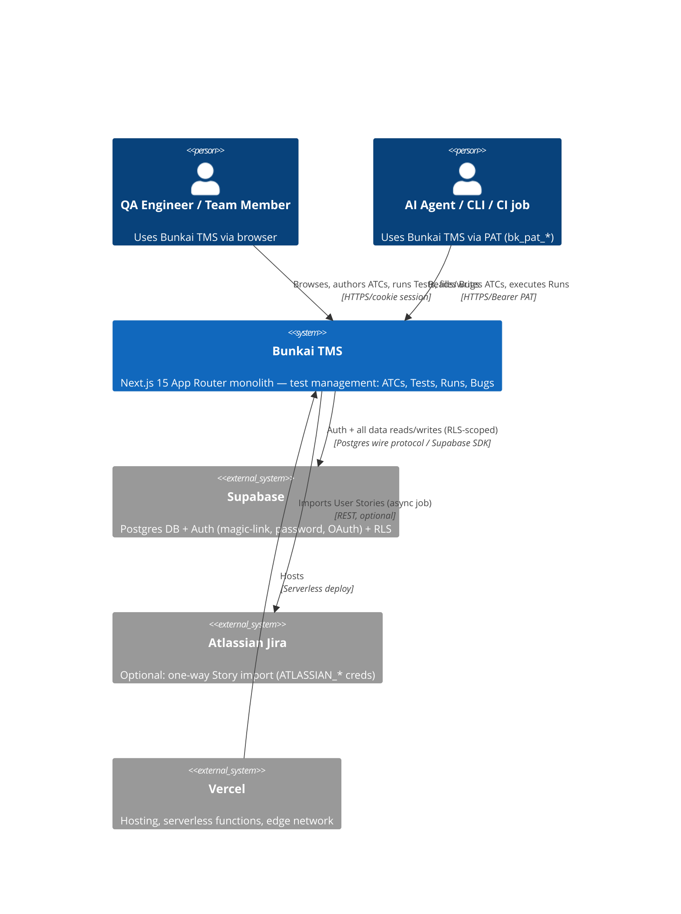
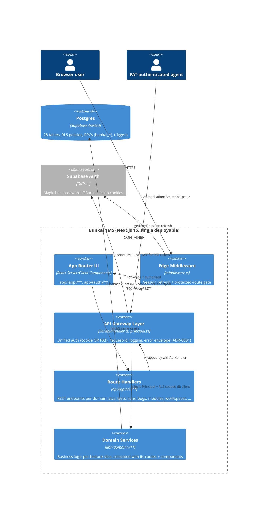
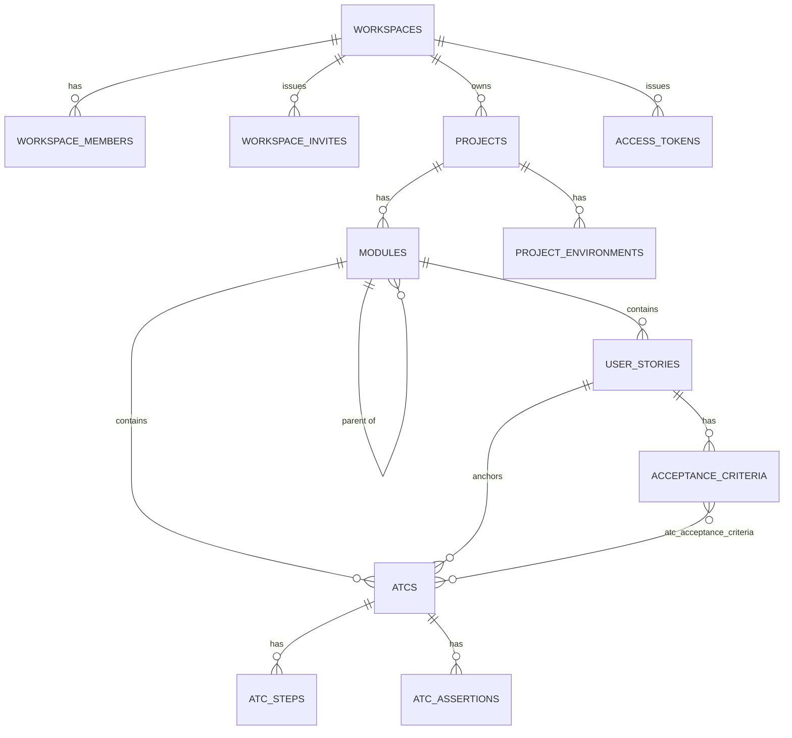
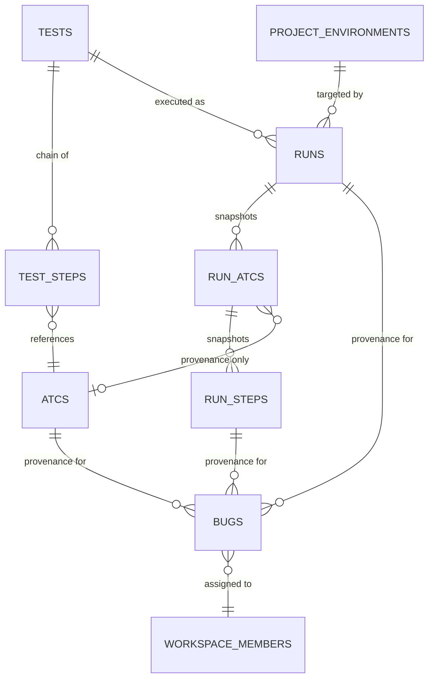
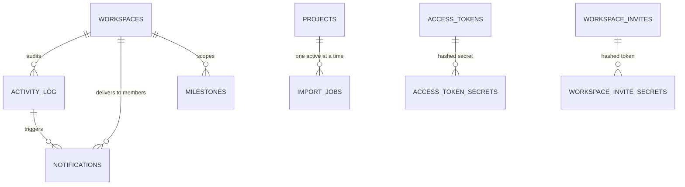
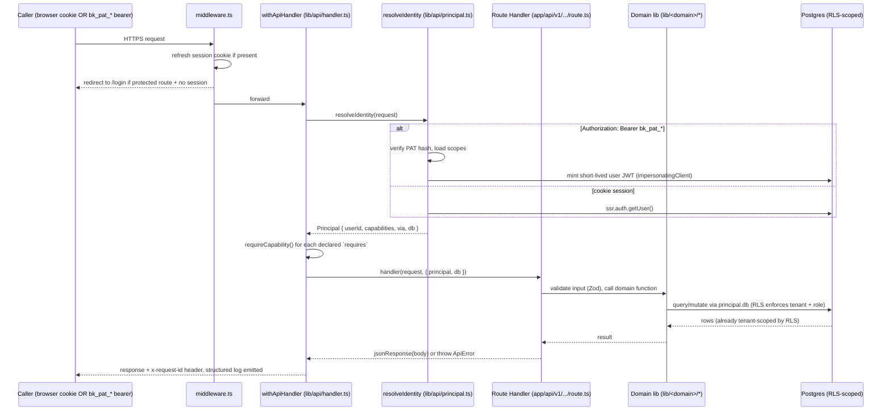
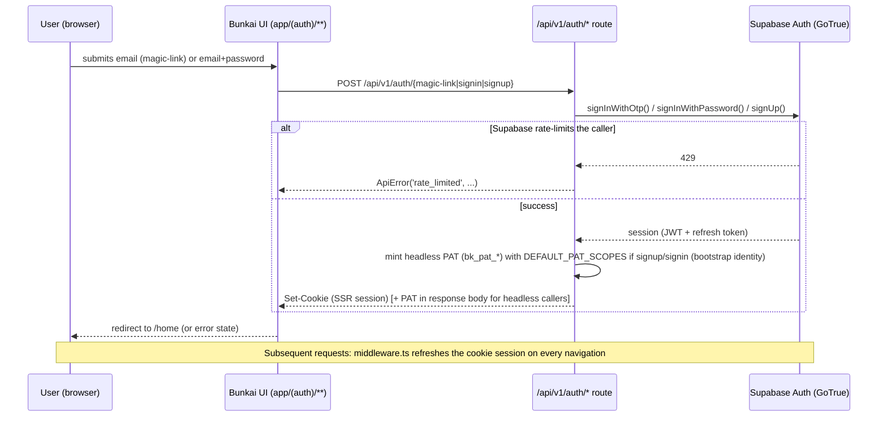

# Architecture Specification — Bunkai TMS

> Target: `upex-bunkai-tms` (local path `../upex-bunkai-tms`). Generated 2026-08-17.
> Sources: fresh discovery of `app/`, `lib/`, `components/`, `next.config.ts`, `middleware.ts`, `package.json`, `.env.example`, `.context/ADR/*` in the target repo; entity/schema facts reused from `.context/business/domain-glossary.md` (28 tables, derived from all 69 migrations) rather than re-reading migrations from scratch. Stack facts reused from `.context/project-config.md`.

---

## System Overview

**Pattern**: Next.js 15 App Router **modular monolith**, not classic MVC and not a strict hexagonal/clean-architecture split. Evidence:

- Single deployable (`upex-bunkai-tms`), no separate backend service — `app/api/v1/**` Route Handlers run in the same Next.js process as the UI (confirmed: no Express/NestJS/Fastify in `package.json`, per `project-config.md`).
- Feature-based vertical slices, not layer-based: `lib/<domain>/` (e.g. `lib/atcs/`, `lib/runs/`, `lib/bugs/`) sits beside `app/api/v1/<domain>/` and `components/<domain>/` — each domain owns its own service logic, route handlers, and UI components rather than a shared `services/`/`controllers/`/`repositories/` split.
- A thin **cross-cutting gateway layer** exists: `lib/api/handler.ts` (`withApiHandler`) + `lib/api/principal.ts` (`resolveIdentity`) centralize auth, request-id propagation, logging, and error mapping for every `/api/v1` route — this is the one place that looks "layered" rather than "feature-sliced."
- No ORM — raw SQL migrations (`supabase/migrations/*.sql`) are the schema source of truth; Postgres Row-Level Security (RLS) is the authorization layer, not application code (see Security Architecture).
- 12 formally-numbered Architecture Decision Records exist in `.context/ADR/*` (ADR-0001 … ADR-0012), documenting real structural decisions (unified auth, idempotency scoping, RPC authorization invariant, etc.) — evidence this is a deliberately-evolved architecture, not organic sprawl.

| Layer | Tech |
|---|---|
| Frontend | Next.js ^15 (App Router), React ^19, TypeScript ^5.9.3 `strict: true` |
| Styling | Tailwind CSS ^3.4 + shadcn/ui-style components (Radix primitives) |
| Backend | Next.js Route Handlers (`app/api/v1/**`), same process as frontend |
| Validation | Zod ^4 (`EnvSchema`, request body schemas) |
| API docs | `@asteasolutions/zod-to-openapi` ^8.5 — generates OpenAPI from Zod schemas |
| Database | PostgreSQL via Supabase; no ORM, raw SQL migrations under `supabase/migrations/` (69 files) |
| Auth | Supabase Auth (cookie session via SSR) + custom Personal Access Tokens (`bk_pat_*`) for headless/API callers |
| Hosting | Vercel (serverless) |
| CI/CD | None — no `.github/workflows/` in target repo |

---

## C4 Context Diagram



---

## C4 Container Diagram

> Split by subsystem to keep each diagram to one screenful (28-table schema — see Database Schema section for the same split applied to the ER diagram).

### Container view — Application + Data



---

## Component Structure

Directory layout (target repo root):

```
app/
  (app)/                # authenticated UI shell — workbench tabs (ADR-0003)
    home/ projects/ workspaces/ settings/ activity/ onboarding/
    projects/[projectSlug]/{atcs,tests,runs,bugs,milestones,metrics,traceability}/
  (auth)/                # login/signup/magic-link/OAuth UI
  api/
    v1/                  # REST surface — one folder per domain
      acceptance-criteria/ activity/ atcs/ auth/ bugs/ environments/
      health/ imports/ invites/ me/ milestones/ modules/
      notification-preferences/ notifications/ projects/ runs/
      tests/ tokens/ user-stories/ workspaces/
      route.ts, route.openapi.ts  # API index + OpenAPI descriptor per route
  qa/                    # internal QA harness UI (app/qa/qa-config.ts)
lib/
  api/                   # cross-cutting gateway: handler.ts, principal.ts, error-envelope.ts,
                          #   idempotency.ts, pat.ts, user-jwt.ts, workspace-cookie.ts, logging.ts, middleware/bearer.ts
  auth/                  # oauth.ts, oauth-state.ts, login-errors.ts
  supabase/              # client.ts (browser), server.ts (SSR), admin.ts (service-role), rpc.ts
  <domain>/              # one folder per business domain (atcs, tests, runs, bugs, modules,
                          #   user-stories, acceptance-criteria, workspaces, projects, environments,
                          #   milestones, notifications, notification-preferences, tokens, jira,
                          #   traceability, coverage, home, activity, account, settings)
  openapi/               # registry.ts — zod-to-openapi schema registry
  types/                 # generated + hand-written types (types/supabase.ts, types.ts)
middleware.ts             # session refresh + protected-route redirect gate
next.config.ts            # minimal — no headers()/CSP config
components/
  <domain>/               # atcs(7) tests(8) settings(9) home(6) layout(7) bugs(3) runs(3)
                          #   milestones(4) notifications(2) markdown(2) activity(1) coverage(1)
                          #   metrics(1) traceability(1) providers(1) ui(7 — shadcn primitives)
supabase/migrations/       # 69 numbered .sql files — sole schema source of truth (no ORM)
.context/ADR/               # 12 ratified Architecture Decision Records
```

**Responsibility table**:

| Component | Responsibility |
|---|---|
| `middleware.ts` | Refreshes Supabase session cookie on every request; redirects unauthenticated users away from `PROTECTED_PREFIXES` (`/home`, `/projects`, `/onboarding`, `/settings`, `/activity`) to `/login` |
| `lib/api/handler.ts` (`withApiHandler`) | Single wrapper around every Route Handler: request-id propagation, structured JSON access log, centralized error→envelope mapping, secure-by-default auth resolution |
| `lib/api/principal.ts` (`resolveIdentity`) | Collapses cookie-session and Bearer-PAT auth into one `Principal` shape; mints a per-request user-scoped JWT for PAT callers so RLS applies identically to both auth methods (ADR-0001) |
| `lib/api/idempotency.ts` | `Idempotency-Key` header handling backed by the `idempotency_keys` table — replay-safe POSTs |
| `lib/supabase/{client,server,admin}.ts` | Three Supabase client flavors: browser (anon key), SSR (cookie-scoped, RLS-respecting), admin (service-role, RLS-bypassing — used only where explicitly needed, e.g. idempotency bookkeeping) |
| `lib/<domain>/**` | Business logic + validation for one domain, called by that domain's route handlers and/or Server Actions |
| `app/api/v1/**/route.ts` | Thin REST handlers — parse/validate input, call domain lib functions, return `jsonResponse`/`errorResponse` |
| `app/(app)/**` | Authenticated UI — Server Components read data directly via `lib/supabase/server.ts`; Client Components call `/api/v1/**` or invoke Server Actions (`actions.ts`, e.g. `app/(app)/projects/[projectSlug]/atcs/[atcId]/actions.ts`) |
| `components/<domain>/**` | Feature-scoped React components, colocated by domain to mirror `lib/` and `app/api/v1/` |
| `components/ui/**` | Shared shadcn/ui primitives (7 files) |

---

## Database Schema

> Full column-level detail, business rules, and enum catalogs already live in `.context/business/domain-glossary.md` §1–§2 (28 tables, derived from reading all 69 migrations). This section **reuses** that data, split into subsystem-level ER diagrams per the "paginate entity lists" convention, plus index detail newly captured for this pass.

### ER Diagram — Tenancy & Authoring subsystem



### ER Diagram — Execution subsystem



### ER Diagram — Infra / cross-cutting subsystem



Full table detail (columns, constraints, JSON examples): `domain-glossary.md` §1.1–§1.14. Enum catalogs: §2. Business rules (BR-1..BR-9): §3. State machines (Run/Bug/RunATC/RunStep/Import status): §6.

### Indexes (newly captured this pass — case-insensitive `create.*index` grep across all 69 migrations)

Non-exhaustive representative sample (full list is embedded in the migration files — 38 files touch indexing):

| Table | Index | Shape | Purpose |
|---|---|---|---|
| `runs` | `runs_test_id_started_at_idx` | `(test_id, started_at desc)` | Latest-runs-per-test listing |
| `runs` | `runs_workspace_id_started_at_running_idx` | partial, `status='running'` | Home dashboard "active runs" widget (`0060`) |
| `runs` | `runs_project_id_status_started_at_idx` | composite | Run list filtering |
| `run_atcs` | `run_atcs_run_id_idx`, `run_atcs_atc_id_idx` | single-col | Run detail fan-out; provenance lookup |
| `run_steps` | `run_steps_run_atc_id_idx` | single-col | Run step fan-out |
| `bugs` | `bugs_workspace_id_severity_unresolved_idx` | partial, unresolved-only | Home dashboard "open bugs" widget (`0061`) |
| `bugs` | `bugs_project_id_created_at_idx`, `bugs_project_id_severity_created_at_id_idx`, `bugs_module_id_idx`, `bugs_run_id_idx`, `bugs_atc_id_idx`, `bugs_assignee_user_id_idx` | various | Bug list filters + provenance joins |
| `atcs` | `atcs_tsv_gin_idx` | GIN on `tsv` | Full-text search |
| `atcs` | `atcs_project_id_idx`, `atcs_module_id_idx`, `atcs_user_story_id_idx`, `atcs_project_id_updated_at_idx` | single/composite | Scoped listing |
| `tests` | `tests_tags_gin_idx` | GIN on `tags` | Tag filtering |
| `modules` | `modules_project_id_idx`, `modules_parent_module_id_idx`, `modules_project_active_idx` | tree navigation | |
| `user_stories` | `user_stories_project_external_id_uniq` (unique), `user_stories_module_id_idx`, `user_stories_module_active_idx` | | Jira `external_id` de-dup + module scoping |
| `project_environments` | `project_environments_project_name_idx` (unique) | case-insensitive per project | Name uniqueness |
| `access_tokens` | `access_tokens_token_prefix_idx`, `access_tokens_user_active_idx` | | PAT lookup by prefix; active-token-per-user |
| `activity_log` | `activity_log_workspace_created_at_id_idx`, `activity_log_workspace_id_created_at_idx` | | Audit stream pagination |
| `notifications` | `notifications_recipient_workspace_created_at_id_idx` | composite | Inbox pagination |
| `magic_link_tokens` | `magic_link_tokens_email_issued_at_idx`, `magic_link_tokens_expires_at_idx` | | Replay-window checks |
| `idempotency_keys` | `idempotency_keys_expires_at_idx`, `idempotency_keys_workspace_id_idx` | | TTL sweep + scoping |
| `import_jobs` | `import_jobs_one_active_per_project` (unique, partial `status in ('queued','running')`) | | BR-7 enforcement at index level |

**Pattern observed**: workspace-scoped high-traffic tables (`runs`, `bugs`, `notifications`, `activity_log`) consistently pair a scoping column with a sort column (`_created_at_idx`, `_started_at_idx`) — a deliberate pagination-friendly indexing convention, not incidental.

---

## Data Flow

### Request sequence (authenticated read/write via `/api/v1`)



### Auth sequence (cookie session bootstrap — magic-link / password)



---

## External Services

| Service | Purpose | Env vars actually read by app code (`lib/env.ts` + grep) | Client / integration point |
|---|---|---|---|
| Supabase (Postgres + Auth) | Primary datastore, RLS authorization, session auth, OAuth, magic-link | `NEXT_PUBLIC_SUPABASE_URL`, `NEXT_PUBLIC_SUPABASE_ANON_KEY`, `SUPABASE_SERVICE_ROLE_KEY`, `SUPABASE_JWT_SECRET` | `lib/supabase/{client,server,admin}.ts`, `createServerClient`/`createBrowserClient` (`@supabase/ssr`), `createClient` (`@supabase/supabase-js`) |
| Atlassian Jira | One-way async Story import (`import_jobs` table) | `ATLASSIAN_URL`, `ATLASSIAN_EMAIL`, `ATLASSIAN_API_TOKEN` (all `.optional()` in `EnvSchema` — missing creds surface as a failed import job, not an app-boot error) | `lib/jira/**` (worker), `app/api/v1/imports/**` |
| Vercel | Hosting / serverless deploy target | n/a (platform, not an app-level integration) | `next.config.ts` (`outputFileTracingRoot`), implicit via `NEXT_PUBLIC_APP_URL` default |

**Declared in `.env.example` but NOT read by application code** (`app/**`, `lib/**`) — confirmed via `lib/env.ts` (the single validated env schema) and a repo-wide `process.env.` grep:

| Var family | `.env.example` purpose | App-code usage found |
|---|---|---|
| `RESEND_API_KEY` | Transactional email (Resend) | None — the only `resend`-matching hits are the `/api/v1/auth/resend` route (resending a verification code) and QA-harness files, unrelated to the Resend service |
| `N8N_API_URL` / `N8N_API_KEY` | n8n workflow automation MCP | None in `app/`/`lib/` |
| `TAVILY_API_KEY` | Tavily search MCP | None in `app/`/`lib/` |
| `SUPABASE_ACCESS_TOKEN` | Supabase MCP control plane (admin/project management) | None in `app/`/`lib/` — MCP-only |
| `POSTGRES_*` (HOST/USER/PASSWORD/DATABASE/URL/URL_NON_POOLING/PRISMA_URL) | Direct Postgres connection for Prisma/raw SQL tooling | None in `app/`/`lib/` — the app talks to Postgres exclusively through the Supabase SDK, never a direct `pg`/Prisma connection |
| `QA_E2E_USER_EMAIL` / `QA_E2E_USER_PASSWORD` | Dedicated automation login identity | Present in test/QA-harness files only (`app/qa/**`, `*.test.ts`), not production runtime code |

**Conclusion**: all six of these families are tooling/MCP-scoped (installed for the *development environment*, per this QA repo's own `.env.example` conventions), not services the running application calls at request time. The application's only true external runtime dependencies are Supabase and (optionally, async) Jira.

---

## Security Architecture

### Authentication

- **Dual method, unified gateway** (ADR-0001, "Accepted — Implemented"): every `/api/v1` route is wrapped by `withApiHandler`, which resolves either a **cookie session** (Supabase SSR, browser UI) or a **Bearer PAT** (`bk_pat_*`, headless/CLI/agent callers) into one `Principal` shape. Secure-by-default: a route requires auth unless explicitly marked `auth: 'public'` (health check, OpenAPI descriptor, sign-in/up/magic-link).
- **PAT mechanics**: `lib/api/pat.ts` — tokens carry an explicit scope array (`atc:read`, `atc:write`, `run:execute`, `workspace:admin`); `workspace:admin` cannot be issued via headless bootstrap, only via `POST /api/v1/tokens` against a specific workspace where the caller already holds admin/owner (ADR-0005). Token secret is split from its lookup prefix (`access_token_secrets`, migration `0011`) — the plaintext secret is never stored, only its hash; `access_tokens_token_prefix_idx` allows prefix lookup without a full-table hash scan.
- **PAT-as-user impersonation**: `impersonatingClient()` in `principal.ts` mints a short-lived, user-scoped Supabase JWT (via `SUPABASE_JWT_SECRET`) for PAT callers, so Postgres RLS evaluates `auth.uid()` identically regardless of auth method — the service-role key is never handed to a request-scoped client.
- **OAuth CSRF protection**: `lib/auth/oauth-state.ts` implements explicit state-parameter validation (`oauth_state_mismatch` error code) — confirmed present, not just assumed.
- **Password storage**: delegated entirely to Supabase Auth (GoTrue) — no `bcrypt`/`argon2` dependency in `package.json`, confirming the app never handles raw password hashing itself.
- **Rate limiting on auth flows**: surfaced, not implemented — `ApiError('rate_limited', ...)` is thrown when Supabase Auth itself returns HTTP 429 (`app/api/v1/auth/{magic-link,signup,confirm,resend,check-email}/route.ts`); this is Supabase's own throttling passed through, not an app-level rate limiter.

### Authorization

- **Postgres Row-Level Security (RLS) is the single source of truth for authorization** — confirmed by ADR-0001's own analysis ("Finding C"): cookie-only routes never implemented app-level access checks in TypeScript; they built an RLS-scoped client and let policies keyed on `auth.uid()` decide. This is a deliberate architectural choice, not an omission — reinforced by ADR-0012 ("RPC Authorization Invariant").
- **Capability model for PATs**: `requireCapability()` gates PAT callers against their token's declared scopes; cookie sessions implicitly hold the full capability set (`ALL_CAPABILITIES`) since the UI itself is the trusted client and RLS + role checks still apply underneath.
- **Known limitation** (from ADR-0001's own text, not this pass's inference): non-ATC routes migrated to the gateway with `requires: []` — they enforce authentication + RLS membership but do not yet map to a specific capability, so a narrowly-scoped PAT gets full member-level access on those routes. Flagged as a documented follow-up in the ADR itself.
- **Workspace-scoping guard**: `assertWorkspaceContext()` additionally restricts bearer (PAT) callers to the single workspace their token is bound to; cookie sessions pass through to RLS + a per-route `workspace_members` role check.

### Data protection / transport

- **TLS**: implicit via Vercel + Supabase hosting (both HTTPS-only); not independently verified in this pass (no explicit HSTS/TLS config found in app code — platform-default).
- **Secret handling**: `lib/env.ts` is the single Zod-validated env schema; `SUPABASE_SERVICE_ROLE_KEY` is explicitly commented as "must never reach the browser bundle" and the module is marked `server-only`. No hard-coded secrets found in the files read this pass.
- **CSP / security headers**: `next.config.ts` has **no `headers()` function** — no CSP, no `X-Frame-Options`, no `Strict-Transport-Security` configured at the app level. No `helmet` dependency in `package.json`.
- **Input sanitization**: `rehype-sanitize` ^6.0 is a dependency, used for Markdown rendering (`lib/markdown/**`, `components/markdown/**`) — sanitizes user-authored Markdown (ATC descriptions, Bug descriptions) before rendering as HTML. No general-purpose `xss`/`DOMPurify`/`validator` package found.
- **Idempotency as a security-adjacent control**: `lib/api/idempotency.ts` — `Idempotency-Key` header backed by the `idempotency_keys` table prevents duplicate-write races on retried POSTs (SHA-256 payload hash comparison, atomic pending→succeeded/failed state machine). Distinct from the Run-specific `start_token` mechanism (BR-4 in domain-glossary).
- **Auth secret splitting pattern**: repeated across three token families — `access_tokens`/`access_token_secrets`, `workspace_invites`/`workspace_invite_secrets`, `magic_link_tokens`/`magic_link_token_secrets` (all migration `0011`) — the lookup row and its hashed secret are stored in separate tables, a deliberate defense-in-depth pattern against a single-table dump exposing usable credentials.

---

## Performance hooks

> Kept to what is discoverable in code — no benchmarks, no invented numbers. Anything unmeasured is listed under Discovery Gaps, per phase-2-srs.md guidance.

- **Connection pooling**: Supabase-managed pgbouncer pooling is implied by this QA repo's own `DBHUB_HOST=aws-1-us-east-1.pooler.supabase.com` (`.env`, referenced in `project-config.md`) and by `.env.example`'s `POSTGRES_URL` comment (`pooled, port 6543`) vs `POSTGRES_URL_NON_POOLING` (direct, port 5432) — but the **application itself never uses these `POSTGRES_*` vars** (see External Services table); it talks to Postgres exclusively through the Supabase JS SDK (which manages its own connection/HTTP behavior via PostgREST), so app-level pool-size tuning is not applicable / not configured in this codebase.
- **Caching**: `revalidatePath()` (Next.js cache invalidation) used in one Server Action (`app/(app)/projects/[projectSlug]/atcs/[atcId]/actions.ts`) after ATC mutations — targeted invalidation, not a general caching layer. A code comment in `lib/home/coverage.ts:322` explicitly notes `unstable_cache` was considered and rejected ("would have to close over the request-scoped [client]") — i.e., the team deliberately did NOT adopt Next's data cache for that module, favoring correctness (fresh RLS-scoped data per request) over cache hits.
- **Query-shape indexing**: heavy, deliberate indexing on workspace/project-scoped high-traffic tables, several as **partial indexes** matched to a specific UI need (`runs_workspace_id_started_at_running_idx` for the "active runs" home widget; `bugs_workspace_id_severity_unresolved_idx` for the "open bugs" widget) — see Database Schema → Indexes. Two GIN indexes for full-text/array search (`atcs_tsv_gin_idx`, `tests_tags_gin_idx`).
- **No rate limiting middleware** in app code — only Supabase's own 429s on auth endpoints are surfaced (see Security Architecture). No `rateLimit`, Redis, or Upstash dependency found.
- **No background job queue** found (no `bullmq`/`pg-boss`/similar dependency) — the Jira import job (`import_jobs`) appears to be polled/worker-driven per its own state machine (`queued → running → completed|failed`), but the actual worker trigger mechanism was not located in this pass (see Discovery Gaps).

---

## Discovery Gaps

- **Jira import worker trigger mechanism not located.** `import_jobs` has a full state machine (`0019`/`0020` migrations) and `lib/jira/**` exists, but this pass did not trace what actually advances `queued → running` (cron? on-request poll? Vercel background function?). Needed before writing a Jira-import test that depends on timing.
- **Production environment identity still unconfirmed** — carried over from `project-config.md`'s own gap list; `webapp_domain` is a naming-convention guess, not a verified live production URL.
- **`POSTGRES_*` / direct-connection vars in `.env.example` are unused by the app** — confirmed this pass (not merely assumed) via `lib/env.ts` + full grep; documented here so a future pass doesn't waste time treating them as an app dependency.
- **TLS/HSTS posture not independently verified** — relies on Vercel + Supabase platform defaults; no app-level header configuration exists to inspect, and no live response-header capture was performed in this pass.
- **RLS policy SQL text was not re-read in this pass** — Security Architecture's RLS claims are corroborated by ADR-0001/ADR-0012's own text and by `domain-glossary.md`'s prior migration read, not by an independent `pg_policies` query in this session. Recommend a `[DB_TOOL]` (DBHub MCP) spot-check before writing RLS-negative test cases.
- **No CI/CD pipeline** (carried over from `project-config.md`) — no automated build/lint/test/deploy gate exists in the target repo to cross-reference against this architecture doc going forward.
- **Two migrations flagged as written-but-not-applied** in `domain-glossary.md` §8 (`0058`, `0067`/`0066` pairing) — re-verify against the live Supabase project before relying on either detail (ATC title length floor; `bunkai_finish_run`/`bunkai_abort_run` `p_via` parameter) for a test assertion.
- **`SUPABASE_JWT_SECRET` is `.optional()` in `EnvSchema`** but is a hard runtime dependency for `impersonatingClient()` (PAT auth path) — if unset, any PAT-authenticated request throws `internal_error`. Not exercised live in this pass; confirm it is actually set in each deployed environment before relying on PAT-based test automation there.

---

## QA Relevance

**Components to test**:

- **Auth gateway** (`lib/api/handler.ts` + `principal.ts`) — the single highest-leverage test target: any coverage gap here silently affects every `/api/v1` route. Test both auth methods (cookie + PAT) against the same endpoint and assert parity, per ADR-0001's own stated goal. Known limitation (routes with `requires: []`) is a documented under-scoping risk worth an explicit negative test (narrowly-scoped PAT should NOT get full access on those routes, but currently does).
- **RLS policies** — since authorization lives in Postgres, not TypeScript, cross-tenant access attempts (same technique, different `workspace_id`) are the standard negative test for every entity in the ER diagrams above, per `domain-glossary.md` §9.5.
- **Idempotency middleware** (`lib/api/idempotency.ts`) — same-key-same-payload replay, same-key-different-payload conflict, concurrent-pending conflict are all distinct, individually testable branches.
- **Home dashboard widgets** ("active runs", "open bugs") — backed by purpose-built partial indexes; a regression here is as likely to be a query-shape/index bug as a UI bug.
- **Jira import flow** — blocked on the Discovery Gap above (worker trigger mechanism); do not write timing-sensitive import tests until that is resolved.
- **Markdown rendering** (`rehype-sanitize`) — the one explicit sanitization boundary in the app; a targeted XSS-payload-in-ATC-description test is a natural, evidence-backed security test case (not speculative — the sanitizer's presence is confirmed).

**Environment requirements**: PAT-based API test automation requires `SUPABASE_JWT_SECRET` to be set in whichever environment is targeted (see Discovery Gaps) — verify before relying on Bearer-auth test flows against `staging`.

## API Spec Source

Recorded in `.context/project-config.md` under "## API Spec Source" (this pass) — see that file for the confirmed OpenAPI locations (`public/openapi.json`, `app/api/openapi` route, `app/api/docs` Scalar UI). Per `phase-2-srs.md` §2, this document does not duplicate endpoint-level API contracts; consume `api/openapi-types.ts` (via `bun run api:sync`) or `.context/business/business-api-map.md` for that angle.
