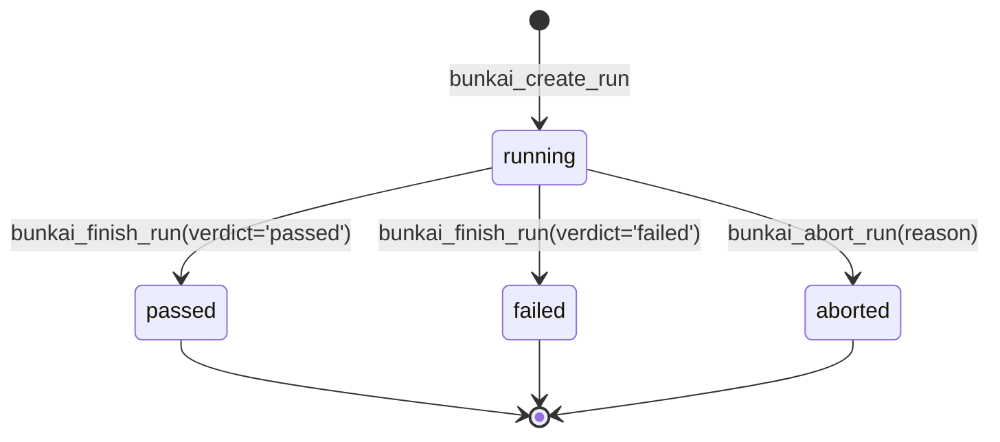
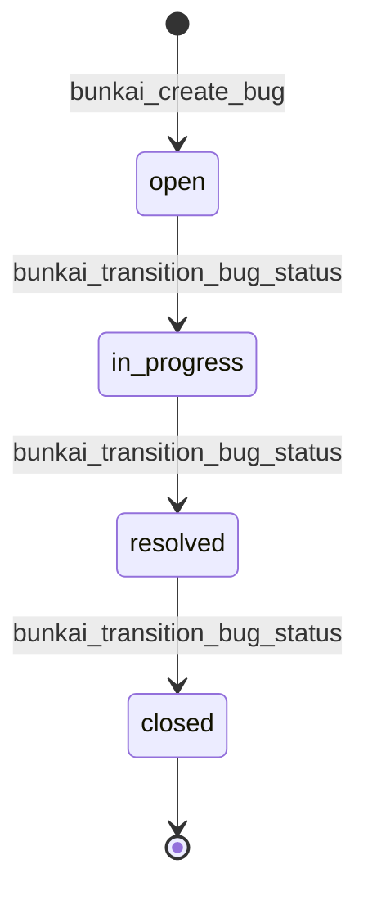

# Functional Specification — Bunkai TMS

> Target: `upex-bunkai-tms` (local path `../upex-bunkai-tms`). Generated 2026-08-17.
> Sources: fresh discovery this pass of `lib/<domain>/validation.ts`, `lib/<domain>/errors.ts`, and `app/api/v1/<domain>/route.ts` for the five domains named in `.context/PRD/executive-summary.md` §2 Core Capabilities (workspaces, user-stories/acceptance-criteria, atcs, tests/runs, bugs), cross-referenced against RPC SQLSTATE mappings and a sample of `*.test.ts` `it(...)` names. Entity/schema facts, Business Rules BR-1..BR-9, and the five `stateDiagram-v2` blocks are **reused** from `.context/business/domain-glossary.md` §3/§6 per this pass's briefing — not re-derived from migrations.
> FR numbering is fresh (first SRS run for this project — no prior `functional-specs.md` existed to preserve IDs against).

---

## Specification Index

| FR ID | Feature | Category | Priority |
|---|---|---|---|
| FR-001 | Workspace creation (bootstrap + auto-enrol owner) | Tenancy & RBAC | Critical |
| FR-002 | Workspace invite issuance + acceptance | Tenancy & RBAC | High |
| FR-003 | Module tree authoring (create / rename / move) | Tenancy & RBAC | High |
| FR-004 | User Story authoring | Authoring | High |
| FR-005 | Acceptance Criterion authoring | Authoring | High |
| FR-006 | Jira import job (async, one-active-per-project) | Authoring | Medium |
| FR-007 | ATC creation (anchored to ≥1 Acceptance Criterion) | ATC Authoring | Critical |
| FR-008 | ATC duplication | ATC Authoring | Medium |
| FR-009 | Test composition (ordered ATC chain) | Composition & Execution | High |
| FR-010 | Run creation (idempotent start) | Composition & Execution | Critical |
| FR-011 | Run step marking + Run finish/abort | Composition & Execution | Critical |
| FR-012 | Bug filing (run-linked or standalone) | Defect Tracking | Critical |
| FR-013 | Bug status transition (forward-only lifecycle) | Defect Tracking | High |
| FR-014 | Bug assignment | Defect Tracking | Medium |

---

## FR-001: Workspace creation (bootstrap + auto-enrol owner)

| Aspect | Value |
|---|---|
| **Feature** | Multi-tenant workspace bootstrap |
| **Related PRD section** | Core Capability #1 (tenancy + RBAC) |
| **Service / method** | `POST /api/v1/workspaces` → RPC `bunkai_bootstrap_workspace` |
| **Evidence path** | `app/api/v1/workspaces/route.ts:39-91` |

**Functional Requirement**: A caller may create a new Workspace by supplying a unique slug and a display name; the RPC transactionally creates the workspace and enrols the caller as its sole `owner`.

**Input Specification**

| Field | Type | Required | Notes |
|---|---|---|---|
| `name` | string | yes | 1-80 chars, trimmed |
| `slug` | string | yes | 3-40 chars, lowercase letters/digits/hyphens, no edge hyphen |

**Validation Rules** (`app/api/v1/workspaces/route.ts:16-50`)

```ts
const SLUG_REGEX = /^[a-z0-9][a-z0-9-]{1,38}[a-z0-9]$/;
const CreateBodySchema = z.object({
  name: z.string().trim().min(1).max(80),
  slug: z.string().min(3).max(40)
    .refine(v => SLUG_REGEX.test(v), { message: 'Slug must be lowercase letters/digits/hyphens, 3–40 chars, no edge hyphen.' })
    .refine(v => !RESERVED_SLUGS.has(v), { message: 'Slug is reserved.' }),
});
```

**Processing Logic**

1. Parse + Zod-validate the body (`app/api/v1/workspaces/route.ts:59`).
2. Call `bunkai_bootstrap_workspace(p_slug, p_name)` via the RLS-scoped client (`:61-64`).
3. On `23505` (slug unique violation) → `conflict`. On `22023` → `validation_failed`. On `42501` → `unauthorized`. Any other error → `internal_error` (`:66-78`).
4. Re-fetch the created workspace row for the response body (`:80-88`).

**Output Specification**

| Outcome | Status | Body |
|---|---|---|
| Success | 201 | `{ workspace: { id, slug, name, owner_user_id, plan, created_at } }` |
| Slug taken | 409 | `conflict` |
| Auth missing | 401 | `unauthorized` |
| Malformed body | 400/422 | Zod validation envelope |

**Business Rules**

| BR ID | Rule |
|---|---|
| BR-008 | Workspace must always retain ≥1 active owner (governs later leave/removal, not creation itself — the bootstrap always creates exactly one owner) |
| BR-012 | Slug must not collide with a reserved app route (`admin`, `api`, `app`, `auth`, `docs`, `invites`, `login`, `logout`, `onboarding`, `projects`, `public`, `qa`, `settings`, `static`, `workspaces`, `_next`) |

**Edge Cases**

| Scenario | Expected Behavior | Evidence |
|---|---|---|
| Slug already taken | 409 `conflict`, "Slug "X" is already taken." | `route.ts:68-70` |
| Slug is a reserved word | 422, "Slug is reserved." | `route.ts:48-50` |
| Slug has leading/trailing hyphen or uppercase | 422, regex message | `route.ts:44-47` |
| Unauthenticated caller | 401 `unauthorized` | `route.ts:74-76` |
| Name empty or > 80 chars | 422 Zod envelope | `route.ts:40` |

---

## FR-002: Workspace invite issuance + acceptance

| Aspect | Value |
|---|---|
| **Feature** | Teammate invite lifecycle |
| **Related PRD section** | Core Capability #1 (RBAC) |
| **Service / method** | `inviteAcceptAction()` (acceptance-decision helper); RPC-backed issue/accept endpoints |
| **Evidence path** | `lib/workspaces/invites.ts:1-42` |

**Functional Requirement**: An admin/owner may invite an email to a Workspace with a target role; on acceptance, the invite either activates a new membership or upgrades an existing lower-ranked one — it must never demote an existing equal-or-higher membership.

**Input Specification**

| Field | Type | Required | Notes |
|---|---|---|---|
| invite role | enum | yes | `viewer`\|`member`\|`admin` (NOT `owner` — not invitable, per domain-glossary §2) |
| existing membership (if any) | `{ role, status }` | n/a | read before decision |

**Validation Rules** — role rank table (`lib/workspaces/invites.ts:9-14`):

```ts
export const ROLE_RANK: Record<WorkspaceRole, number> = { viewer: 1, member: 2, admin: 3, owner: 4 };
```

**Processing Logic** (`inviteAcceptAction`, `lib/workspaces/invites.ts:29-41`)

1. If no existing membership, or existing `status !== 'active'` → `upsert` (activate with invite's role).
2. Else compare `ROLE_RANK[inviteRole]` vs `ROLE_RANK[existing.role]`.
3. If invite role ranks strictly higher → `upsert` (legitimate promotion).
4. Otherwise → `reject_already_member` (never demote).

**Output Specification**

| Outcome | Result |
|---|---|
| No prior membership / inactive | Membership row activated with invite's role |
| Invite role is a promotion | Membership role upgraded |
| Invite role ≤ existing active role | Rejected — accept must not demote |

**Business Rules**

| BR ID | Rule |
|---|---|
| BR-011 | Invite acceptance never demotes an existing active membership; issuing a same-or-lower-role invite to an already-active member should not happen upstream (BK-60 blocks issuing it) |

**Edge Cases**

| Scenario | Expected Behavior | Evidence |
|---|---|---|
| Caller already an active `admin`, invite is for `member` | `reject_already_member` | `invites.ts:36-40` |
| Caller has a `status: 'invited'` (not yet active) row | `upsert` — activates with invite's role | `invites.ts:33-35` |
| Caller has no membership at all | `upsert` | `invites.ts:33-35` |
| Invite targets `owner` role | Not representable — `owner` excluded from `WorkspaceRole` invite domain (domain-glossary §2) | `domain-glossary.md:402` |

---

## FR-003: Module tree authoring (create / rename / move)

| Aspect | Value |
|---|---|
| **Feature** | Module (feature-folder) tree management |
| **Related PRD section** | Core Capability #1 (project structure) |
| **Service / method** | `modulePatchShapeError()`, `stripHtmlTags()`, module create/move RPCs |
| **Evidence path** | `lib/modules/validation.ts:1-63` |

**Functional Requirement**: A member may create, rename, or move a Module within a Project's tree (max depth 6); a PATCH request may either edit fields (name/description) or move the module (change `parent_module_id`), never both in the same request.

**Input Specification**

| Field | Type | Required | Notes |
|---|---|---|---|
| `name` | string | for create | HTML tags stripped before validation (`stripHtmlTags`) |
| `description` | string | optional | Markdown, sanitized separately |
| `parent_module_id` | uuid \| null | optional | move-only field |

**Validation Rules** (`lib/modules/validation.ts:29-38, 44-52`)

```ts
export function modulePatchShapeError(input: ModulePatchShape): ModulePatchShapeError | null {
  const { hasName, hasDescription, hasParent } = input;
  if (!hasName && !hasDescription && !hasParent) return 'no_fields';
  if ((hasName || hasDescription) && hasParent) return 'combined_update_and_move';
  return null;
}
const HTML_TAG = /<\/?[a-z][a-z0-9-]*(?:\s[^>]*)?\/?>/gi;
```

**Processing Logic**

1. PATCH body shape validated: reject empty body (`no_fields`) and reject a combined rename+move (`combined_update_and_move`) — the two run as separate RPC calls server-side, so a combined request could half-apply.
2. Name sanitized via `stripHtmlTags` before the length/emptiness rules run.
3. Move requests are checked against the depth-6 cap by `bunkai_move_module` (BR-002).

**Output Specification**

| Outcome | Status | Body |
|---|---|---|
| Valid create | 201 | Module row (+ optional deep-nesting warning toast, `moduleCreateToasts`) |
| Empty PATCH body | 422 | `reason: no_fields` |
| Combined rename+move | 422 | `reason: combined_update_and_move` |
| Move exceeds depth 6 | error `depth_exceeded` (45002) | per BR-002 |

**Business Rules**

| BR ID | Rule |
|---|---|
| BR-002 | Module tree may not exceed 6 levels of nesting (`modules_path_depth_max_6` CHECK + `bunkai_move_module` backstop) |
| BR-010 | A PATCH must not combine a field edit with a move in one request (separate RPC calls, partial-apply risk) |

**Edge Cases**

| Scenario | Expected Behavior | Evidence |
|---|---|---|
| PATCH body has no fields at all | `no_fields` | `validation.ts:31-33` |
| PATCH sets `name` AND `parent_module_id` together | `combined_update_and_move` | `validation.ts:34-36` |
| Module name is `<script>alert(1)</script>` | Stored as `alert(1)` (tags stripped, not the whole value) | `validation.ts:50-52` |
| Move pushes a subtree past depth 6 | `depth_exceeded` (45002) | domain-glossary BR-2 |
| Create at depth 6 with warning | Success toast + additive `warning` toast (never a replacement) | `validation.ts:57-63` |

---

## FR-004: User Story authoring

| Aspect | Value |
|---|---|
| **Feature** | User Story creation/edit |
| **Related PRD section** | Core Capability #2 |
| **Service / method** | `storyTitleError()`, `jiraKeyError()`, `normalizeJiraKey()` |
| **Evidence path** | `lib/user-stories/validation.ts:1-45` |

**Functional Requirement**: A member may author a User Story with a title (3-200 chars) and an optional Jira external key; the key, if present, must match `LETTERS-NUMBER` and is stored trimmed/upper-cased.

**Input Specification**

| Field | Type | Required | Notes |
|---|---|---|---|
| `title` | string | yes | server trims first; 3-200 chars |
| `description` | string | optional | ≤ 50,000 UTF-8 bytes (decimal) |
| `external_id` | string | optional | Jira key, e.g. `BK-42` |

**Validation Rules** (`lib/user-stories/validation.ts:15-27, 29-45`)

```ts
export const MIN_STORY_TITLE = 3;
export const MAX_STORY_TITLE = 200;
export const MAX_STORY_DESCRIPTION_BYTES = 50_000;
const JIRA_KEY = /^[A-Z]+-\d+$/;
export function jiraKeyError(key: string): 'external_id_invalid' | null {
  const normalized = normalizeJiraKey(key);
  if (normalized.length === 0) return null;
  return JIRA_KEY.test(normalized) ? null : 'external_id_invalid';
}
```

**Processing Logic**

1. Trim title; empty → `title_required`; < 3 chars → `title_too_short`; > 200 → `title_too_long`.
2. If `external_id` supplied, normalize (trim + upper-case) and test against `^[A-Z]+-\d+$`; mismatch → `external_id_invalid`.
3. `user_stories.status` gate (`draft`↔`ready_to_test`) is enforced downstream by AC-count logic (see FR-005 relationship) — a story auto-reverts to `draft` if its last active AC is archived (domain-glossary §2).

**Output Specification**: success → 201/200 with the Story row; failure → `validation_failed` with `details.reason` ∈ `{title_required, title_too_short, title_too_long, external_id_invalid}`.

**Business Rules**

| BR ID | Rule |
|---|---|
| (none new — status gate documented as an enum-driven rule in domain-glossary §2, not a numbered BR) | `user_stories.status` needs ≥1 active AC to become `ready_to_test`; reverts to `draft` if the last active AC is archived |

**Edge Cases**

| Scenario | Expected Behavior | Evidence |
|---|---|---|
| Title is only whitespace | `title_required` (trimmed length 0) | `validation.ts:17-19` |
| Title exactly 3 chars | Valid (boundary — BVA) | `validation.ts:20-22` |
| Title exactly 200 chars | Valid; 201 chars → `title_too_long` | `validation.ts:23-25` |
| `external_id` = `"bk-42"` (lowercase) | Normalized to `BK-42`, valid | `validation.ts:33-35, 39-45` |
| `external_id` = `"BK42"` (no hyphen) | `external_id_invalid` | `validation.ts:44` |
| Jira key must be unique per project | Enforced at DB level, not this helper — `user_stories_project_external_id_uniq` | `domain-glossary.md:122` |

---

## FR-005: Acceptance Criterion authoring

| Aspect | Value |
|---|---|
| **Feature** | AC creation/edit, sortable per Story |
| **Related PRD section** | Core Capability #2 |
| **Service / method** | `criterionTitleError()` |
| **Evidence path** | `lib/acceptance-criteria/validation.ts:1-28` |

**Functional Requirement**: A member may author an Acceptance Criterion on a User Story with a 3-200 character title; ACs are individually orderable via `position` (active-only unique).

**Input Specification**

| Field | Type | Required | Notes |
|---|---|---|---|
| `title` | string | yes | server trims first; 3-200 chars — identical rule to User Story title |
| `description` | string | optional | ≤ 50,000 UTF-8 bytes |
| `position` | integer | server-assigned | 1..N, unique among active ACs of the same Story |

**Validation Rules** (`lib/acceptance-criteria/validation.ts:16-27`) — byte-identical shape to FR-004's title rule (`MIN_CRITERION_TITLE=3`, `MAX_CRITERION_TITLE=200`).

**Processing Logic**: same three-branch trim→length check as `storyTitleError`; returns `title_required` \| `title_too_short` \| `title_too_long` \| `null`.

**Output Specification**: success → 201 AC row; failure → `validation_failed`, `details.reason` per above.

**Business Rules**

| BR ID | Rule |
|---|---|
| BR-001 | An ATC must link to ≥1 AC of its own User Story at creation (the "anchoring moat" — enforced downstream by `bunkai_create_atc`, see FR-007) |

**Edge Cases**

| Scenario | Expected Behavior | Evidence |
|---|---|---|
| Title 2 chars | `title_too_short` | `validation.ts:20-22` |
| Archiving the last active AC on a `ready_to_test` Story | Story reverts to `draft` (domain-glossary §2) | `domain-glossary.md:419` |
| Two active ACs with the same `position` on one Story | Rejected by DB uniqueness (`0017_acceptance_criteria_ordering.sql:29-39`) | `domain-glossary.md:150` |

---

## FR-006: Jira import job (async, one-active-per-project)

| Aspect | Value |
|---|---|
| **Feature** | One-way Jira Story import |
| **Related PRD section** | Core Capability #2 |
| **Service / method** | `POST /api/v1/imports` → `runImportJob()` (background via Vercel `after()`) |
| **Evidence path** | `app/api/v1/imports/route.ts:1-85` |

**Functional Requirement**: A member may enqueue an async import of Jira issues (by JQL) into a Project; at most one `queued`/`running` job may exist per project at a time; the job is then processed in the background after the HTTP response is flushed.

**Input Specification**

| Field | Type | Required | Notes |
|---|---|---|---|
| `project_id` | uuid | yes | must resolve under RLS (else `not_found`) |
| `jql` | string | yes | 1-2000 chars, trimmed |

**Validation Rules** (`app/api/v1/imports/route.ts:15-18`)

```ts
const CreateBodySchema = z.object({
  project_id: z.string().uuid(),
  jql: z.string().trim().min(1).max(2000),
});
```

**Processing Logic** (`route.ts:20-84`)

1. Parse + validate body.
2. Resolve `project_id` under RLS; a project outside the caller's visibility reads as `not_found` (non-disclosure).
3. Fast-path check: an existing `queued`/`running` job for the same project → `conflict` (`import_in_progress`).
4. Insert the `import_jobs` row (RLS INSERT policy gates member+; a `viewer`'s insert is rejected `42501` → `forbidden`). A `23505` here means the fast-path check lost the race against the partial unique index (BR-007) → same `conflict`.
5. Schedule `runImportJob(data.id)` via Next.js `after()` — this is the concrete worker-trigger mechanism (Vercel Fluid Compute background execution), **resolving the Discovery Gap `architecture.md` left open** ("Jira import worker trigger mechanism not located").
6. Return 202 with `{ import_job_id, status }` immediately; caller polls `GET /api/v1/imports/{id}`.

**Output Specification**

| Outcome | Status | Body |
|---|---|---|
| Enqueued | 202 | `{ import_job_id, status: 'queued' }` |
| Project not found/visible | 404 | `not_found` |
| Already an active import | 409 | `conflict`, `reason: import_in_progress` |
| Caller is a `viewer` | 403 | `forbidden`, `reason: not_a_member` |

**Business Rules**

| BR ID | Rule |
|---|---|
| BR-007 | Only one `queued`/`running` import job may exist per project at a time (partial unique index, race-proof) |

**Edge Cases**

| Scenario | Expected Behavior | Evidence |
|---|---|---|
| Two imports enqueued concurrently for the same project | Second loses the DB race, `23505` → `conflict` | `route.ts:72-77` |
| `jql` is empty or whitespace-only | 422 Zod envelope (`min(1)` after trim) | `route.ts:17` |
| `project_id` belongs to another workspace | `not_found` (RLS scoping — non-disclosure) | `route.ts:38-40` |
| Caller has `viewer` role only | `forbidden`, `not_a_member` | `route.ts:67-70` |

---

## FR-007: ATC creation (anchored to ≥1 Acceptance Criterion)

| Aspect | Value |
|---|---|
| **Feature** | Acceptance Test Case authoring (the "anchoring moat") |
| **Related PRD section** | Core Capability #3 |
| **Service / method** | `POST /api/v1/atcs` → RPC `bunkai_create_atc`; `stepPositionsError()`, `AtcCreateBodySchema` |
| **Evidence path** | `app/api/v1/atcs/route.ts:16-49`; `lib/atcs/validation.ts:22-93` |

**Functional Requirement**: A member (or a PAT with `atc:write`) may create an ATC with ordered steps and assertions, anchored to ≥1 Acceptance Criterion belonging to the ATC's own User Story; the server derives an immutable slug and stores version 1.

**Input Specification**

| Field | Type | Required | Notes |
|---|---|---|---|
| `title` | string | yes | 3-200 chars |
| `layer` | enum | yes | `UI`\|`API`\|`Unit` |
| `tags` | string[] | optional | ≤ 10 |
| `steps` | object[] | yes | ≥ 1; each `{ position, content, input_data?, expected? }`; content/input/expected ≤ 2048 UTF-8 bytes |
| `assertions` | object[] | optional | each `{ content }`, ≤ 2048 bytes |
| `acceptance_criterion_ids` | uuid[] | yes | ≥ 1 (the anchoring moat) |
| `module_id`, `user_story_id` | uuid | yes | create-only, immutable thereafter |

**Validation Rules** (`lib/atcs/validation.ts:9-93`)

```ts
export const MAX_ATC_CONTENT_BYTES = 2048;
export const MAX_ATC_TAGS = 10;
export const ATC_TITLE_MIN = 3;
export const ATC_TITLE_MAX = 200;
export const AtcCreateBodySchema = AtcWriteBodySchema.extend({
  module_id: z.string().uuid(),
  user_story_id: z.string().uuid(),
});
export function stepPositionsError(steps: { position: number }[]): StepPositionsError | null { /* integers, strictly increasing from 1 */ }
```

**Processing Logic** (`app/api/v1/atcs/route.ts:16-49`)

1. Parse JSON body → `bad_request` if malformed.
2. `AtcCreateBodySchema.parse()` — Zod shape validation.
3. `stepPositionsError(body.steps)` — reject non-integer / non-strictly-increasing-from-1 positions, listing offending positions.
4. Sanitize steps/assertions Markdown (`sanitizeAtcSteps`/`sanitizeAtcAssertions`).
5. Call `createAtc()` (`bunkai_create_atc` RPC) — SECURITY DEFINER; derives project from user story, validates AC∈Story and module∈Story's-project-subtree, computes the immutable slug, writes `atcs` + `atc_steps` + `atc_assertions` + `atc_acceptance_criteria`, emits `atc.created`.
6. Map any RPC SQLSTATE via `mapAtcRpcError` (see table below).

**Output Specification**

| Outcome | Status | Body / Error |
|---|---|---|
| Success | 201 | `{ atc: <row + children> }` |
| Bad JSON | 400 | `bad_request` |
| Zod shape violation | 422 | generic envelope |
| Step positions invalid | 422 | `steps_position_invalid`, `details.positions: number[]` |
| AC outside the User Story | domain error | `ac_outside_user_story` (45020) |
| Module outside the User Story's project subtree | domain error | `module_outside_project_subtree` (45021) |
| Non-member / no write access | 403 | `forbidden`, `not_a_member` (42501) |
| ATC/US/module not found | 404 | `not_found` (P0002) |
| Tags > 10 (RPC backstop only) | 422 | `tags_limit_exceeded` (45024) |

**Business Rules**

| BR ID | Rule |
|---|---|
| BR-001 | ATC anchoring moat — must link ≥1 AC belonging to its own User Story (`ac_outside_user_story`, 45020) |

**Edge Cases**

| Scenario | Expected Behavior | Evidence |
|---|---|---|
| `acceptance_criterion_ids: []` | Zod `.min(1)` rejects before the RPC is even reached | `lib/atcs/validation.ts:41` |
| Steps positions `[1, 3, 2]` | `steps_position_invalid`, offending positions listed | `lib/atcs/validation.ts:81-93` |
| Steps positions `[1, 2, 5]` (gap, no violation) | Valid — gaps allowed, persisted as-is | `lib/atcs/validation.ts:78-79` |
| A supplied AC belongs to a different User Story | `ac_outside_user_story` (45020) | `lib/atcs/errors.ts:16-19` |
| `tags` array of 11 items | Zod `.max(10)` rejects client-side; RPC's own `45024` only fires for a direct PostgREST caller | `lib/atcs/validation.ts:38`, `lib/atcs/errors.ts:43-50` |
| Content field exceeds 2048 UTF-8 bytes (multibyte input) | Rejected via `byteLength`, not `.max()` (UTF-16-unit-safe) | `lib/atcs/validation.ts:19-20` |

---

## FR-008: ATC duplication

| Aspect | Value |
|---|---|
| **Feature** | Copy an existing ATC into a new one |
| **Related PRD section** | Core Capability #3 |
| **Service / method** | `AtcDuplicateBodySchema`, `defaultCopyTitle()`, `mapAtcRpcError` (45023 branch) |
| **Evidence path** | `lib/atcs/validation.ts:56-71`; `lib/atcs/errors.ts:33-38` |

**Functional Requirement**: A member may duplicate an ATC; the server copies steps, assertions, and AC bindings, assigns a fresh immutable slug, resets version to 1, and titles the copy `<source> (copy)` unless an explicit `new_title` is supplied.

**Input Specification**

| Field | Type | Required | Notes |
|---|---|---|---|
| `new_title` | string | optional | 3-200 chars if supplied; empty body is valid |

**Validation Rules**

```ts
export const AtcDuplicateBodySchema = z.object({
  new_title: z.string().min(ATC_TITLE_MIN).max(ATC_TITLE_MAX).optional(),
});
export function defaultCopyTitle(sourceTitle: string): string {
  return `${sourceTitle} (copy)`;
}
```

**Processing Logic**

1. Empty body valid → server defaults title to `<source> (copy)`.
2. RPC copies steps + assertions + AC bindings; assigns a fresh slug; sets `version: 1`.
3. Editing the copy afterward never changes the source (independence, AC4).
4. If the computed/supplied title would exceed 200 chars → `title_too_long` (45023).

**Output Specification**: 201 with the new ATC row; 422 `validation_failed` (`title_too_long`) if the resulting title exceeds 200 chars; 403 `forbidden` for a non-member; 404 `not_found` for a nonexistent source.

**Business Rules**: none beyond FR-007's anchoring moat (the copy inherits the source's AC bindings, so it is anchored by construction).

**Edge Cases**

| Scenario | Expected Behavior | Evidence (test) |
|---|---|---|
| Default copy of a source titled 195+ chars | `<source> (copy)` may exceed 200 → `title_too_long` (45023) | `lib/atcs/errors.ts:33-38` |
| Duplicating a copy (no de-dup of the suffix) | Title becomes `… (copy) (copy)` — PO-PENDING, current behavior | `lib/atcs/validation.ts:66-68` |
| Editing a duplicated step | Source step unchanged (independence) | test `duplicate-rpc.test.ts:126` "editing a copied step does not change the source (AC4)" |
| Non-member duplicates an ATC | `forbidden` (42501) | test `duplicate-rpc.test.ts:170` |
| Duplicate of a nonexistent/archived/foreign source | `not_found` (P0002) | test `duplicate-rpc.test.ts:183` |

---

## FR-009: Test composition (ordered ATC chain)

| Aspect | Value |
|---|---|
| **Feature** | Compose a named, reusable chain of ATC references |
| **Related PRD section** | Core Capability #4 |
| **Service / method** | `TestCreateBodySchema`, `TestReorderBodySchema`, `chainDiff()`, `reorderStructuralError()` |
| **Evidence path** | `lib/tests/validation.ts:1-97` |

**Functional Requirement**: A member may compose a Test as a named, ordered, workspace-scoped chain of ATC **references** (the same ATC may legally appear at multiple positions); the chain may later be reordered by submitting the complete new `step_id` order, which must be a set-equal permutation of the current chain.

**Input Specification**

| Field | Type | Required | Notes |
|---|---|---|---|
| `title` | string | yes | 1-200 chars, trimmed |
| `atc_ids` | uuid[] | yes | ≥ 1, duplicates legal |
| `workspace_id` | uuid | conditional | required for PAT callers; cookie sessions resolve it from the active-workspace cookie |
| `step_ids` (reorder) | uuid[] | yes | complete new order, must set-match current `test_steps.id` values |
| `tags` (PUT) | string[] | optional | ≤ 20 tags, ≤ 50 chars each, no commas |

**Validation Rules** (`lib/tests/validation.ts:8-20, 31-48, 66-82`)

```ts
export const TestCreateBodySchema = z.object({
  title: z.string().trim().min(1).max(TEST_TITLE_MAX),
  atc_ids: z.array(z.string().uuid()).min(1),
  workspace_id: z.string().uuid().optional(),
});
export function reorderStructuralError(stepIds: string[]): 'empty' | 'duplicate' | null { /* ... */ }
export function chainDiff(current: string[], submitted: string[]): { missing: string[], extra: string[] } { /* set diff */ }
```

**Processing Logic**

1. Create: Zod-validate title/`atc_ids`; the RPC assigns `version: 1`, persists `test_steps` (surrogate PK, `(test_id, position)` unique — no `(test_id, atc_id)` uniqueness, so duplicates are legal).
2. Reorder: `reorderStructuralError` checks the submitted array is non-empty and duplicate-free → `chain_invalid` if not. `chainDiff` checks set-equality against the Test's current `step_ids` → `chain_mismatch` if `missing`/`extra` is non-empty. The RPC re-checks under lock as the authoritative gate.
3. Tags PUT: trims + drops blanks, then enforces ≤ 50 chars/tag, no commas, ≤ 20 tags; reserved tags (`smoke`/`sanity`/`regression`) are lowercased server-side, custom tags preserve casing (BR-009).

**Output Specification**: create → 201 Test row; reorder → 200 with the new ordered chain, or 422 `chain_invalid` / `chain_mismatch`; tags PUT → 200 with the normalized tag set.

**Business Rules**

| BR ID | Rule |
|---|---|
| BR-003 | A Run snapshots the Test's chain at start time — editing the Test/ATC afterward never changes an already-started Run |
| BR-009 | Reserved Test tags (`smoke`/`sanity`/`regression`) are lowercased on write; custom tags preserve caller casing |
| BR-013 | A chain reorder must submit a set-equal permutation of the current `step_id`s (`chainDiff`); a half-supplied or foreign set is `chain_mismatch` |

**Edge Cases**

| Scenario | Expected Behavior | Evidence |
|---|---|---|
| Same ATC referenced at two chain positions | Legal — no `(test_id, atc_id)` uniqueness | domain-glossary §1.8 |
| Reorder submits an empty array | `chain_invalid`, reason `empty` | `validation.ts:41-43` |
| Reorder submits a `step_id` twice | `chain_invalid`, reason `duplicate` | `validation.ts:44-46` |
| Reorder omits one existing `step_id` | `chain_mismatch`, `missing: [id]` | `validation.ts:90-96` |
| Tags include `"Smoke"` and `"MyCustomTag"` | Stored as `["smoke", "MyCustomTag"]` | domain-glossary BR-9 |
| A tag contains a comma | Rejected, "Tags must not contain commas." | `validation.ts:76-79` |

---

## FR-010: Run creation (idempotent start)

| Aspect | Value |
|---|---|
| **Feature** | Start a Run of a Test against an Environment |
| **Related PRD section** | Core Capability #4 |
| **Service / method** | `POST /api/v1/runs` → RPC `bunkai_create_run`; `resolveRunWorkspaceId()` |
| **Evidence path** | `app/api/v1/runs/route.ts:1-140`; `lib/runs/validation.ts:1-28` |

**Functional Requirement**: A member (or PAT with `run:execute`) may start a Run of a Test against a chosen Environment; the same `(test_id, start_token)` pair within a 24-hour window replays the existing Run instead of duplicating it, and the HTTP layer separately enforces a required `Idempotency-Key` header for full request-replay safety.

**Input Specification**

| Field | Type | Required | Notes |
|---|---|---|---|
| `test_id` | uuid | yes | |
| `environment_id` | uuid | yes | must belong to the Test's Project |
| `executor_mode` | enum | optional | `human`\|`agent`\|`ci`; cookie sessions are forced to `human` regardless of body value |
| `start_token` | string | optional | 1-200 chars, trimmed; server mints a fresh UUID when absent |
| `Idempotency-Key` header | string | **required** | HTTP-level replay guard, distinct from `start_token` |

**Validation Rules** (`lib/runs/validation.ts:11-26`)

```ts
export const RUN_EXECUTOR_MODES = ['human', 'agent', 'ci'] as const;
export const RUN_START_TOKEN_MAX = 200;
export const RunCreateBodySchema = z.object({
  test_id: z.string().uuid(),
  environment_id: z.string().uuid(),
  executor_mode: z.enum(RUN_EXECUTOR_MODES).optional(),
  start_token: z.string().trim().min(1).max(RUN_START_TOKEN_MAX).optional(),
});
```

**Processing Logic** (`app/api/v1/runs/route.ts:55-140`)

1. Parse + Zod-validate body.
2. Derive `executorMode`: cookie session → `human` (always); PAT → body value or `human` default.
3. Derive `startToken`: body value, else `randomUUID()` (a fresh, unrepeatable token — no "expired token" reject path exists).
4. Resolve the workspace for the `Idempotency-Key` namespace (`resolveRunWorkspaceId`) — cookie sessions use the active-workspace cookie; PAT callers fall back to their principal workspace or first membership.
5. `beginIdempotentRequest()` — if this exact `Idempotency-Key` was already answered, replay the stored snapshot verbatim (short-circuits before the RPC).
6. Call `createRun()` (`bunkai_create_run`); on RPC error → `discardIdempotencyResult()` then rethrow (never strand a pending key).
7. RPC tags the response `replayed: true/false` (24h same-`start_token` window) → HTTP 200 if replayed, 201 if freshly created.
8. `recordIdempotencyResult()` stores the snapshot; a snapshot-store failure does NOT fail the request (logged, key left to expire by TTL).

**Output Specification**

| Outcome | Status | Body |
|---|---|---|
| Fresh Run | 201 | `{ run }` |
| Replayed via `start_token` window (domain-level) | 200 | `{ run }` (`replayed: true`) |
| Replayed via `Idempotency-Key` (HTTP-level) | `begin.status` | `begin.snapshot` verbatim |
| No executable steps on the Test | domain error | `no_executable_steps` (45202) |
| Environment not in the Test's Project | domain error | `environment_invalid` (45201) |
| Non-member / no write access | 403 | `forbidden`, `not_a_member` (42501) |
| No workspace resolvable | 422 | `validation_failed` |

**Business Rules**

| BR ID | Rule |
|---|---|
| BR-003 | Run snapshots the Test's chain (ATC titles + step content) at start time — immutable against later ATC edits |
| BR-004 | Same `(test_id, start_token)` within 24h replays the existing Run rather than creating a duplicate |

**Edge Cases**

| Scenario | Expected Behavior | Evidence (test) |
|---|---|---|
| Start with a fresh `start_token` | New `run_id`, `run_steps` snapshot chain order, all `pending`, `status: running` | test ATC-01, `start-run.test.ts:104` |
| Same `(test_id, start_token)` within 24h | Same `run_id`, `replayed: true`, no duplicate | test ATC-04, `start-run.test.ts:162` |
| Same `test_id`, different `start_token` | New `run_id` | test ATC-05, `start-run.test.ts:187` |
| `environment_id` from a different Project | `environment_invalid` (45201) | test ATC-03, `start-run.test.ts:138` |
| `executor_mode: 'agent'` / `'ci'` stored verbatim; out-of-range mode | valid modes persisted; invalid → 45200 | test ATC-06, `start-run.test.ts:198` |
| A non-member actor attempts to start a Run | `forbidden` (42501), no existence disclosure | `start-run.test.ts:247` |
| RPC throws after `beginIdempotentRequest` succeeded | Idempotency key discarded, error rethrown (no stuck pending key) | `route.ts:123-126` |

---

## FR-011: Run step marking + Run finish/abort

| Aspect | Value |
|---|---|
| **Feature** | Execute a Run's steps to completion (mark/finish/abort) |
| **Related PRD section** | Core Capability #4 |
| **Service / method** | RPCs `bunkai_mark_run_step`, `bunkai_finish_run`, `bunkai_abort_run`; `RunStepMarkBodySchema`, `RunFinishBodySchema`, `RunAbortBodySchema` |
| **Evidence path** | `lib/runs/validation.ts:30-105` |

**Functional Requirement**: While a Run is `running`, each `run_step` may be marked `passed`/`failed`/`blocked` (re-markable, last-write-wins); the Run itself may then be finished with a final verdict (`passed`/`failed`) or aborted early with a reason — either action is terminal and auto-skips any steps still `pending`.

**Input Specification**

| Field | Type | Required | Notes |
|---|---|---|---|
| Mark: `status` | enum | yes | `passed`\|`failed`\|`blocked` — `'pending'` never accepted |
| Mark: `note` | string | optional | ≤ 2000 chars; empty string normalizes to `null` |
| Mark: `evidence_url` | string (URL) | optional | ≤ 2000 chars; empty string normalizes to `null` |
| Finish: `verdict` | enum | yes | `passed`\|`failed` only (`'aborted'` is its own action) |
| Abort: `reason` | string | yes | trimmed, 3-500 chars |

**Validation Rules** (`lib/runs/validation.ts:75-105, 43-45, 63-65`)

```ts
export const RUN_STEP_STATUSES = ['passed', 'failed', 'blocked'] as const;
export const RunStepMarkBodySchema = z.object({
  status: z.enum(RUN_STEP_STATUSES),
  note: z.preprocess(emptyStringToNull, z.string().trim().max(2000).nullable().optional()),
  evidence_url: z.preprocess(emptyStringToNull, z.string().trim().max(2000).url().nullable().optional()),
});
export const RUN_FINISH_VERDICTS = ['passed', 'failed'] as const;
export const RunAbortBodySchema = z.object({ reason: z.string().trim().min(3).max(500) });
```

**Processing Logic**

1. Mark: any `run_atcs`/`run_steps` status transition is re-markable (`passed↔failed`) — last write wins, no conflict error, unlike Run-level transitions. A parent `run_atcs.status` is computed from its sibling steps: any `pending` → `pending`; else `failed` if any failed; else `blocked` if any blocked; else `passed`.
2. Finish/Abort: both reject if the Run is already closed (`passed`/`failed`/`aborted`) — first-wins; a concurrent loser gets the "already closed" conflict.
3. Finish/Abort both auto-skip any `run_steps` still `pending` at the moment of closing.

**Output Specification**

| Outcome | Status | Body / Error |
|---|---|---|
| Step marked | 200 | updated `run_step` |
| Run already closed (mark) | 409 | `conflict`, `run_step_marking_closed` (45212) |
| Run finished | 200 | `run` with terminal status |
| Run already closed (finish) | 409 | `conflict`, `run_not_finishable` (45206) |
| Finish body missing/invalid verdict | 422 | AC-exact: "Select a final verdict of passed or failed to finish the run." |
| Run aborted | 200 | `run` with `status: aborted`, `abort_reason` set |
| Run already closed (abort) | 409 | `conflict`, `run_not_abortable` (45204) |
| Abort reason too short/long | 422 | AC-exact message per bound |

**Business Rules**

| BR ID | Rule |
|---|---|
| (state-machine invariant, not a numbered domain BR) | No RPC transitions a Run out of a terminal state (`passed`/`failed`/`aborted`) — see State Machines §Run status |

**Edge Cases**

| Scenario | Expected Behavior | Evidence |
|---|---|---|
| Mark a step `'pending'` explicitly | Rejected — not in `RUN_STEP_STATUSES`; RPC backstop 45213 for a direct caller | `validation.ts:75, 92-102` |
| Re-mark a step from `failed` to `passed` | Allowed, last-write-wins, no conflict | domain-glossary §6.2 |
| `evidence_url: ""` (empty string) | Normalized to `null`, not rejected as an invalid URL | `validation.ts:88-90, 98-100` |
| Abort reason of exactly 2 chars | Rejected, "Please give a reason of at least 3 characters" | `validation.ts:32, 37` |
| Abort reason of exactly 501 chars | Rejected, "must be at most 500 characters" | `validation.ts:33, 38` |
| Finish an already-`aborted` Run | 409 `conflict`, `run_not_finishable` (45206) | `lib/runs/errors.ts:52-59` |
| Finish body with `verdict: 'aborted'` | Rejected — `'aborted'` is not in `RUN_FINISH_VERDICTS` | `validation.ts:53, 63-65` |

---

## FR-012: Bug filing (run-linked or standalone)

| Aspect | Value |
|---|---|
| **Feature** | File a defect, optionally traced to a failed Run Step |
| **Related PRD section** | Core Capability #5 |
| **Service / method** | `POST /api/v1/bugs` → RPC `bunkai_create_bug`; `locateRunStepBugContext()` |
| **Evidence path** | `app/api/v1/bugs/route.ts:1-70`; `lib/bugs/validation.ts:1-90` |

**Functional Requirement**: A member (Bearer `atc:write`, reused rather than a new `bug:*` scope) may file a Bug either linked to a failed `run_step` (provenance auto-derived server-side) or standalone against a Project+Module directly.

**Input Specification**

| Variant | Field | Type | Required | Notes |
|---|---|---|---|---|
| Run-linked | `run_step_id` | uuid | yes | project_id/module_id/run_id/atc_id are NEVER accepted from the client on this path — always server-derived |
| Standalone | `project_id`, `module_id` | uuid | yes | |
| Both | `title` | string | yes | 5-200 chars, trimmed |
| Both | `severity` | enum | yes | `P1`\|`P2`\|`P3`\|`P4` |
| Both | `description`, `steps_to_reproduce` | string | optional | |
| Both | `evidence_urls` | string[] (URL) | optional | ≤ 10 |

**Validation Rules** (`lib/bugs/validation.ts:24-65`)

```ts
const titleSchema = z.string().trim().min(BUG_TITLE_MIN, MSG).max(BUG_TITLE_MAX, MSG); // 5-200
const severitySchema = z.enum(BUG_SEVERITY_VALUES); // P1..P4
const evidenceUrlsSchema = z.array(z.string().url()).max(BUG_EVIDENCE_MAX).optional(); // ≤10
export const BugCreateBodySchema = z.union([BugRunLinkedCreateBodySchema, BugStandaloneCreateBodySchema]);
```

**Processing Logic** (`app/api/v1/bugs/route.ts:34-70` + RPC)

1. Zod `z.union` (not `discriminatedUnion` — no shared literal tag) parses either shape; the route narrows via `'run_step_id' in body` (safe — the two branches have disjoint required-key sets).
2. Run-linked path: resolve the step's owning `run_id`, then read that Run through the SAME membership-gated RPC (`bunkai_get_run_expanded`/`getRunExpanded`) the runner already uses — this is what actually proves the caller can read the Run. `locateRunStepBugContext` then finds the specific step to confirm it exists and is `'failed'`, and reads `project_id`/`module_id`/`atc_id` off that SAME trusted payload — never off client input.
3. Standalone path: `project_id`/`module_id` come straight from the body.
4. Either way, `bunkai_create_bug` independently re-validates `module ∈ project` (defense in depth).

**Output Specification**

| Outcome | Status | Body / Error |
|---|---|---|
| Success | 201 | `{ bug }` |
| Title outside 5-200 chars | 422 | `validation_failed`, `title_invalid` (client Zod; RPC backstop 45301) |
| Severity not P1-P4 | 422 | `severity_invalid` (45302) |
| > 10 evidence URLs | 422 | `evidence_limit_exceeded` (45303) |
| Module not in the given project | 422 | `module_outside_project` (45300) |
| Run/run_step/ATC not in the given project | 422 | `run_outside_project` (45305) / `run_step_outside_run` (45306) / `atc_outside_project` (45307) |
| Non-member / no write access | 403 | `forbidden`, `not_a_member` (42501) |
| Project or module not found | 404 | `not_found` (P0002, non-disclosure) |

**Business Rules**

| BR ID | Rule |
|---|---|
| BR-014 | Run-linked bug creation derives `project_id`/`module_id`/`run_id`/`atc_id` exclusively from the server-resolved `run_step_id` context — client-supplied values for these fields are structurally impossible on this path (disjoint schema, unknown keys stripped) |

**Edge Cases**

| Scenario | Expected Behavior | Evidence |
|---|---|---|
| Run-linked body also sends a `project_id` | Silently stripped by `z.object`'s default unknown-key behavior — never reaches the RPC | `lib/bugs/validation.ts:17-22` |
| `run_step_id` points to a step the caller cannot read (foreign workspace) | `getRunExpanded` itself gates via membership → surfaces as `not_found`, not "step not failed" | `app/api/v1/bugs/route.ts:21-28` |
| Title exactly 5 or 200 chars | Valid (BVA boundary) | `lib/bugs/validation.ts:26-30` |
| 11 evidence URLs | Rejected, `evidence_limit_exceeded` | `lib/bugs/validation.ts:34-37` |
| `module_id` belongs to a different project than `project_id` | `module_outside_project` (45300) | `lib/bugs/errors.ts:87-90` |

---

## FR-013: Bug status transition (forward-only lifecycle)

| Aspect | Value |
|---|---|
| **Feature** | Advance a Bug through its status lifecycle |
| **Related PRD section** | Core Capability #5 |
| **Service / method** | `POST /api/v1/bugs/{id}/status` → RPC `bunkai_transition_bug_status`; `BugStatusTransitionBodySchema` |
| **Evidence path** | `lib/bugs/validation.ts:81-89`; `lib/bugs/errors.ts:43-74` |

**Functional Requirement**: A Bug's status may only advance one stage at a time, `open → in_progress → resolved → closed`, never skipping a stage and never moving backward; both the RPC and a DB trigger backstop the same rule.

**Input Specification**

| Field | Type | Required | Notes |
|---|---|---|---|
| `status` | enum | yes | must be one of `BUG_STATUS_VALUES` |

**Validation Rules**

```ts
export const BugStatusTransitionBodySchema = z.object({ status: z.enum(BUG_STATUS_VALUES) });
```

**Processing Logic**

1. Zod validates the value is a legal status.
2. RPC ranks `open=1 .. closed=4`; rejects `new_rank > old_rank + 1` (skip, 45310) and `new_rank <= old_rank` (backward/no-move, 45311).
3. On 45310, the route re-derives the required next stage from the Bug's own current (unchanged) status and names it explicitly in the error message (e.g. "A bug must move to 'in_progress' first.") since the RPC's raised exception carries no DETAIL/HINT payload.
4. A non-member of the Bug's workspace and a Bug that doesn't exist collapse into the SAME `not_found` (non-disclosure); a member with only `viewer` access is `forbidden` (distinct from not-found).

**Output Specification**

| Outcome | Status | Body / Error |
|---|---|---|
| Valid one-stage advance | 200 | updated Bug row; `bug.status_changed` activity + notification |
| Skip a stage | 422 | `validation_failed`, `status_transition_skipped` (45310), message names the required next stage |
| Backward or same-status move | 422 | `validation_failed`, `status_transition_backward` (45311) |
| Caller not a workspace member | 404 | `not_found` (non-disclosure) |
| Caller is `viewer`-only | 403 | `forbidden` |

**Business Rules**

| BR ID | Rule |
|---|---|
| BR-005 | Bug status is forward-only, one stage at a time (`open→in_progress→resolved→closed`); enforced by RPC + trigger backstop |

**Edge Cases** (test-corroborated, `lib/bugs/transition-bug-status-isolation.test.ts`)

| Scenario | Expected Behavior | Evidence |
|---|---|---|
| Non-member of the Bug's workspace | Rejected, same not-found as a missing Bug (non-disclosure) | test (a), `:218` |
| Member with `viewer`-only access | `forbidden`, distinct from not-found | test (b), `:240` |
| `open` → `resolved` directly (skip) | Rejected 45310, status unchanged | test (c), `:256` |
| `resolved` → `open` (backward) | Rejected 45311, status unchanged | test (d), `:272` |
| Full valid lifecycle, one stage at a time | Succeeds; `activity_log` records correct payload + actor at each step | test (e), `:288` |

---

## FR-014: Bug assignment

| Aspect | Value |
|---|---|
| **Feature** | Assign/unassign a Bug to a workspace member |
| **Related PRD section** | Core Capability #5 |
| **Service / method** | `POST /api/v1/bugs/{id}/assign` → RPC `bunkai_assign_bug`; `BugAssignBodySchema` |
| **Evidence path** | `lib/bugs/validation.ts:75-79`; `lib/bugs/errors.ts:75-80` |

**Functional Requirement**: A Bug may be assigned to a user who is an active member of the Bug's workspace with a role other than `viewer`; `assignee_user_id: null` explicitly unassigns.

**Input Specification**

| Field | Type | Required | Notes |
|---|---|---|---|
| `assignee_user_id` | uuid \| null | yes | `null` = unassign |

**Validation Rules**

```ts
export const BugAssignBodySchema = z.object({ assignee_user_id: z.string().uuid().nullable() });
```

**Processing Logic**

1. Zod validates shape only; `bunkai_assign_bug` checks `workspace_members.status = 'active'` and `role <> 'viewer'` for the target assignee before writing.
2. Fires `bug.assigned`/`bug.reassigned`/`bug.unassigned` activity + notification events depending on the prior state.

**Output Specification**

| Outcome | Status | Body / Error |
|---|---|---|
| Valid assignment/unassignment | 200 | updated Bug row |
| Target not an active member | 422 | `validation_failed`, `assignee_not_workspace_member` (45312) |
| Target is an active `viewer` | 422 | `validation_failed`, `assignee_view_only` (45313) |

**Business Rules**

| BR ID | Rule |
|---|---|
| BR-006 | Bug assignee must be an active, non-`viewer` workspace member |

**Edge Cases**

| Scenario | Expected Behavior | Evidence |
|---|---|---|
| Assign to a `suspended` member | `assignee_not_workspace_member` (45312) | `lib/bugs/errors.ts:75-80` |
| Assign to an active `viewer` | `assignee_view_only` (45313) | `lib/bugs/errors.ts:81-86` |
| `assignee_user_id: null` | Unassigns; fires `bug.unassigned` | domain-glossary §1.11 |

---

## State Machines

> Reused from `.context/business/domain-glossary.md` §6 (5 diagrams available). Per the briefing, the two most critical to QA are detailed here with full transition tables; the remaining three are cited at diagram level only.

### Run status (detailed)



| From | To | Trigger | Guard | Side Effects |
|---|---|---|---|---|
| `[*]` | `running` | `POST /api/v1/runs` → `bunkai_create_run` | Caller has write membership/`run:execute` (else 42501); Test has ≥1 executable step (else `no_executable_steps` 45202); `environment_id` belongs to the Test's Project (else `environment_invalid` 45201); `executor_mode` valid (else 45200) | Snapshots Test's chain into `run_atcs`/`run_steps` (BR-003); opens the 24h `(test_id, start_token)` idempotency window (BR-004); `run.started` activity event |
| `running` | `passed` | `bunkai_finish_run(verdict='passed')` | Run not already closed (else `run_not_finishable` 45206, first-wins); `verdict` ∈ `{passed,failed}` (else `finish_verdict_invalid` 45207) | Any still-`pending` `run_steps` auto-skip; `finished_at` set; `run.finished` event + notification |
| `running` | `failed` | `bunkai_finish_run(verdict='failed')` | same as above | same as above |
| `running` | `aborted` | `bunkai_abort_run(reason)` | Run not already closed (else `run_not_abortable` 45204); `reason` trimmed 3-500 chars (else `abort_reason_invalid` 45205) | Pending steps auto-skip; `abort_reason` recorded; `run.aborted` event + notification |
| `passed`/`failed`/`aborted` | — | (none) | Terminal — no RPC transitions a Run out of a terminal state | — |

### Bug status (detailed)



| From | To | Trigger | Guard | Side Effects |
|---|---|---|---|---|
| `[*]` | `open` | `bunkai_create_bug` (FR-012) | — | `bug.created` activity |
| `open` | `in_progress` | `POST /bugs/{id}/status` → `bunkai_transition_bug_status` | Caller is an active, non-`viewer` member (else 403 `forbidden`); caller is a workspace member at all (else 404 `not_found`, non-disclosure) | `bug.status_changed` activity + notification |
| `in_progress` | `resolved` | same | same, plus: exactly one rank forward (else `status_transition_skipped` 45310 / `status_transition_backward` 45311) | same |
| `resolved` | `closed` | same | same | same |
| any | (skip a stage, e.g. `open`→`resolved`) | rejected | `status_transition_skipped` (45310) — error names the required next stage | status unchanged |
| any | (backward or no-move) | rejected | `status_transition_backward` (45311) | status unchanged |
| `closed` | — | (none) | Terminal | — |

### Other state machines (diagram-level citation only — see domain-glossary.md §6 for full detail)

- **Run ATC / Run Step status** (`pending → passed/failed/blocked/skipped`, re-markable last-write-wins) — `domain-glossary.md:652-668`.
- **Workspace Member status** (`invited → active ↔ suspended`) — `domain-glossary.md:682-692`. The `active↔suspended` transition endpoint was not located in either this pass or the glossary's migration read; see Discovery Gaps.
- **Import Job status** (`queued → running → completed|failed`) — `domain-glossary.md:694-705`. This pass located the concrete worker trigger (`after()` in `app/api/v1/imports/route.ts:82`), resolving `architecture.md`'s open gap on this point.

---

## Business Rules Summary

| BR ID | Rule | Entities | Source |
|---|---|---|---|
| BR-001 | ATC anchoring moat — must link ≥1 AC of its own User Story | `atcs`, `acceptance_criteria` | domain-glossary BR-1; FR-007 |
| BR-002 | Module tree max depth 6 | `modules` | domain-glossary BR-2; FR-003 |
| BR-003 | Run snapshots Test's chain at start; immutable against later ATC edits | `atcs`, `runs`, `run_atcs`, `run_steps` | domain-glossary BR-3; FR-009, FR-010 |
| BR-004 | Same `(test_id, start_token)` within 24h replays the Run | `runs` | domain-glossary BR-4; FR-010 |
| BR-005 | Bug status forward-only, one stage at a time | `bugs` | domain-glossary BR-5; FR-013 |
| BR-006 | Bug assignee must be active, non-`viewer` member | `bugs`, `workspace_members` | domain-glossary BR-6; FR-014 |
| BR-007 | One active Jira import per project | `import_jobs` | domain-glossary BR-7; FR-006 |
| BR-008 | Workspace must retain ≥1 active owner | `workspace_members` | domain-glossary BR-8; FR-001 |
| BR-009 | Reserved Test tags lowercased; custom tags preserve casing | `tests` | domain-glossary BR-9; FR-009 |
| BR-010 | Module PATCH cannot combine a field edit with a move in one request | `modules` | new — FR-003 |
| BR-011 | Invite acceptance never demotes an existing active membership | `workspace_members`, `workspace_invites` | new — FR-002 |
| BR-012 | Workspace slug must not collide with a reserved app route | `workspaces` | new — FR-001 |
| BR-013 | Test chain reorder must submit a set-equal permutation of current `step_id`s | `tests`, `test_steps` | new — FR-009 |
| BR-014 | Run-linked bug creation derives provenance fields exclusively server-side from `run_step_id` | `bugs`, `runs`, `run_steps` | new — FR-012 |

---

## Validation Rules Catalog

| Entity | Field | Rules | Error Message / Reason |
|---|---|---|---|
| Workspace | `name` | 1-80 chars, trimmed | Zod envelope |
| Workspace | `slug` | 3-40 chars, `^[a-z0-9][a-z0-9-]{1,38}[a-z0-9]$`, not reserved | "Slug must be lowercase letters/digits/hyphens…" / "Slug is reserved." |
| User Story | `title` | trim, 3-200 chars | `title_required` / `title_too_short` / `title_too_long` |
| User Story | `description` | ≤ 50,000 UTF-8 bytes (decimal) | — |
| User Story | `external_id` | optional; normalized trim+upper; `^[A-Z]+-\d+$` | `external_id_invalid` |
| Acceptance Criterion | `title` | trim, 3-200 chars (identical rule to Story) | `title_required` / `title_too_short` / `title_too_long` |
| Module | `name` | HTML tags stripped, then non-empty | — |
| Module | PATCH shape | ≥1 field present; edit XOR move | `no_fields` / `combined_update_and_move` |
| ATC | `title` | 3-200 chars | Zod envelope |
| ATC | `layer` | enum `UI`\|`API`\|`Unit` | Zod envelope |
| ATC | `tags` | ≤ 10 | client Zod `.max(10)`; RPC backstop `tags_limit_exceeded` (45024) |
| ATC | step/assertion `content`/`input_data`/`expected` | ≤ 2048 UTF-8 bytes (`byteLength`, not `.max`) | "Content must be at most 2048 bytes." |
| ATC | step `position` | integers, strictly increasing from 1 (gaps allowed) | `steps_position_invalid` |
| ATC | `acceptance_criterion_ids` | ≥ 1 (client) + all ∈ same User Story (RPC) | Zod `.min(1)`; `ac_outside_user_story` (45020) |
| ATC duplicate | `new_title` | optional, 3-200 chars | `title_too_long` (45023) |
| Test | `title` | trim, 1-200 chars | Zod envelope |
| Test | `atc_ids` | ≥ 1, duplicates legal | Zod envelope |
| Test | reorder `step_ids` | non-empty, no duplicates, set-equal to current chain | `chain_invalid` (`empty`/`duplicate`) / `chain_mismatch` |
| Test | `tags` | trim+drop-blank, ≤ 50 chars, no commas, ≤ 20 tags | "Tags must not contain commas." |
| Run | `test_id`, `environment_id` | uuid | Zod envelope |
| Run | `executor_mode` | enum `human`\|`agent`\|`ci` | RPC backstop 45200 |
| Run | `start_token` | trim, 1-200 chars | Zod envelope |
| Run | abort `reason` | trim, 3-500 chars | AC-exact frozen messages (too-short / too-long) |
| Run | finish `verdict` | enum `passed`\|`failed` | AC-exact: "Select a final verdict of passed or failed to finish the run." |
| Run step | mark `status` | enum `passed`\|`failed`\|`blocked` (never `pending`) | RPC backstop 45213 |
| Run step | `note` | trim, ≤ 2000 chars; empty→null | — |
| Run step | `evidence_url` | trim, ≤ 2000 chars, valid URL; empty→null | — |
| Bug | `title` | trim, 5-200 chars | "Title must be between 5 and 200 characters" |
| Bug | `severity` | enum `P1`\|`P2`\|`P3`\|`P4` | RPC backstop 45302 |
| Bug | `evidence_urls` | ≤ 10, each a valid URL | RPC backstop `evidence_limit_exceeded` (45303) |
| Bug | create body shape | `z.union` of run-linked / standalone (disjoint required keys) | — |
| Bug | `status` (transition) | enum, +1 rank only | `status_transition_skipped` (45310) / `status_transition_backward` (45311) |
| Bug | `assignee_user_id` | uuid \| null; target must be active, non-`viewer` | `assignee_not_workspace_member` (45312) / `assignee_view_only` (45313) |
| Jira Import | `project_id` | uuid, RLS-visible | `not_found` |
| Jira Import | `jql` | trim, 1-2000 chars | Zod envelope |
| Milestone (not detailed as an FR — see Discovery Gaps) | `name` | 1-100 chars, whitespace-normalized, unique per project | domain-glossary §1.12 |

---

## Discovery Gaps

- **Jira import worker trigger — RESOLVED this pass, correcting `architecture.md`'s open gap**: `app/api/v1/imports/route.ts:82` schedules `runImportJob(data.id)` via Next.js `after()` (Vercel Fluid Compute background execution), not a cron or poll loop. Update any downstream assumption that treated this as unconfirmed.
- **`workspace_members.status` `active ↔ suspended` transition endpoint still not located.** Carried over unchanged from `domain-glossary.md` §8 and `architecture.md`'s own Discovery Gaps — this pass's sampled routes (`atcs`, `runs`, `bugs`, `workspaces`, `imports`) did not include a `workspaces/{id}/members/{userId}` suspend/reactivate route; a targeted read of `app/api/v1/workspaces/[id]/**` would be needed before writing a test for this transition.
- **`atcs.status` remains a confirmed dead column** (domain-glossary §8) — no FR in this document asserts on it; every execution-status FR (FR-010, FR-011) correctly targets `run_atcs.status`/`run_steps.status` instead.
- **PAT capability (`requires: [...]`) matrix not exhaustively verified across all `/api/v1/**` routes.** Only `atcs` (`atc:write`), `runs` (`run:execute`), `bugs` (reuses `atc:write`, per Technical Decision 13 cited in `lib/bugs/validation.ts:15`), `workspaces` (`auth: 'required'`, no specific capability), and `imports` (`auth: 'required'`, no specific capability) were sampled. `architecture.md`'s own known-limitation note (routes with `requires: []` granting full member-level access to a narrowly-scoped PAT) was not independently re-verified against every domain this pass.
- **List/pagination endpoints (`lib/bugs/list-query.ts`, `list-cursor.ts`, `lib/runs/history-*`) were not modeled as their own FRs** — this document scopes to the top-5 create/execute/transition flows named in the PRD's Core Capabilities table, per this pass's briefing; cursor-based pagination correctness is a candidate for a dedicated follow-up FR set if traceability/coverage reporting needs its own spec pass.
- **Two migrations flagged as written-but-not-applied** in `domain-glossary.md` §8 (`0058` ATC title floor, `0067` `p_via` parameter on finish/abort) — carried over; re-verify against the live Supabase project before asserting FR-007's title floor or FR-011's finish/abort parameter shape in a test.

---

## QA Relevance

**Test-case derivation per FR** (boundary value analysis where a numeric/length rule exists; state-transition technique mandatory for FR-010/FR-011/FR-013 per every entity in the State Machines section):

- **FR-001 (Workspace create)**: EP on slug charset/length + reserved-word set; BVA at 3/40 char slug boundaries and 1/80 char name boundaries; negative test for a slug collision race.
- **FR-002 (Invites)**: Decision-table over `{existing membership present/absent} × {existing status active/inactive} × {invite rank vs existing rank}` — `inviteAcceptAction`'s four branches map directly to four test cases.
- **FR-003 (Modules)**: BVA at depth 5 (last legal level) vs depth 6 (last legal move target) vs depth 7 (rejected); decision-table for the 3-way PATCH shape guard (name-only / move-only / combined).
- **FR-004/FR-005 (Story/AC titles)**: BVA at 2/3/200/201 chars (identical rule, shared test data factory candidate); EP on Jira-key regex (valid, no-hyphen, lowercase-normalizes, empty-optional).
- **FR-006 (Jira import)**: State-transition on `import_jobs.status`; concurrency test for the one-active-per-project race (two simultaneous POSTs → one 202, one 409).
- **FR-007 (ATC create)**: Pairwise across `{layer} × {tags count} × {AC count}`; BVA at step-position sequences (`[1]`, `[1,2]`, `[1,3]` invalid, `[1,2,5]` valid-with-gap); byte-boundary BVA at 2048/2049 bytes using multibyte (non-ASCII) content specifically, since the rule is byte-based not char-based.
- **FR-008 (ATC duplicate)**: Boundary test for a 197+ char source title (default `(copy)` suffix pushes past 200); independence assertion (edit copy → source unchanged).
- **FR-009 (Test composition)**: EP for duplicate-ATC-in-chain (legal) vs duplicate `step_id` in a reorder (illegal) — same "duplicate" word, opposite outcomes, a natural error-guessing target.
- **FR-010/FR-011 (Runs)**: State-transition technique is MANDATORY here — draw every edge in the Run status diagram plus every plausible invalid edge (`passed→running`, `aborted→passed`); idempotency-specific cases: same `start_token` replay, different token, HTTP `Idempotency-Key` replay independent of `start_token`, RPC-failure-after-idempotency-begin (key must be discarded, not stranded).
- **FR-012 (Bug filing)**: Security-adjacent test — attempt to inject `project_id`/`module_id`/`run_id`/`atc_id` into a run-linked body and assert they are silently stripped, never reach the RPC.
- **FR-013 (Bug status)**: State-transition technique MANDATORY — every drawn edge (`open→in_progress→resolved→closed`) plus every invalid edge (`closed→open`, `open→resolved`, `resolved→resolved`); RBAC cross-check (`viewer` vs non-member vs valid member) as a decision table, not three isolated tests.
- **FR-014 (Bug assignment)**: EP over assignee role × status (`active/member`, `active/viewer`, `suspended/member`) — 3 cases plus the `null` unassign path.

**Cross-cutting**: every FR above that mutates data is also a tenant-isolation candidate (same technique, different `workspace_id`) per `domain-glossary.md` §9.5 — not repeated per-FR here to avoid duplication with `architecture.md`'s own QA Relevance section, which already names the Auth Gateway and RLS as the highest-leverage cross-cutting test targets.
