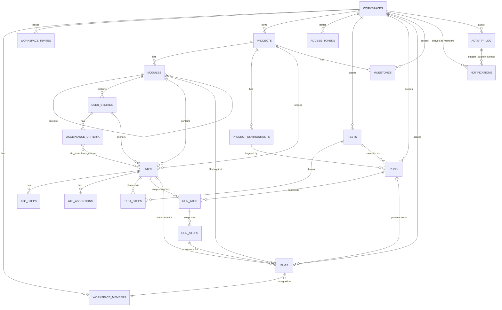
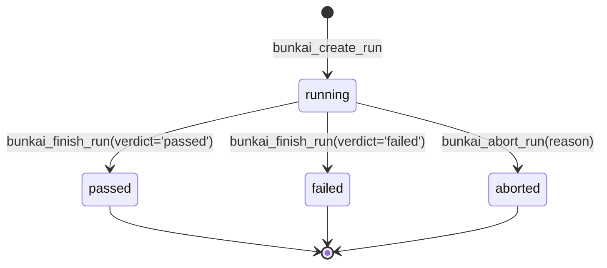
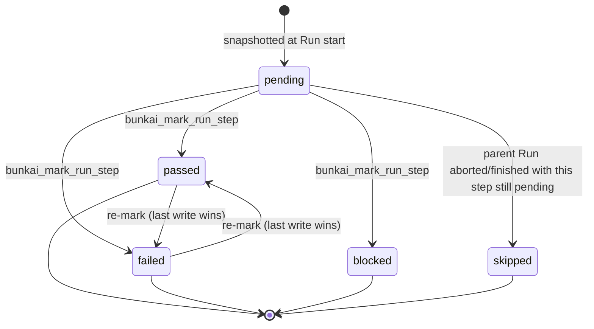
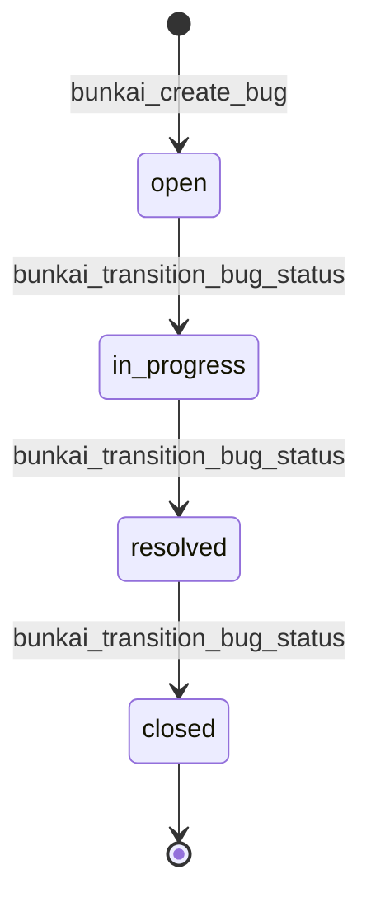
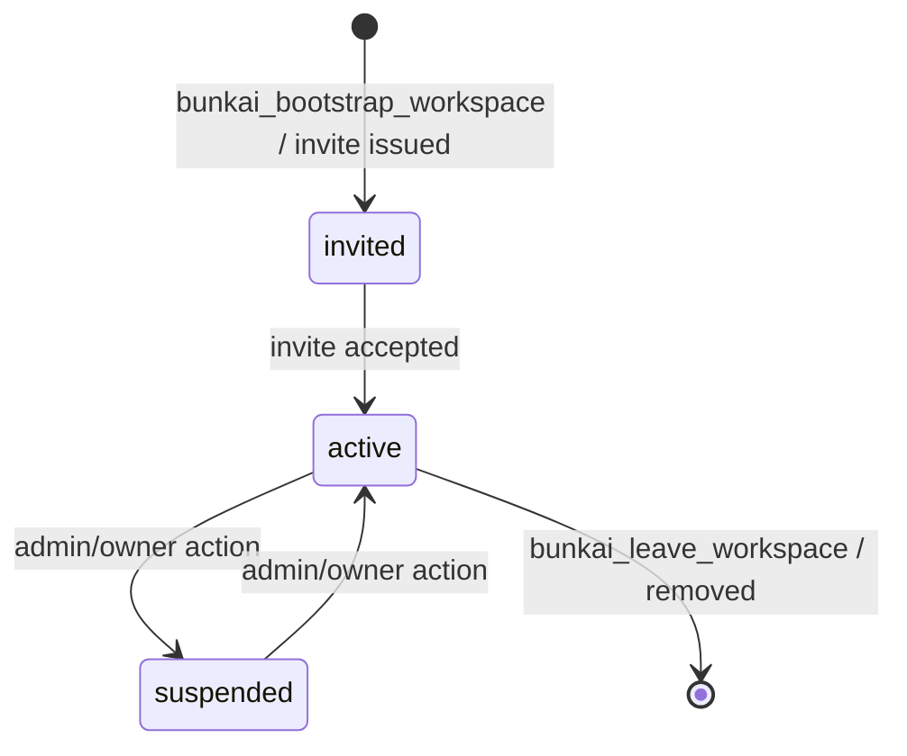
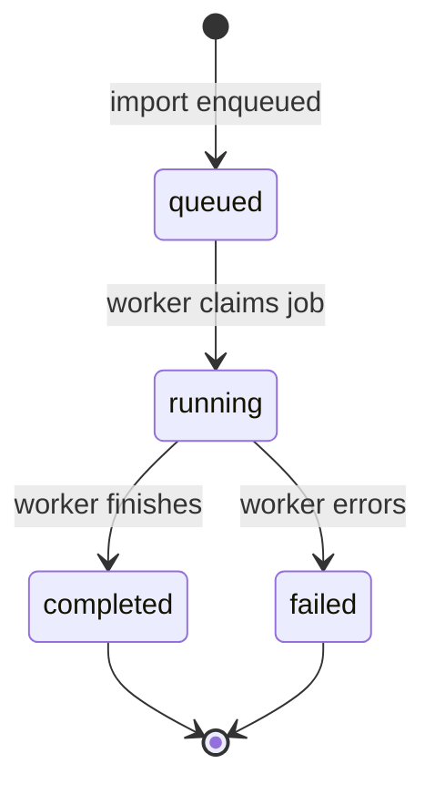

# Domain Glossary — Bunkai TMS

> Target: `upex-bunkai-tms` (local path `../upex-bunkai-tms`). Reverse-engineered from **all 69** `supabase/migrations/*.sql` files (`0001_tenancy.sql` → `0069_story_traceability_module.sql`), read in full for this pass — not sampled. Migrations are treated as authoritative per the skill's "prefer schema over ORM models" rule.
> Generated: 2026-08-17
> No `database.types.ts` or other generated Supabase types file exists in the target repo (confirmed via glob) — there was nothing to cross-reference against, so every column below comes directly from `CREATE TABLE` / `ALTER TABLE` statements.
> No i18n / locales directory exists in the target repo (`public/locales/`, `src/locales/` both empty) — see §7 UI Labels Reference and §8 Discovery Gaps.

---

## 1. Core Entities

Scope note: the schema has 28 tables. The 12 below are the **business-meaningful core entities** — each gets the full contract (table, relationships, JSON example). A further 6 tables are tightly-coupled **child/detail tables** of a core entity (steps, assertions, join tables, execution-time snapshots) and are documented as sub-rows inside their parent's section rather than as standalone subsections, to keep the parent-child relationship visible. A final 10 tables are **supporting / infrastructure entities** (auth secrets, audit log, feature flags, idempotency, notification delivery) — real tables, but not business domain nouns a test case would name; they get one summary table in §1.14 rather than 10 near-identical subsections. Every one of the 28 tables is accounted for; none is silently dropped.

### 1.1 Workspace

The tenant boundary. Every other table resolves its tenant by walking back to a `workspace_id`.

| Technical Name | Business Name | Description | Table/Collection | Key Attributes | Found In |
|---|---|---|---|---|---|
| `workspaces` | Workspace | The multi-tenant root; one workspace = one customer/team account | `public.workspaces` | `id`, `slug` (unique, URL-safe), `name`, `owner_user_id`, `plan`, `created_at` | `supabase/migrations/0001_tenancy.sql:27-35` |

**Relationships**
- Has many `workspace_members` (RBAC roster)
- Has many `workspace_invites`
- Has many `projects`
- Has many `access_tokens` (workspace-scoped tokens)
- Has many `runs`, `tests`, `bugs`, `milestones`, `notifications` (all workspace-scoped)
- Belongs to one `owner_user_id` (`auth.users`, Supabase-managed, not a Bunkai table)

```json
{
  "id": "b3f1c2e0-...",
  "slug": "acme-qa",
  "name": "Acme QA",
  "owner_user_id": "8a2e...",
  "plan": "community",
  "created_at": "2026-05-19T10:00:00Z"
}
```

### 1.2 Workspace Member

The RBAC join between a Supabase Auth user and a Workspace.

| Technical Name | Business Name | Description | Table/Collection | Key Attributes | Found In |
|---|---|---|---|---|---|
| `workspace_members` | Workspace Membership | A user's role + status inside one workspace | `public.workspace_members` | `workspace_id`, `user_id` (composite PK), `role`, `status`, `joined_at` | `supabase/migrations/0001_tenancy.sql:40-49` |

**Relationships**
- Belongs to one `workspace`
- Belongs to one `auth.users` row
- Referenced by `bugs.assignee_user_id` eligibility checks (`supabase/migrations/0054_bug_assignment_status.sql:158-174`)

```json
{
  "workspace_id": "b3f1c2e0-...",
  "user_id": "8a2e...",
  "role": "member",
  "status": "active",
  "joined_at": "2026-05-19T10:05:00Z"
}
```

### 1.3 Project

The application-under-test, scoped to a single workspace.

| Technical Name | Business Name | Description | Table/Collection | Key Attributes | Found In |
|---|---|---|---|---|---|
| `projects` | Project | One product/app being QA'd inside a workspace | `public.projects` | `id`, `workspace_id`, `slug` (unique per workspace), `name`, `description`, `created_at` | `supabase/migrations/0002_projects_modules.sql:17-25` |

**Relationships**
- Belongs to one `workspace`
- Has many `modules`, `project_environments`, `atcs`, `tests` (via workspace + chain), `runs`, `bugs`, `milestones`

```json
{
  "id": "c1a2...",
  "workspace_id": "b3f1c2e0-...",
  "slug": "checkout-api",
  "name": "Checkout API",
  "description": null,
  "created_at": "2026-05-19T10:10:00Z"
}
```

### 1.4 Module

A self-referential tree (max depth 6) organizing a Project's requirements/tests. Path is materialized (slash-separated).

| Technical Name | Business Name | Description | Table/Collection | Key Attributes | Found In |
|---|---|---|---|---|---|
| `modules` | Module | A folder/section of a Project's feature tree | `public.modules` | `id`, `project_id`, `parent_module_id`, `path` (materialized, depth ≤ 6), `name`, `position`, `description`, `archived_at`, `created_at` | `supabase/migrations/0002_projects_modules.sql:109-121`, description added `0013_module_description.sql:12-13`, soft-delete added `0014_module_soft_delete.sql:28` |

**Relationships**
- Belongs to one `project`
- Has one optional parent `module` (self-referential tree)
- Has many child `modules`
- Has many `user_stories`, `atcs`
- Referenced by `runs.module_id` (chain-position-1 snapshot), `bugs.module_id`

```json
{
  "id": "m1...",
  "project_id": "c1a2...",
  "parent_module_id": null,
  "path": "checkout",
  "name": "Checkout",
  "position": 0,
  "description": null,
  "archived_at": null,
  "created_at": "2026-05-19T10:15:00Z"
}
```

### 1.5 User Story

The unit of business intent, anchored to a Module.

| Technical Name | Business Name | Description | Table/Collection | Key Attributes | Found In |
|---|---|---|---|---|---|
| `user_stories` | User Story | A requirement/feature description, importable from Jira | `public.user_stories` | `id`, `module_id`, `project_id` (denormalized), `title`, `description`, `external_id`/`external_url` (Jira link), `status` (`draft`\|`ready_to_test`), `archived_at`, `created_at` | `supabase/migrations/0003_authoring.sql:15-23`, `project_id` + Jira-key uniqueness `0016_user_story_uniqueness.sql:13-24`, `status` gate `0017_acceptance_criteria_ordering.sql:20-27` |

**Relationships**
- Belongs to one `module`
- Has many `acceptance_criteria`
- Has many `atcs` (an ATC anchors to exactly one user story)

```json
{
  "id": "us1...",
  "module_id": "m1...",
  "project_id": "c1a2...",
  "title": "As a shopper I can apply a promo code",
  "description": null,
  "external_id": "BK-101",
  "external_url": "https://jira.example.com/browse/BK-101",
  "status": "ready_to_test",
  "archived_at": null,
  "created_at": "2026-05-20T09:00:00Z"
}
```

### 1.6 Acceptance Criterion

A sortable, individually-testable condition of satisfaction on a User Story.

| Technical Name | Business Name | Description | Table/Collection | Key Attributes | Found In |
|---|---|---|---|---|---|
| `acceptance_criteria` | Acceptance Criterion (AC) | One testable condition within a User Story | `public.acceptance_criteria` | `id`, `user_story_id`, `title`, `description`, `position` (1..N, active-only unique), `archived_at`, `created_at` | `supabase/migrations/0003_authoring.sql:122-130`, active-only ordering `0017_acceptance_criteria_ordering.sql:29-39` |

**Relationships**
- Belongs to one `user_story`
- Has many `atcs` via `atc_acceptance_criteria` (M:N — the "anchoring moat")

```json
{
  "id": "ac1...",
  "user_story_id": "us1...",
  "title": "A valid promo code reduces the order total",
  "description": null,
  "position": 1,
  "archived_at": null,
  "created_at": "2026-05-20T09:05:00Z"
}
```

### 1.7 ATC (Acceptance Test Case)

The reusable, versioned test-case unit. Must be linked to ≥1 Acceptance Criterion (the "anchoring moat" — enforced app-side + by 0021's RPC validation, not a raw DB FK).

| Technical Name | Business Name | Description | Table/Collection | Key Attributes | Found In |
|---|---|---|---|---|---|
| `atcs` | ATC / Acceptance Test Case | A named, versioned test case anchored to a User Story + ≥1 AC | `public.atcs` | `id`, `project_id`, `module_id`, `user_story_id`, `slug` (`<module-slug>/atc-<8hex>`, immutable), `title` (min 3 chars, `0058`), `layer` (`UI`\|`API`\|`Unit`), `version`, `status` (see gap note below), `tags` (max 10, `0065`), `tsv` (full-text search), `archived_at`, `created_at`, `updated_at` | `supabase/migrations/0004_atcs.sql:53-69`, title floor `0058_atc_title_min_length.sql:50-53`, tag cap `0065_atc_tags_cap_guard.sql:26-27` |

**Child tables** (documented here rather than as separate subsections — they have no independent business identity outside their parent ATC):
- `atc_steps` — ordered executable steps (`atc_id`, `position`, `content`, `input_data`, `expected`) — `supabase/migrations/0004_atcs.sql:179-187`
- `atc_assertions` — ordered pass/fail assertions (`atc_id`, `position`, `content`) — `supabase/migrations/0004_atcs.sql:285-291`
- `atc_acceptance_criteria` — the M:N anchoring join (`atc_id`, `acceptance_criterion_id`) — `supabase/migrations/0004_atcs.sql:389-393`

**Relationships**
- Belongs to one `project`, one `module`, one `user_story`
- Has many `atc_steps`, `atc_assertions`
- Linked to ≥1 `acceptance_criteria` via `atc_acceptance_criteria`
- Referenced by `test_steps.atc_id` (chained into Tests), `run_atcs.atc_id` (execution provenance), `bugs.atc_id` (defect provenance)

```json
{
  "id": "atc1...",
  "project_id": "c1a2...",
  "module_id": "m1...",
  "user_story_id": "us1...",
  "slug": "checkout/atc-3f9a12bc",
  "title": "Apply valid promo code reduces total",
  "layer": "API",
  "version": 1,
  "status": "unrun",
  "tags": ["smoke"],
  "archived_at": null,
  "created_at": "2026-06-08T09:00:00Z",
  "updated_at": "2026-06-08T09:00:00Z"
}
```

### 1.8 Test

A named, ordered chain of ATC **references** (never copies) — a workspace-scoped composition, not a project-scoped one.

| Technical Name | Business Name | Description | Table/Collection | Key Attributes | Found In |
|---|---|---|---|---|---|
| `tests` | Test | A named, reusable chain of ATCs, executed as a Run | `public.tests` | `id`, `workspace_id`, `title` (1-200 chars, trimmed), `created_by`, `version` (optimistic lock, `0026`), `tags` (`0030`), `created_at`, `updated_at` | `supabase/migrations/0024_tests.sql:40-49`, `version` `0026_tests_reorder.sql:45-46`, `tags` `0030_test_tags.sql:45-46` |

**Child table**: `test_steps` — the ordered chain itself (`id` surrogate PK, `test_id`, `atc_id`, `position` ≥ 1, unique per `(test_id, position)`; **no** `unique(test_id, atc_id)` — the same ATC may legally appear at multiple chain positions) — `supabase/migrations/0024_tests.sql:60-68`

**Relationships**
- Belongs to one `workspace`
- Chains many `atcs` (via `test_steps`, ordered, duplicates allowed)
- Has many `runs` (each Run snapshots this Test's chain at start time)

```json
{
  "id": "test1...",
  "workspace_id": "b3f1c2e0-...",
  "title": "Checkout smoke suite",
  "created_by": "8a2e...",
  "version": 1,
  "tags": ["smoke"],
  "created_at": "2026-06-12T09:00:00Z",
  "updated_at": "2026-06-12T09:00:00Z"
}
```

### 1.9 Project Environment

A first-class target a Run executes against (e.g. Staging, Production).

| Technical Name | Business Name | Description | Table/Collection | Key Attributes | Found In |
|---|---|---|---|---|---|
| `project_environments` | Environment | A named execution target for a Project's Runs | `public.project_environments` | `id`, `project_id`, `name` (1-50 chars, unique case-insensitive per project), `created_at` | `supabase/migrations/0031_runs.sql:30-39`, CRUD RPCs `0032_project_environments_crud.sql` |

**Relationships**
- Belongs to one `project`
- Has many `runs` (a Run targets exactly one environment; deletion blocked while any Run references it — `bunkai_delete_environment`, `0032:214-258`)

```json
{ "id": "env1...", "project_id": "c1a2...", "name": "Staging", "created_at": "2026-06-19T10:00:00Z" }
```

### 1.10 Run

One execution of a Test against an Environment. **Snapshots** the Test's chain (ATC titles + step content) at start time — editing the source ATC afterward never retroactively changes a past Run.

| Technical Name | Business Name | Description | Table/Collection | Key Attributes | Found In |
|---|---|---|---|---|---|
| `runs` | Run | One execution instance of a Test | `public.runs` | `id`, `workspace_id`, `project_id`, `test_id`, `environment_id`, `module_id` (chain-position-1 snapshot, `0040`), `status`, `executor_mode` (`human`\|`agent`\|`ci`), `executor_user_id` (the starter), `start_token` (idempotency), `test_title` (snapshot), `abort_reason` (`0036`), `version`, `started_at`, `finished_at`, `created_at`, `updated_at` | `supabase/migrations/0031_runs.sql:72-90`, abort_reason `0036_run_abort.sql:32-44`, module snapshot `0040_run_module_snapshot.sql:41-42` |

**Child tables**:
- `run_atcs` — one row per chain position, snapshotting the ATC title + rolling up a verdict from its steps (`run_id`, `atc_id` [provenance-only, `on delete set null`], `position`, `atc_title`, `status`) — `supabase/migrations/0031_runs.sql:120-129`
- `run_steps` — one row per executable step, snapshotting content/input/expected (`run_atc_id`, `atc_step_id` [provenance-only], `position`, `content`, `input_data`, `expected`, `status`, `note`, `evidence_url`, `executed_at`) — `supabase/migrations/0031_runs.sql:163-179`, marking RPC `0042_run_step_mark.sql`

**Relationships**
- Belongs to one `workspace`, `project`, `test`, `environment`, and an optional snapshotted `module`
- Has many `run_atcs`, each with many `run_steps`
- Referenced by `bugs.run_id` / `bugs.run_step_id` (provenance)
- Idempotent create (same `test_id` + `start_token` within 24h replays the existing Run, `0031_runs.sql:380-397`)

```json
{
  "id": "run1...",
  "workspace_id": "b3f1c2e0-...",
  "project_id": "c1a2...",
  "test_id": "test1...",
  "environment_id": "env1...",
  "module_id": "m1...",
  "status": "passed",
  "executor_mode": "human",
  "executor_user_id": "8a2e...",
  "test_title": "Checkout smoke suite",
  "abort_reason": null,
  "version": 3,
  "started_at": "2026-06-19T11:00:00Z",
  "finished_at": "2026-06-19T11:05:00Z"
}
```

### 1.11 Bug

A defect record, filed from a failed Run Step or standalone.

| Technical Name | Business Name | Description | Table/Collection | Key Attributes | Found In |
|---|---|---|---|---|---|
| `bugs` | Bug / Defect | A reported quality issue, optionally traced to a Run/Step/ATC | `public.bugs` | `id`, `workspace_id`, `project_id`, `module_id`, `run_id`/`run_step_id`/`atc_id` (nullable provenance, `on delete set null`), `title` (5-200 chars), `severity` (`P1`-`P4`), `status` (`open`→`in_progress`→`resolved`→`closed`, forward-only), `description`, `steps_to_reproduce`, `evidence_urls` (≤10), `assignee_user_id` (`0054`), `created_by`, `created_at`, `updated_at` | `supabase/migrations/0046_bugs.sql:93-116`, assignment + status lifecycle `0054_bug_assignment_status.sql` |

**Relationships**
- Belongs to one `workspace`, `project`, `module`
- Optionally references one `run`, `run_step`, `atc` (provenance snapshot, survives their deletion)
- Optionally assigned to one `workspace_member` (must be active, non-`viewer`)
- Fires `bug.assigned`/`bug.reassigned`/`bug.unassigned`/`bug.status_changed` activity + notification events

```json
{
  "id": "bug1...",
  "workspace_id": "b3f1c2e0-...",
  "project_id": "c1a2...",
  "module_id": "m1...",
  "run_id": "run1...",
  "run_step_id": "rs1...",
  "atc_id": "atc1...",
  "title": "Promo code field accepts negative discount",
  "severity": "P2",
  "status": "open",
  "assignee_user_id": null,
  "evidence_urls": [],
  "created_by": "8a2e...",
  "created_at": "2026-08-01T09:00:00Z"
}
```

### 1.12 Milestone

A named target date for a Project's release/checkpoint.

| Technical Name | Business Name | Description | Table/Collection | Key Attributes | Found In |
|---|---|---|---|---|---|
| `milestones` | Milestone | A dated checkpoint for a Project | `public.milestones` | `id`, `workspace_id`, `project_id`, `name` (1-100 chars, whitespace-normalized, unique per project), `target_date` (today..+5y at write time), `description` (≤500 chars), `created_by`, `created_at`, `updated_at` | `supabase/migrations/0064_milestones.sql:44-56` |

**Relationships**
- Belongs to one `workspace`, one `project`
- No delete path exists (deliberately out of scope, `0064_milestones.sql:28-29`)

```json
{
  "id": "ms1...",
  "project_id": "c1a2...",
  "name": "v2.0 Release",
  "target_date": "2026-12-01",
  "description": "",
  "created_by": "8a2e...",
  "created_at": "2026-08-05T09:00:00Z"
}
```

### 1.13 Notification

A per-recipient inbox entry produced from workspace events (run finished/aborted, bug assigned/status-changed).

| Technical Name | Business Name | Description | Table/Collection | Key Attributes | Found In |
|---|---|---|---|---|---|
| `notifications` | Notification | One inbox item for one recipient | `public.notifications` | `id`, `workspace_id`, `recipient_user_id`, `event_type`, `entity_type` (`run`\|`test`\|`bug`), `entity_id` (no FK — polymorphic, survives entity deletion), `payload` (jsonb snapshot), `read_at` (null = unread), `created_at`, `source_event_id` (idempotency key back to `activity_log.id`) | `supabase/migrations/0053_notifications.sql:63-83`, idempotency column `0056_bug_event_notifications.sql:113-120` |

**Relationships**
- Belongs to one `workspace`, one recipient (`auth.users`)
- Produced by triggers on `activity_log` INSERT (`bunkai_notify_bug_event` `0056`, `bunkai_notify_run_event` `0066`) — never written directly by a client
- 90-day retention window enforced at RLS read time, not by deletion

```json
{
  "id": "notif1...",
  "workspace_id": "b3f1c2e0-...",
  "recipient_user_id": "8a2e...",
  "event_type": "bug.status_changed",
  "entity_type": "bug",
  "entity_id": "bug1...",
  "payload": { "title": "Promo code field...", "previous_status": "open", "status": "in_progress" },
  "read_at": null,
  "created_at": "2026-08-03T10:00:00Z"
}
```

### 1.14 Supporting / Infrastructure Entities

Real tables, each with its own `Found In`, but not business nouns a manual test case names — auth secrets, audit trail, delivery plumbing.

| Technical Name | Business Name | Description | Found In |
|---|---|---|---|
| `access_tokens` (+ `access_token_secrets`) | Personal Access Token (PAT) | Bearer credential for CLI/CI/AI-agent API calls, scoped to `atc:read`\|`atc:write`\|`run:execute`\|`workspace:admin` | `0008_access_tokens.sql`, secret split `0011_split_token_secrets.sql` |
| `workspace_invites` (+ `workspace_invite_secrets`) | Teammate Invite | A pending invite (email + role), token-hashed, 7-day expiry | `0010_workspace_invites.sql`, secret split `0011` |
| `activity_log` | Activity Event | Append-only audit trail of every mutating action; source of the Activity Stream + notification producers | `0009_cross_cutting.sql:79-88` |
| `import_jobs` | Jira Import Job | Async one-way Jira→Bunkai story import (`queued`→`running`→`completed`\|`failed`), one active per project | `0019_import_jobs.sql`, `0020_import_jobs_one_active.sql` |
| `notification_preferences` | Notification Preference | Personal, cross-workspace opt-in/out grid: `run_lifecycle`\|`bug_lifecycle`\|`mentions` (locked) × `in_app`\|`email` | `0062_notification_preferences.sql:42-50` |
| `idempotency_keys` | Idempotency Record | Generic POST-replay guard (24h TTL), independent of the Run-specific `start_token` mechanism | `0009_cross_cutting.sql:28-42` |
| `feature_flags` | Feature Flag | Global or per-workspace boolean toggle, no client write path in MVP | `0009_cross_cutting.sql:116-134` |
| `user_view_state` | User View State | Per-user, per-project UI state persistence (e.g. last-used filters) | `0009_cross_cutting.sql:166-173` |
| `magic_link_tokens` (+ `magic_link_token_secrets`) | Magic Link Token | Audit trail of auth magic-link issuance/consumption for replay detection | `0009_cross_cutting.sql:211-221`, secret split `0011` |

---

## 2. Enumerations and Constants

| Table.Column | Value | Business Meaning | Usage Context | Found In |
|---|---|---|---|---|
| `workspace_members.role` | `viewer` | Read-only member | Cannot create/edit/delete any workspace resource | `0001_tenancy.sql:43-44` |
| | `member` | Standard contributor | Can author + write across the workspace | |
| | `admin` | Workspace administrator | Can manage members/invites in addition to `member` rights | |
| | `owner` | Workspace owner | Full control; only role that can delete the workspace; ≥1 must always remain (`0044_leave_workspace.sql`) | |
| `workspace_members.status` | `active` | Membership in force | Grants access | `0001_tenancy.sql:45-46` |
| | `invited` | Not yet accepted | No access yet | |
| | `suspended` | Access revoked | No access, row retained | |
| `workspaces.plan` | `community` | Free/self-hosted tier | Default at bootstrap | `0001_tenancy.sql:32-34` |
| | `cloud` | Hosted paid tier | No enforcement logic found (see §8) | |
| | `enterprise` | Enterprise tier | No enforcement logic found (see §8) | |
| `workspace_invites.role` | `viewer`\|`member`\|`admin` | Role the invite will grant on acceptance | Note: `owner` is NOT invitable | `0010_workspace_invites.sql:17-18` |
| `atcs.layer` | `UI`\|`API`\|`Unit` | Test automation layer the ATC targets | Filters/classifies ATC search results | `0004_atcs.sql:60` |
| `atcs.status` | `pass`\|`fail`\|`blocked`\|`skipped`\|`running`\|`unrun` | Declared, defaults `unrun` | **Dead in production** — confirmed by migration `0050`'s own audit: no write path ever updates this column; the real per-execution status lives on `run_atcs.status` instead. See §8. | `0004_atcs.sql:62-63`; dead-column finding `0050_project_coverage_report_real_execution_source.sql:1-24` |
| `runs.status` | `running` | In progress | Initial state | `0031_runs.sql:79-80` |
| | `passed` | Finished, all steps passed | Terminal | `0037_run_finish.sql` |
| | `failed` | Finished, verdict = failed | Terminal | `0037_run_finish.sql` |
| | `aborted` | Manually stopped before completion | Terminal | `0036_run_abort.sql` |
| `runs.executor_mode` | `human`\|`agent`\|`ci` | Who/what is driving the Run | Stamped at start, never changes | `0031_runs.sql:81` |
| `run_atcs.status` / `run_steps.status` | `pending` | Not yet executed | Initial state | `0031_runs.sql:126-127,173-174` |
| | `passed` | Step/ATC passed | | |
| | `failed` | Step/ATC failed | Overrides all other outcomes when computing a parent ATC verdict | `0042_run_step_mark.sql:167-172` |
| | `blocked` | Could not be executed | | |
| | `skipped` | Explicitly skipped, or auto-skipped when a Run is aborted/finished with steps still pending | `0036_run_abort.sql:193-206`, `0037_run_finish.sql:105-118` |
| `bugs.severity` | `P1`\|`P2`\|`P3`\|`P4` | Priority ranking, P1 = most severe | Sorts bug lists severity-first | `0046_bugs.sql:106` |
| `bugs.status` | `open`→`in_progress`→`resolved`→`closed` | Forward-only lifecycle, one stage at a time (no skipping, no backward move) | Enforced both in the RPC and a DB trigger backstop | `0046_bugs.sql:107-108`; adjacency rule `0054_bug_assignment_status.sql:138-156` |
| `access_tokens.scopes` | `atc:read`\|`atc:write`\|`run:execute`\|`workspace:admin` | Per-action PAT permission grants (array, ≥1 required) | `workspace:admin` requires the issuing user to actually hold admin/owner (retro-enforced by `0033`) | `0008_access_tokens.sql:34-36` |
| `import_jobs.status` | `queued`→`running`→`completed`\|`failed` | Jira import job lifecycle | One active (`queued`/`running`) job per project, enforced by a partial unique index | `0019_import_jobs.sql:15`, race-proofed `0020_import_jobs_one_active.sql` |
| `user_stories.status` | `draft`\|`ready_to_test` | Gate: a story needs ≥1 active AC to become `ready_to_test` | Reverts to `draft` automatically if its last active AC is archived | `0017_acceptance_criteria_ordering.sql:20-27` |
| `notification_preferences.event_type` | `run_lifecycle`\|`bug_lifecycle`\|`mentions` | Which event family a preference row governs | `mentions` is structurally locked (rejected by RLS) until a future Team Chat feature ships | `0062_notification_preferences.sql:45` |
| `notification_preferences.channel` | `in_app`\|`email` | Delivery channel | | `0062_notification_preferences.sql:46` |
| `feature_flags.scope` | `global`\|`workspace` | Flag applies app-wide or to one workspace | | `0009_cross_cutting.sql:119-120` |

---

## 3. Business Rules

### BR-1: ATC anchoring moat
**Description**: An ATC must be linked to at least one Acceptance Criterion at creation time.
**Entities Affected**: `atcs`, `acceptance_criteria`, `atc_acceptance_criteria`
**Validation**: `bunkai_create_atc` raises `ac_outside_user_story` (SQLSTATE `45020`) when the supplied AC id array is empty or any id doesn't belong to the ATC's own user story.
**Error Message**: `ac_outside_user_story`
**Found In**: `supabase/migrations/0021_atc_create_update.sql:158-169`

```gherkin
Given a User Story with zero linked Acceptance Criteria supplied
When a QA engineer attempts to create an ATC without selecting any AC
Then the create request is rejected with ac_outside_user_story
```

### BR-2: Module tree depth cap
**Description**: A Module tree may not exceed 6 levels of nesting, enforced both by a CHECK constraint on `path` and by the move RPC.
**Entities Affected**: `modules`
**Validation**: `modules_path_depth_max_6` CHECK; `bunkai_move_module` raises `depth_exceeded` (`45002`) when a move would push any descendant past depth 6.
**Found In**: `supabase/migrations/0002_projects_modules.sql:118-121`, `0015_module_move.sql:91-93`

```gherkin
Given a Module subtree currently at depth 6
When a user moves that subtree under a sibling one level deeper
Then the move is rejected with depth_exceeded
```

### BR-3: Test chain snapshot immutability
**Description**: Editing an ATC after a Run has started does not retroactively change that Run's recorded steps — a Run snapshots ATC title/step content at creation time.
**Entities Affected**: `atcs`, `test_steps`, `runs`, `run_atcs`, `run_steps`
**Validation**: `bunkai_create_run` copies `atcs.title`/`atc_steps.content`/`input_data`/`expected` into `run_atcs`/`run_steps` at start; no later ATC edit touches an existing Run's rows.
**Found In**: `supabase/migrations/0031_runs.sql:410-436`

```gherkin
Given a Run has started and snapshotted ATC "Apply promo code" v1
When the source ATC is edited to v2 with different step text
Then the already-started Run's steps still show the v1 text unchanged
```

### BR-4: Run idempotency via start_token
**Description**: Starting a Run with the same `(test_id, start_token)` pair within a 24-hour window replays the existing Run instead of creating a duplicate.
**Entities Affected**: `runs`
**Validation**: `bunkai_create_run` looks up an existing Run with the same token under a project-level lock before inserting.
**Found In**: `supabase/migrations/0031_runs.sql:380-397`

```gherkin
Given a Run was started 10 minutes ago with start_token "abc123"
When the same client retries the start-Run call with the same test_id and start_token "abc123"
Then the API returns the SAME Run (replayed: true), not a new one
```

### BR-5: Bug status is forward-only, one stage at a time
**Description**: A Bug's status can only advance `open → in_progress → resolved → closed`, never skip a stage and never move backward.
**Entities Affected**: `bugs`
**Validation**: `bunkai_transition_bug_status` ranks each status 1-4 and rejects `new_rank > old_rank + 1` (`bug_status_transition_skipped`, `45310`) or `new_rank <= old_rank` (`bug_status_transition_backward`, `45311`). A trigger (`bunkai_bugs_check_consistency`) re-enforces the same rule on any direct table write.
**Found In**: `supabase/migrations/0054_bug_assignment_status.sql:589-601` (RPC), `:143-156` (trigger backstop)

```gherkin
Given a Bug currently in status "open"
When a user attempts to set its status directly to "resolved" (skipping in_progress)
Then the transition is rejected with bug_status_transition_skipped
```

### BR-6: Bug assignee must be an active, non-viewer workspace member
**Description**: A Bug can only be assigned to a user who is an active member of the bug's workspace and whose role is not `viewer`.
**Entities Affected**: `bugs`, `workspace_members`
**Validation**: `bunkai_assign_bug` checks `workspace_members.status = 'active'` and `role <> 'viewer'` before writing `assignee_user_id`.
**Found In**: `supabase/migrations/0054_bug_assignment_status.sql:502-513`

```gherkin
Given a user with role "viewer" in the workspace
When a QA lead attempts to assign a Bug to that viewer
Then the assignment is rejected with bug_assignee_view_only
```

### BR-7: One active Jira import per project
**Description**: Only one `queued` or `running` import job may exist per project at a time.
**Entities Affected**: `import_jobs`
**Validation**: A partial unique index on `project_id` where `status in ('queued','running')`; the enqueue route maps the resulting unique-violation to HTTP 409.
**Found In**: `supabase/migrations/0020_import_jobs_one_active.sql:11-13`

```gherkin
Given Project "Checkout API" already has an import job in status "running"
When a user starts a second Jira import for the same project
Then the request is rejected with HTTP 409 import_in_progress
```

### BR-8: Workspace must always retain ≥1 active owner
**Description**: A user cannot leave (or lose) their only workspace, and the sole remaining owner cannot leave without another owner present.
**Entities Affected**: `workspace_members`
**Validation**: `bunkai_leave_workspace` raises `last_membership` (`45212`) if it's the caller's only active membership, or `sole_owner` (`45213`) if the caller is the only active owner.
**Found In**: `supabase/migrations/0044_leave_workspace.sql:75-95`

```gherkin
Given a workspace with exactly one active owner
When that owner attempts to leave the workspace
Then the request is rejected with sole_owner
```

### BR-9: Reserved Test tags are lowercased, custom tags preserve casing
**Description**: The three reserved suite tags (`smoke`, `sanity`, `regression`) are normalized to lowercase on write; any other (custom) tag keeps the caller's casing.
**Entities Affected**: `tests`
**Validation**: `bunkai_normalize_test_tags` lowercases only when `lower(btrim(val)) in ('smoke','sanity','regression')`.
**Found In**: `supabase/migrations/0030_test_tags.sql:99-124`

```gherkin
Given a Test with no tags
When a user sets tags ["Smoke", "MyCustomTag"]
Then the stored tags are ["smoke", "MyCustomTag"] — reserved tag lowercased, custom tag untouched
```

---

## 4. Entity Relationships Diagram



---

## 5. Terminology Mapping

### 5.1 Technical → Business Terms

| Technical Term | Business Term | Notes |
|---|---|---|
| `workspaces` | Workspace / Account / Tenant | The top-level customer boundary |
| `workspace_members` | Team Roster / Membership | |
| `workspace_invites` | Teammate Invite | |
| `projects` | Project / Application Under Test | |
| `modules` | Module / Feature Folder | Self-referential tree, max depth 6 |
| `user_stories` | User Story / Requirement | Often Jira-imported |
| `acceptance_criteria` | Acceptance Criterion (AC) | |
| `atcs` | ATC / Acceptance Test Case | The reusable test-case unit |
| `atc_steps` | Test Step | Ordered, executable |
| `atc_assertions` | Assertion / Expected Result | |
| `tests` | Test (capital T) | A named chain of ATC references |
| `test_steps` | Chain Position | One link in a Test's ATC chain |
| `runs` | Run / Execution | One instance of executing a Test |
| `run_atcs` | Run ATC Result | Per-chain-position verdict rollup |
| `run_steps` | Run Step Result | Per-step pass/fail/blocked/skipped |
| `project_environments` | Environment | e.g. Staging, Production |
| `bugs` | Bug / Defect | |
| `milestones` | Milestone | |
| `access_tokens` | Personal Access Token (PAT) | For CLI/CI/AI-agent auth |
| `activity_log` | Activity Event / Audit Trail | |
| `notifications` | Notification / Inbox Item | |
| `import_jobs` | Jira Import Job | |

### 5.2 Abbreviations and Acronyms

| Abbreviation | Expansion |
|---|---|
| ATC | Acceptance Test Case |
| AC | Acceptance Criterion |
| PAT | Personal Access Token |
| RLS | Row Level Security (Postgres/Supabase tenant isolation mechanism) |
| RPC | Remote Procedure Call (a Postgres function invoked via `supabase.rpc()`) |
| CI | Continuous Integration (one of the three `executor_mode` values) |
| TMS | Test Management System (the product category Bunkai belongs to) |
| P1-P4 | Bug severity/priority tiers (P1 = most severe) |

---

## 6. Status / State Flows

### 6.1 Run status


Found In: `supabase/migrations/0031_runs.sql:79-80`, `0036_run_abort.sql`, `0037_run_finish.sql`. Terminal states are final — no RPC transitions a Run out of `passed`/`failed`/`aborted`.

### 6.2 Run ATC / Run Step status


Found In: `supabase/migrations/0042_run_step_mark.sql:97-192` (re-mark is last-write-wins, no conflict error, unlike Run-level transitions which are first-wins). A `run_atcs.status` is computed from its sibling `run_steps`: any step still `pending` → `pending`; else `failed` if any step failed; else `blocked` if any blocked; else `passed` (`0042:159-176`).

### 6.3 Bug status


Found In: `supabase/migrations/0046_bugs.sql:107-108`, adjacency enforcement `0054_bug_assignment_status.sql:138-156,589-601`. Strictly forward, one stage at a time — see BR-5.

### 6.4 Workspace Member status


Found In: `supabase/migrations/0001_tenancy.sql:45-46`. No RPC reading the migrations explicitly drives `active → suspended`/back in this pass — the CHECK constraint permits it, but the transition-triggering endpoint was not located in the 69 files read (see §8 gap).

### 6.5 Import Job status


Found In: `supabase/migrations/0019_import_jobs.sql:15`, one-active-per-project guard `0020_import_jobs_one_active.sql`.

---

## 7. UI Labels Reference

**No i18n/locales directory exists in the target repo** (`public/locales/`, `src/locales/` both confirmed empty via glob). No component `.tsx` files were opened in this discovery pass to read literal button/label text — that would require a separate, deeper sweep of `app/(app)/**/*.tsx` and `components/**/*.tsx`, which was out of scope for a schema-driven glossary pass.

The table below is therefore **inferred, low-confidence**, derived only from RPC/action names and Jira-comment quotes embedded in migration headers (e.g. `0054`'s "assigned this defect to Sara Iglesias", `0058`'s AC copy). Treat every row as a hypothesis to verify against the live UI, not a citation.

| Inferred Action / Field | Likely UI Label | Source (low confidence) |
|---|---|---|
| `bunkai_create_run` | "Start Run" | RPC name + `run.started` event |
| `bunkai_abort_run` | "Abort Run" | RPC name + `run.aborted` event |
| `bunkai_finish_run` | "Finish Run" / Pass-Fail verdict buttons | RPC name + `run.finished` event |
| `bunkai_mark_run_step` | Pass / Fail / Blocked buttons per step | `0042_run_step_mark.sql` SQLSTATE names |
| `bunkai_assign_bug` | "Assign" / assignee picker | `0054` quoted AC: "assigned this defect to Sara Iglesias" |
| `bunkai_transition_bug_status` | Status dropdown (Open / In Progress / Resolved / Closed) | Enum values themselves |
| `bunkai_create_milestone` | "New Milestone" form (Name, Target Date, Description) | `0064` field names |
| ATC `layer` filter | "UI" / "API" / "Unit" chips | Enum values themselves |
| Test tag filter | "smoke" / "sanity" / "regression" reserved-tag chips | `0030_test_tags.sql` comments |

**Recommendation**: before writing UI-level test cases, a follow-up pass should grep `app/(app)/**/*.tsx` for literal JSX strings, since no i18n bundle exists to shortcut that work.

---

## 8. Discovery Gaps

- **`database.types.ts` (or any generated Supabase types file) does not exist in the target repo.** Nothing to cross-reference the migration-derived schema against; the migrations are the sole source of truth here (consistent with the skill's stated preference anyway).
- **No i18n/locales directory exists.** §7 UI Labels is low-confidence and inferred, not extracted from real UI strings — see the recommendation in §7.
- **`atcs.status` is a dead column in production.** It exists, defaults to `'unrun'`, and is documented as a coverage signal in 0004 — but migration `0050`'s own header proves no production write path (across 0007/0014/0021/0023/0035, plus every ATC HTTP route) ever updates it, and the real per-execution status lives on `run_atcs.status` / `run_steps.status` instead. Any test case that asserts on `atcs.status` changing after a Run completes will fail — flagging so QA doesn't write a test against a column the app never touches.
- **`workspace_members.status` transition endpoints (`active ↔ suspended`) were not located** in the 69 migrations read. The CHECK constraint and the RLS policies (admin/owner write-gated) exist, but no RPC or table-comment named the suspend/reactivate action explicitly — likely a plain RLS-scoped `UPDATE` through the app layer (matching the `notification_preferences`/`milestones` "no RPC" precedent elsewhere in this schema) rather than a missing feature. Worth a targeted follow-up grep of `app/api/v1/workspaces/**` if this flow needs test coverage.
- **`workspaces.plan` (`community`/`cloud`/`enterprise`) has no enforcement logic anywhere in the 69 migrations.** Corroborates `business-model.md`'s own "Revenue Streams: Unknown" finding — the column exists, nothing reads it to gate behavior.
- **RLS policy text and RPC SQLSTATE comments were the primary source for business rules** (§3) — no `.context/business/business-rules.md` or equivalent product-side document was cross-referenced in this pass; several rules (e.g. BR-5, BR-6) are recorded verbatim from migration headers that themselves cite specific Jira PO/Tech-Lead ratification comments (e.g. `0054`'s comments 2026-08-03), which were not independently re-read here.
- **Two migrations are written but explicitly NOT applied to the live database as of the file's own header**: `0058_atc_title_min_length.sql` ("PENDING HUMAN APPROVAL — WRITTEN, NOT APPLIED") and `0067_run_finish_abort_via.sql` (its own header states neither `0066` nor `0067` were applied together to avoid an incoherent intermediate state). A schema snapshot taken directly from the live Supabase project (rather than this file-based read) could disagree with this glossary on: the ATC title ≥3-char floor, and whether `bunkai_finish_run`/`bunkai_abort_run` accept a `p_via` parameter. Re-verify against `mcp__supabase__list_migrations` before relying on either detail for a test assertion.

---

## 9. QA Usage Guide

**How to use this file when designing test cases:**

1. **Start from §1 (Core Entities) to find the real column names, constraints, and value domains** before writing any test-data fixture — e.g. `bugs.title` requires 5-200 chars, `milestones.name` is whitespace-normalized before the uniqueness check runs, `atcs.tags` caps at 10.
2. **Use §2 (Enumerations) as the exhaustive value list for any dropdown/status field.** Every enum here is a closed set validated by a Postgres CHECK or an RPC backstop — an EP (equivalence partitioning) test suite for a status field should cover every listed value plus one invalid value, per `agentic-qa-core/references/test-design-doctrine.md`.
3. **Use §3 (Business Rules) as your first source of negative/edge-case test scenarios** — every rule here maps to an actual SQLSTATE the API surfaces, so the expected HTTP status/error code is already known (e.g. BR-5 → `bug_status_transition_skipped`/`45310`).
4. **Use §6 (Status Flows) for State-Transition-technique test design** (mandatory trigger per the test-design doctrine for any status field) — each diagram is the authoritative transition table; test every drawn edge plus every plausible **invalid** edge (e.g. `closed → open` for Bugs, `passed → running` for Runs).
5. **Cross-check tenant isolation claims against §4 (ER Diagram) before writing an RLS/multi-tenant test** — every entity ultimately resolves to one `workspace_id`; a cross-workspace access attempt (same technique, different `workspace_id`) is the standard negative test for every entity that appears here.
6. **Treat §8 (Discovery Gaps) as an explicit "verify before trusting" list**, especially the `atcs.status` dead-column gap and the two not-yet-applied migrations — do not write a test asserting behavior this glossary itself flags as unconfirmed against the live database.
7. **This file is a bridge, not a spec.** For the authoritative business narrative (why these entities exist, who uses them, what value they deliver), pair this with `.context/business/business-model.md`. For live API contracts, cross-reference `public/openapi.json` in the target repo.
