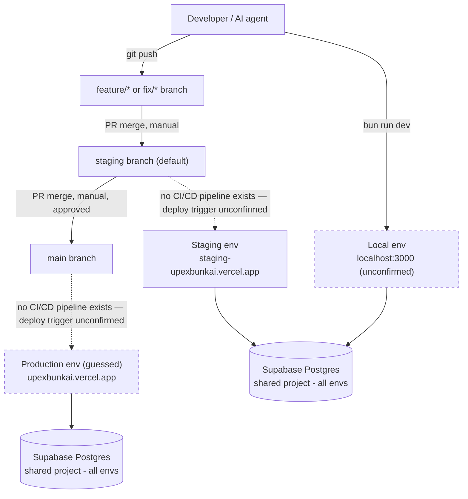
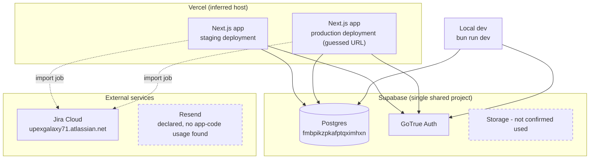

# Infrastructure Mapping — Bunkai TMS

> Target: `upex-bunkai-tms` (local path `../upex-bunkai-tms`). Single Next.js app, no monorepo — no per-package sections.
> Sources: fresh discovery this pass — `.github/workflows/` (absent), `.gitlab-ci.yml`/`Jenkinsfile`/`.circleci/` (absent), `vercel.json` (absent), `.vercel/` (absent), `*.tf`/`Pulumi.yaml`/`cdk.json`/`serverless.yml` (absent), `git remote -v`, `git branch -a`, `docs/workflows/environments.md`, `docs/workflows/git-flow.md`. Facts reused (not re-derived) from `.context/infrastructure/backend.md`, `.context/infrastructure/frontend.md`, `.context/project-config.md`, `.context/SRS/non-functional-specs.md`, `CLAUDE.md` §Project Assessment.

---

## Overview Diagram

**Reading this diagram**: the dashed arrows from `staging`/`main` to their env boxes are drawn as **assumed** (Vercel's own git-integration auto-deploy), not evidenced — no workflow file or `vercel.json` exists to confirm the trigger mechanism. See Discovery Gaps.

---

## CI/CD Configuration

**None — no workflow files found.**

Confirmed absent in this pass (re-verification of `CLAUDE.md` §Project Assessment and `.context/project-config.md`, which already flagged this — not a new finding):

| Signal checked | Result |
|---|---|
| `.github/workflows/` | Not found |
| `.gitlab-ci.yml` | Not found |
| `Jenkinsfile` | Not found |
| `.circleci/config.yml` | Not found |

No pipeline exists to read triggers/jobs/steps/secrets from. The only automated gates in the repo are local Husky hooks (`.husky/pre-commit`, `.husky/pre-push` — lint-staged, `types:check`, `vars:check`, `skills:check`, `format:check`, `lint:check`, `skills:registry:check`), which run on the developer's machine, not in any CI runner. The 135-file `bun:test` suite (`NFR-REL-007`, `CLAUDE.md` Testing Maturity 2/4) is invoked by none of these hooks — it is developer-run-on-demand only.

**No CI/CD pipeline is invented here** — this section intentionally stops at "none found," per Rule #1.

---

## Deployment Configuration

- **Hosting platform**: Vercel (inferred — not directly confirmed this pass; no `vercel.json`/`.vercel/` project-link metadata found in the repo, and no live Vercel dashboard access was used). Inference basis, reused from prior passes:
  - `webapp_domain` and `environments.staging.web_url` in this QA repo's `.agents/project.yaml` both resolve to `*.vercel.app` domains.
  - `lib/urls.ts` `getEnvironment()` (per `backend.md`) branches on `VERCEL_ENV` (`'production'` / `'preview'`) to compute the app's own `env` label — this is first-party evidence the app expects to run on Vercel, since `VERCEL_ENV` is a Vercel-injected variable, not something the app would invent otherwise.
- **`vercel.json`**: confirmed absent (re-verified this pass; matches the prior finding in `non-functional-specs.md` and `backend.md`). Per the Stack Detection Gotcha in `phase-3-infrastructure.md` ("Missing Dockerfile is not a red flag... check for platform-specific config before assuming no deploy config") — the absence of `vercel.json` is **not** evidence against Vercel; Vercel deployments commonly run entirely on zero-config git-integration defaults (framework auto-detection from `next` in `package.json`) with no `vercel.json` needed.
- **`.vercel/` directory**: confirmed absent — this local checkout has never been linked to a Vercel project via `vercel link` (or the link metadata was gitignored and never materialized locally). No secret contents were read; only the directory's non-existence was checked.
- **Deployment method**: platform build (Vercel's own `next build` invocation), not a Docker image push or static upload — no Dockerfile/docker-compose exists (confirmed absent in `project-config.md`'s prior pass; this is the expected, non-anomalous shape for a Vercel-native Next.js app, not a gap).
- **Preview environments per PR**: Vercel's default behavior if the project is in fact linked to Vercel via git integration (unconfirmed — no PR was observed triggering a preview deploy in this pass).
- **Regions / replica counts**: unknown — no Vercel project configuration is readable from this repo.

---

## Environments Matrix

| Environment | URL | Branch | Auto Deploy | Approval | Confidence |
|---|---|---|---|---|---|
| Local | `http://localhost:3000` | — (any branch, dev machine) | No | — | **Unconfirmed generic** — template default in `.agents/project.yaml`, never independently verified against a real `bun run dev` of this target repo (carried over from `project-config.md`) |
| Staging | `https://staging-upexbunkai.vercel.app` | `staging` (default branch, `origin/HEAD -> origin/staging`) | Assumed Yes (Vercel git-integration default) — **not confirmed**, no CI/CD or `vercel.json` exists to verify the trigger | None observed | **Confirmed reachable** — `curl -I` returned `HTTP 307` (live host, redirect to auth) per `project-config.md` |
| Production | `https://upexbunkai.vercel.app` (guessed) | `main` | Assumed Yes with approval (per `docs/workflows/git-flow.md`: "Solo recibe merges desde `staging` a través de pull requests aprobados") — **not confirmed** | PR review (documented convention, not a technical gate — no branch-protection rule was inspected) | **Guessed URL, unconfirmed** — derived from `webapp_domain` naming convention (no `staging-` prefix); reachability never curled |

**Branch model** (fresh discovery this pass, `git branch -a` / `git remote -v` in target repo):

- Remote: `origin` → `https://github.com/upex-galaxy/upex-bunkai-tms.git`
- `staging` is the default branch (`origin/HEAD -> origin/staging`) and the local checkout's current branch.
- `main` exists on `origin` alongside `staging` — confirmed, matches `project-config.md`'s prior finding.
- A large number of `feature/*`, `feat/*`, `fix/*`, `docs/*`, `test/*`, and `claude/*` branches exist on `origin` (70+), all named after Jira keys (`BK-NNN`) — consistent with the `docs/workflows/git-flow.md` documented convention: `feature/nombre-tarea` branches cut from `staging`, merged back to `staging`, then `staging` → `main` via approved PR.
- This confirms the Environment Matrix's branch column: `staging` branch = staging environment, `main` branch = production environment (per `docs/workflows/environments.md` §"Ambientes en Este Template" — explicitly states this project uses 3 environments: Local, Staging (`staging` branch), Production (`main` branch), a simplified model without a separate `dev` environment).

---

## Environment Variables by Environment

> Full variable inventory (names, required/optional/external-service classification) already documented in `backend.md` and `frontend.md` — not repeated here. This table records only what differs **per environment**, which is close to nothing confirmable from static code.

| Var | Local | Staging | Production |
|---|---|---|---|
| `NEXT_PUBLIC_SUPABASE_URL` | Same remote Supabase project as all other envs — no local Supabase stack exists (`backend.md`) | Same | Same |
| `NEXT_PUBLIC_SUPABASE_ANON_KEY` | Same project's anon key | Same | Same |
| `NEXT_PUBLIC_APP_URL` | `http://localhost:3000` (Zod schema default) | Not verified — no Vercel project settings read | Not verified |
| `SUPABASE_SERVICE_ROLE_KEY`, `SUPABASE_JWT_SECRET` | Server-only; presumed set per-environment in whatever store holds secrets | Same | Same |

No `.env.staging` / `.env.production` files exist in the repo (confirmed absent in `frontend.md`'s prior pass); environment separation for these vars is expected to live entirely in the hosting platform's dashboard, not in-repo.

---

## Secrets Management

| Secret category | Storage (inferred) | Access scope | Confidence |
|---|---|---|---|
| `SUPABASE_SERVICE_ROLE_KEY`, `SUPABASE_JWT_SECRET`, `NEXT_PUBLIC_SUPABASE_*` | Vercel dashboard project environment variables | Per-environment (Vercel supports separate Preview/Production/Development values) | **Inferred, not confirmed** — standard inference given `.env` is git-ignored (confirmed in target repo — `.gitignore` excludes `.env*` per convention) and Vercel is the presumed host; no way to independently verify from local code or a dashboard login |
| `ATLASSIAN_API_TOKEN`, `RESEND_API_KEY`, `TAVILY_API_KEY`, etc. (tooling/MCP-only) | Local `.env`, this QA repo's own credential store | Developer/CI-tooling scope, not app runtime | Confirmed present as `.env.example` entries (`backend.md`); values never read or reproduced |

No secret manager (Vault, AWS Secrets Manager, Doppler, 1Password CLI) reference found anywhere in the target repo. Rotation cadence: unknown, no policy documented.

---

## Cloud Services

| Service | Provider | Purpose |
|---|---|---|
| Hosting / compute | Vercel (inferred) | Next.js build + serverless function execution |
| Database | Supabase (hosted Postgres, pgbouncer pooling) | Primary datastore — single shared project across Local/Staging/Production (no per-env DB isolation found) |
| Auth | Supabase Auth (GoTrue) | Cookie session + Bearer PAT dual-method auth (per `non-functional-specs.md` NFR-SEC-001) |
| Issue tracker | Jira Cloud (`upexgalaxy71.atlassian.net`) | Source of `BK-NNN` tickets driving the branch-naming convention observed above |
| Email | Resend (`RESEND_API_KEY` declared) | Declared but **no app-code usage found** (`backend.md`) — tooling/MCP-scoped only |

---

## Database Infrastructure

Fully documented in `backend.md` → Database Configuration; summarized here for the infra-map context, not re-derived:

| Item | Value |
|---|---|
| Provider | Supabase (hosted Postgres) |
| Region | Unknown — not surfaced by any file read in this pass |
| Backups | Unknown — Supabase-managed default presumed, not independently verified |
| Connection | Supabase JS SDK (PostgREST) exclusively — no direct `pg`/Prisma connection; pgbouncer pooling implied (port 6543 transaction / 5432 direct, per this QA repo's own `.env` naming) |
| Isolation per environment | **None found** — Local, Staging, and (by extension) Production all appear to point at the same remote Supabase project ref (`fmbpikzpkafptqximhxn`, per `backend.md`'s migration README read). This is a significant testing-safety fact, not a minor detail — see QA Relevance. |
| Migrations | Applied via Supabase MCP `apply_migration` tool against the remote project directly — no Supabase CLI local stack, no per-environment migration replay mechanism found |

---

## Infrastructure Resources Diagram

---

## IaC (Infrastructure as Code)

**Not present.** Confirmed absent this pass: no `*.tf` files, no `Pulumi.yaml`, no `cdk.json`, no `serverless.yml`/`serverless.ts` anywhere in the target repo (checked at repo root and two levels deep, excluding `node_modules`). Matches the prior `non-functional-specs.md` finding ("no `vercel.json` found... scaling/concurrency config, if any, is entirely on Vercel's dashboard-managed platform defaults"). All infrastructure provisioning, if it exists beyond default platform behavior, is manual/dashboard-driven and not version-controlled.

---

## Monitoring & Observability

Fully assessed in `non-functional-specs.md` §5 (NFR-OBS-001 through 005) — summarized, not re-derived:

| Concern | Status |
|---|---|
| Error tracking (Sentry/Rollbar/Bugsnag) | Not implemented — zero matches in `package.json` |
| APM / tracing (Datadog/New Relic/OpenTelemetry) | Not implemented |
| Metrics | Not implemented |
| Alerting | Not implemented |
| Log shipping | Structured JSON to stdout (`lib/api/logging.ts`), relies entirely on Vercel's built-in log capture — no dedicated shipping pipeline (Logtail/Better Stack/Datadog drain) configured in code |
| Uptime monitoring | None found in-repo. `GET /api/v1/health` exists (`auth: 'public'`) but nothing was found polling it |

**Rollback mechanism**: unknown/unconfirmed — no CI/CD to script a rollback step, no `vercel.json` with rollback config. If hosted on Vercel, the platform's own dashboard "Instant Rollback" / `vercel rollback` CLI would be the presumed mechanism, but this was not verified (no Vercel CLI session, no dashboard access in this pass).

---

## Deployment Checklist

> Reconstructed from documented convention (`docs/workflows/git-flow.md`), not from an actual pipeline — **there is no automated checklist enforcement**, since no CI/CD exists.

**Pre-deploy** (manual, convention-only):
- [ ] Feature branch merged to `staging` via PR
- [ ] Local Husky gates passed on the merging branch (`types:check`, `lint:check`, `format:check`, `vars:check`) — enforced only if the contributor didn't bypass hooks locally; no server-side re-check exists
- [ ] `bun test` run manually — not gated, per `non-functional-specs.md` NFR-REL-007

**Post-deploy** (staging → main):
- [ ] `staging` → `main` merge requires an "approved" PR per `docs/workflows/git-flow.md` — the approval mechanism itself (branch protection rule, required reviewer count) was not inspected in this pass
- [ ] No automated smoke test confirmed to run post-deploy

**Rollback**: no documented or scripted rollback procedure found. See Monitoring & Observability above.

---

## Discovery Gaps

- **Vercel hosting is an inference, not a confirmed fact.** No `vercel.json`, no `.vercel/` directory, no Vercel CLI session, no dashboard access. The inference rests on `*.vercel.app` URLs in this QA repo's own config and the app's own `VERCEL_ENV`-branching code in `lib/urls.ts`. A definitive confirmation would require either dashboard access or a live deployed-response header check (`x-vercel-id` or similar).
- **No CI/CD pipeline exists at all** — carried over from every prior pass (`project-config.md`, `non-functional-specs.md`, `CLAUDE.md` §Project Assessment), re-confirmed fresh this pass (`.github/workflows/`, `.gitlab-ci.yml`, `Jenkinsfile`, `.circleci/` all absent). Deploy trigger mechanism for `staging`/`main` pushes is therefore unconfirmed — could be Vercel's git-integration auto-deploy, could be fully manual.
- **Production URL is a guess by naming convention**, never curled or otherwise confirmed reachable (unlike staging, which returned a live `HTTP 307`). Do not treat `https://upexbunkai.vercel.app` as verified.
- **Local environment values are untested** — `http://localhost:3000` is the generic template default, never confirmed against an actual `bun run dev` of this specific repo.
- **Database has no per-environment isolation that this pass could find** — Local, Staging, and (presumed) Production all appear to share one Supabase project. This needs explicit confirmation before any destructive test scenario is written against "staging," since it may not be isolated from what "production" actually reads.
- **Secrets storage is inferred, not verified** — "Vercel dashboard env vars" is the standard default for this hosting inference, but no dashboard was accessed to confirm secrets aren't stored some other way (e.g. a `.env` file manually uploaded to the server, a secrets manager not visible from the repo).
- **Rollback mechanism unconfirmed** — no CI/CD script, no `vercel.json` config to read a rollback strategy from.
- **Region, backup cadence, and replica count for the Supabase database are all unknown** — nothing in the repo surfaces this; would require Supabase dashboard access.
- **Branch-protection rules on `main`/`staging` were not inspected** — "approved PR" is a documented convention (`docs/workflows/git-flow.md`), not confirmed as a technically enforced GitHub branch-protection rule.

---

## QA Relevance

**Two real defects already found in prior discovery passes — both are concrete deployment-config test targets, not hypothetical:**

1. **Environment-variable naming mismatch** (`backend.md` / `frontend.md`): `.env.example` declares new-style Supabase key names (`SUPABASE_PUBLISHABLE_KEY`, `SUPABASE_SECRET_KEY`), but `lib/env.ts` — the Zod schema that actually gates app boot — validates legacy-style names (`NEXT_PUBLIC_SUPABASE_ANON_KEY`, `SUPABASE_SERVICE_ROLE_KEY`). This is a **deployment-config correctness test target**: any new environment (a hypothetical fresh Vercel project, a new contributor's local setup) provisioned by following `.env.example` literally will fail to boot with `[bunkai/env] Invalid environment variables`. Worth a dedicated "does the documented env-var contract match the enforced schema" check whenever this repo's env handling changes.
2. **Hardcoded `metadataBase`** (`frontend.md`): `app/layout.tsx` sets `metadataBase: new URL('http://localhost:3000')` unconditionally — not environment-aware. This is directly testable against the deployment matrix above: **hit staging and (if confirmed) production, inspect OG/canonical meta tags, and confirm whether they resolve to `localhost:3000` in a deployed environment** — a concrete, deployment-target-dependent regression check this infra map makes actionable.

**Other QA-relevant facts from this pass:**

- **No CI/CD means no test-environment gate exists.** Regression suites built by this QA repo cannot hook into a target-repo pipeline because none exists — any CI integration (Allure reporting, GitHub Actions triggers) has to live in **this** QA repo, driving against the target's Staging URL directly, not triggered by the target repo's own git events.
- **Staging is the only environment confirmed reachable** (`HTTP 307` via `curl`) — test automation should default to Staging as the primary target, consistent with `.agents/project.yaml`'s `testing.default_env: staging` and this doc's Environments Matrix confidence ratings.
- **Shared database across environments (unconfirmed but suspected)** — before writing any test that creates/deletes data against "staging," confirm whether that data is isolated from whatever "production" reads. This is a higher-priority confirmation than most Discovery Gaps above because it has direct blast-radius implications for automated test data cleanup.
- **No security headers (CSP) and no rate limiting** (per `non-functional-specs.md` NFR-SEC-003 / NFR-PERF-004) — both are testable today as simple response-header/behavior assertions against the confirmed-reachable Staging URL, without needing any new tooling.
