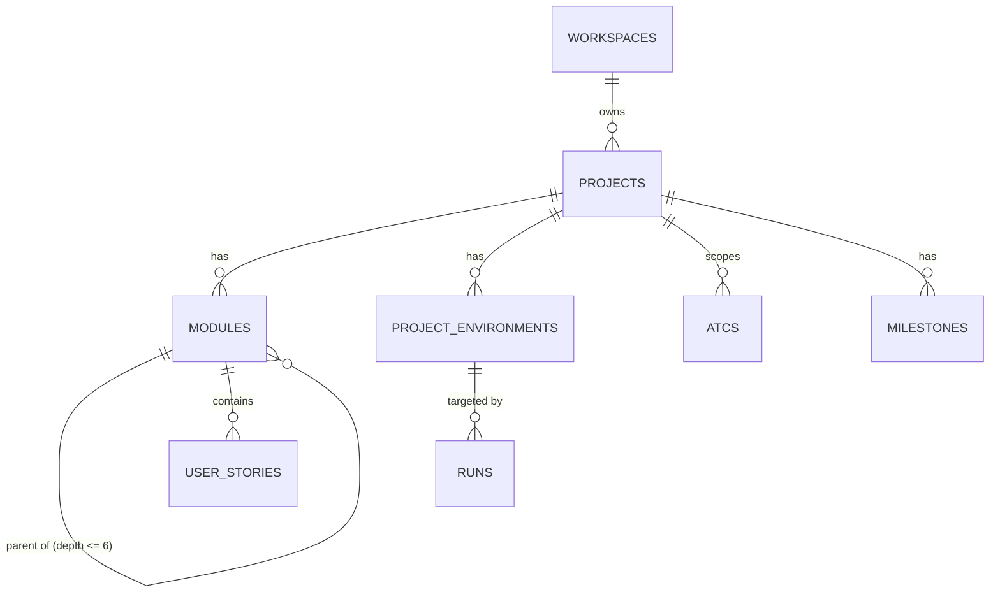

# BK-509 — Mapa de contexto de negocio (versión documentada)

> Complemento de `business-context-brief.md` (la versión que vive en la carpeta del PBI). Misma regla de origen: todo lo que sigue es real, citado desde `.context/business/*` o desde la DB de staging en vivo — nada inventado. Misma regla de exclusión también: sin defectos históricos (BK-54/55/56) acá, eso queda reservado para la respuesta de la Fase 3.
>
> Donde el brief es un resumen de texto, este es la versión "documentada" que pediste: un mapa, interconexiones de tablas, conexiones de features, y un hallazgo adicional respaldado en datos reales. Para lectura local / archivo de entrenamiento — no publicado como artefacto alojado.

---

## 1. Mapa de entidades (recorte del ERD completo)

El diagrama completo vive en `.context/business/domain-glossary.md` §4 (33 entidades). Esto es solo la rama que cuelga de Project — todo lo que BK-509 pasa a ser raíz en el momento en que se crea.

Cómo leerlo: BK-509 solo construye el borde `WORKSPACES ||--o{ PROJECTS`. Todos los demás bordes de este mapa son features que no pueden existir hasta que el borde de esta historia exista primero — Modules, Environments, Milestones y, de forma transitiva a través de Modules, también ATCs y User Stories dependen de este ticket.

## 2. Interconexión de tablas (verificado contra la DB de staging en vivo)

Esta vez no lo modelé desde la documentación, lo saqué directo del pooler de Supabase durante la práctica de BK-509 (`db-notes.md`, misma carpeta). Nombres de columna reales, no los nombres de campo que usa la API.

| Tabla | Columnas clave | FK hacia |
|---|---|---|
| `workspaces` | `id, slug, name, owner_user_id, plan, created_at` | — (tenant raíz) |
| `projects` | `id, workspace_id, slug, name, description, created_at` | `workspace_id -> workspaces.id` |
| `workspace_members` | `workspace_id, user_id, role, status, joined_at` | `workspace_id -> workspaces.id` |

Dos cosas para notar acá:

1. `projects.slug` no tiene una anotación visible de unicidad a nivel de listado de columnas — la regla del AC de `SLUG_DUPLICATE_IN_WORKSPACE` (409) se tiene que aplicar en algún lado (constraint de base de datos o código de aplicación), y confirmar **dónde** exactamente es un objetivo de prueba legítimo, no solo confirmar **que** el 409 aparece.
2. `workspace_members.role` es lo que habilita a alguien como "Member+" — el AC4 de BK-509 (403 `NOT_A_MEMBER`) depende enteramente de que exista una fila acá. La condición real de falla es que no exista una fila `workspace_members` para ese par usuario+workspace, no algún flag en `projects`.

## 3. Conexión de features — qué tiene al lado FEAT-014

`business-feature-map.md` documenta tres features hermanas de Project, todas construidas directamente sobre un Project una vez que BK-509 hace que exista uno. Ponerlas una al lado de la otra muestra un patrón que el brief solo no dejaba ver:

| Feature | ID | Comportamiento de borrado | Detalle notable |
|---|---|---|---|
| Project Creation | FEAT-014 | no aplica (no existe endpoint de DELETE) | tampoco existe `GET` individual ni `PATCH` — solo listado + rutas de subrecurso |
| Module Tree | FEAT-015 | Soft delete (`archived_at`) | árbol auto-referencial, path materializado, profundidad tope de 6 |
| Environment | FEAT-016 | **Hard delete** | única entidad de todo el mapa con borrado real |
| Milestone | FEAT-017 | **Sin borrado alguno** | deliberado, según el propio comentario de la migración |

Cuatro hermanas con cuatro filosofías de borrado distintas, y Project es la más estricta de todas — se puede crear pero nunca borrar ni editar vía API tal como está especificado hoy. Vale la pena llevarlo al ATP como pregunta explícita en vez de asumir "el delete simplemente todavía no está implementado".

## 4. Contrato de API — nivel de autenticación (esto faltaba, corregido)

`business-feature-map.md` lista el endpoint de BK-509 con nivel de auth **Dual**: `POST /api/v1/workspaces/{id}/projects` acepta cookie de sesión O Bearer PAT, no exige uno en particular (`business-api-map.md` §2.1). Dos cosas que eso implica y que las 4 ACs de la historia no distinguen entre sí:

1. **Cómo resuelve la identidad**: `resolveIdentity()` revisa primero el header `Authorization: Bearer` y si no hay, cae al cookie de sesión SSR. O sea que un mismo request puede llegar autenticado por dos caminos distintos, y el AC4 (403 `NOT_A_MEMBER`) tiene que valer para ambos por igual — vale la pena confirmarlo con un PAT, no solo con sesión de navegador.
2. **Un segundo camino al 403 que las ACs no mencionan**: si quien llama es un PAT con `assertWorkspaceContext()` — es decir, un token emitido para OTRO workspace — el rechazo pasa por esa función antes de siquiera llegar a la lógica de "no sos miembro". Las ACs solo describen un 403 (`NOT_A_MEMBER`), pero hay dos rutas de código distintas que pueden producir ese mismo 403 por razones distintas. Es exactamente el tipo de hueco que el shift-left tiene que preguntar: ¿usan el mismo código de error, o hacen falta dos códigos distintos para poder diferenciarlos en un reporte de bug?
3. **Gap real, no cubierto por ninguna AC**: las 4 ACs no contemplan un request completamente sin autenticar (ni cookie ni Bearer). Por la definición de "Dual", el sistema debería rechazarlo — probablemente 401 — pero eso no está escrito en ningún lado de esta historia. Ejemplo de "AC = piso, no techo" (doctrina de diseño de test de este repo): es un caso de riesgo genuino más allá de lo que el AC pide verificar.

## 5. Algo que el brief no tenía: escala real de producción

De la misma sesión de descubrimiento que generó estos mapas, conteos de filas reales en staging en vivo (no un mock, no un fixture): **479 workspaces, 530 projects**. Promedio de ~1.1 proyectos por workspace. Es decir, en el sistema real hoy, la mayoría de los workspaces todavía tienen exactamente un proyecto o ninguno. Ese es un dato de referencia útil para priorizar el testing exploratorio: el camino de múltiples proyectos por workspace (que es justo donde viven los riesgos de colisión de slug y de mezcla cross-project) es el camino **menos** transitado en producción, no el default — así que merece atención deliberada en vez de asumir "seguro alguien ya se topó con esto".

## Fuentes

- `.context/business/domain-glossary.md` §4 (Entity Relationships Diagram)
- `docs/training/BK-509-create-project-in-workspace/db-notes.md` (columnas reales de la DB)
- `.context/business/business-feature-map.md` — FEAT-014/015/016/017, matriz CRUD, tabla de endpoints
- `.context/business/business-data-map.md` (conteos de filas en staging, sección de discovery)
- `.context/business/business-api-map.md` §2.1 (modelo de autenticación, tier Dual y `assertWorkspaceContext()`)

## Excluido a propósito

Misma regla que `business-context-brief.md`: sin BK-54/55/56, sin el resultado real de la resolución. Eso es territorio de la Fase 3.
