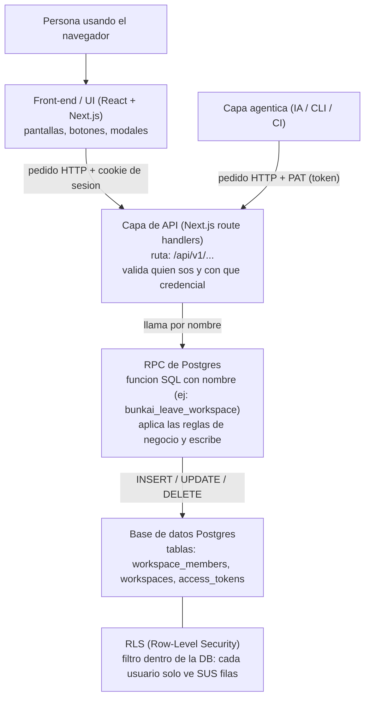

# Bunkai - Capas e integraciones (guía para QA)

> Guía de contexto para entrenamiento. **Compartida** entre prácticas: no es de una sola historia.
> Objetivo: entender cómo está apilado el sistema y quién le habla a quién, para poder leer
> documentos técnicos (contratos de API, RPC, RLS) sin perderse.
> Idioma castellano. Identificadores, nombres de tablas, rutas y enums van textuales.

---

## 1. La idea en una frase

Bunkai es una aplicación web **en capas**: el navegador dibuja la pantalla, una capa de API
recibe los pedidos, y la base de datos los ejecuta y controla los permisos. Cada capa solo
le habla a la de al lado.

## 2. Las capas, de arriba hacia abajo

Leer el diagrama: hay **una sola puerta de entrada al servidor**, la capa de API. Tanto una
persona (con cookie) como un programa/agente (con PAT) entran por ahí. Lo que cambia es la
credencial, y para algunas operaciones el PAT queda afuera.

## 3. Glosario mínimo (término / en criollo)

| Término | Qué es | Analogía |
|---|---|---|
| Front-end / UI | Código que corre en el navegador y dibuja la pantalla | La vidriera y el mostrador |
| Capa de API | Programa en el servidor que recibe pedidos HTTP en rutas `/api/v1/...` | El empleado del mostrador que decide si te deja pasar |
| Route handler | Un archivo de esa capa que responde una ruta concreta | Una ventanilla específica |
| RPC | "Remote Procedure Call". Acá: una función guardada dentro de Postgres, con nombre, que la API llama para hacer un trabajo | Un procedimiento escrito y firmado que el back-office ejecuta siempre igual |
| Guard | Condición que la RPC chequea **antes** de permitir la acción. Si no se cumple, corta con error | El control en la puerta: "sin esto no entrás" |
| SQLSTATE | Código corto que Postgres devuelve para nombrar un error puntual (ej: `45212`) | El número de artículo del reglamento que te aplicaron |
| Hard delete | Borrar la fila de verdad de la tabla. Lo opuesto es dejarla y marcarla inactiva (soft) | Tirar el papel vs archivarlo tachado |
| RLS (Row-Level Security) | Filtro de Postgres: cada consulta solo devuelve las filas que ese usuario puede ver. Un no-miembro recibe **cero filas, no un error** | El archivo solo te entrega tus carpetas; las de otro no existen para vos |
| Cookie de sesión | Credencial que el navegador guarda cuando te logueás como persona | La pulsera que te ponen al entrar |
| PAT (Personal Access Token) | Token que usa un programa (CLI, CI, agente de IA) para pegarle a la API sin navegador. Alcance de un solo workspace | La tarjeta de proveedor: entra por la puerta de servicio, a zonas limitadas |
| Cookie-only | Operación que SOLO se puede hacer con cookie de sesión. El PAT queda excluido | "Solo clientes con pulsera; proveedores no" |
| SECURITY DEFINER | Una RPC que corre con los permisos de quien la definió, no de quien la llama. Sirve para escrituras controladas | El cajero abre la caja fuerte con SU llave, no con la tuya |
| Active workspace | El workspace que tu sesión tiene "seleccionado" ahora. Se guarda en la cookie `bk_active_ws` | La pestaña que tenés abierta |
| slug | Texto corto, sin espacios, para identificar algo en una URL (ej: `mi-equipo`) | El apodo que va en la dirección |

## 4. Cómo se ven las capas en un pedido concreto: "Leave a workspace"

Ejemplo con la feature de BK-859.

| Paso | Capa | Qué pasa |
|---|---|---|
| 1 | UI | La persona abre `Settings > Workspaces`, aprieta "Leave", confirma en el modal `LeaveWorkspaceModal.tsx` |
| 2 | UI → API | El navegador manda `DELETE /api/v1/workspaces/{id}/membership` con la cookie de sesión. Sin body |
| 3 | API | Verifica que venga con cookie (no con PAT). Si viene con PAT, corta con `403`. Después llama a la RPC |
| 4 | RPC | `bunkai_leave_workspace` corre 4 guards en orden (ver Documento 2). Si alguno falla, devuelve error |
| 5 | RPC → DB | Si pasa los guards: `DELETE` de la fila en `workspace_members`, y revoca los PAT con alcance de ese workspace |
| 6 | API | Si el workspace que dejaste era tu activo, la API elige el nuevo activo (la membresía más vieja que te queda) y rota la cookie `bk_active_ws` |
| 7 | API → UI | Responde `200` con `{ newActiveWorkspaceId, newActiveWorkspaceName }` |
| 8 | DB / RLS | Desde ahora RLS ya no te devuelve ninguna fila de ese workspace. No es un error, es "no hay nada" |

## 5. Por qué a QA le importa cada capa

| Capa | Qué probás ahí |
|---|---|
| UI | Que el botón aparezca/desaparezca cuando corresponde, que el modal confirme, que el error se entienda. **OJO**: un bloqueo solo en UI no alcanza, hay que probar el servidor |
| API | Códigos HTTP correctos (`200/401/403/404/409`), que un PAT sea rechazado, forma de la response |
| RPC | Que cada guard corte cuando debe y en el orden correcto. El caso de orden: anteúltimo owner se va OK, último owner se va justo después FALLA |
| DB | Que la fila realmente se borró (hard delete), que los PAT quedaron revocados |
| RLS | Que un ex-miembro recibe resultado vacío (no datos de otro tenant, no error). Siempre con un caso positivo al lado (un miembro válido sí ve sus datos) |

## 6. Límite de este documento

Esto es el mapa del terreno. No dice qué casos de prueba escribir ni con qué técnica.
Eso sale de la pasada ciega y la asistida de cada práctica.
